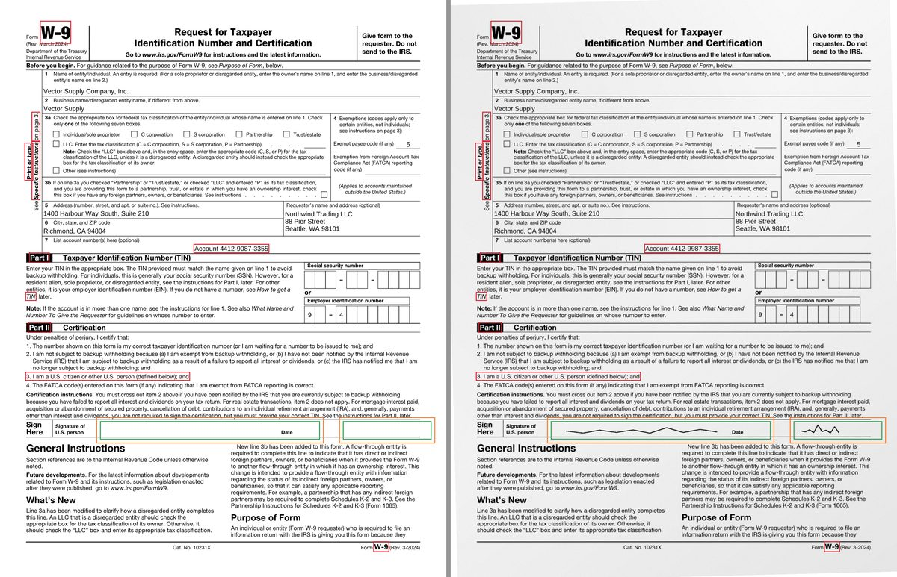
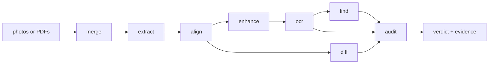

# scanmate

Tools for checking what came back. A document goes out as a PDF; a scan or a
photograph of it comes back turned, rescaled and shadowed, with something
written on it — and perhaps something changed. These packages put the two back
on the same coordinates and answer three questions: **was it signed where it
should be, is everything that must be there still there, and did anything
change?**



*The audit's evidence page. Green: a field that was filled in. Orange: the room
a signature is given to stray past its box. Red: text that reads differently —
here, one printed digit of the account number replaced by another of the same
run. Made from the [IRS Form W-9](https://www.irs.gov/pub/irs-pdf/fw9.pdf) (a
work of the United States government, in the public domain).*

## The pipeline



Every stage stands on its own: install the one you need, or the lot.

## Packages

| package | what it answers |
|---|---|
| [`@scanmate/audit`](packages/audit) | **Is this return acceptable?** Runs the reading and the pixel comparison, merges what each saw by place, and gives a verdict with a side-by-side evidence page. |
| [`@scanmate/ocr`](packages/ocr) | **Does the scan still say what the original said?** Read run by run against the original's text layer, with printed figures matched glyph by glyph against the original's own ink. |
| [`@scanmate/diff`](packages/diff) | **What changed?** Expected regions filled in, unexpected marks, printed ink lost — measured in square millimetres of real ink. |
| [`@scanmate/find`](packages/find) | **Is the required content there, where it should be?** And where is a field, resolved from the words the form prints. |
| [`@scanmate/align`](packages/align) | **Where does this scan sit on the original?** Deskewed, rescaled and registered, with a confidence you can act on. |
| [`@scanmate/extract`](packages/extract) | **What is in this PDF?** Pages as rasters at the scan's own resolution, page kind, real resolution, and the text layer with its geometry. |
| [`@scanmate/enhance`](packages/enhance) | **What does this page look like without the scanner?** Even lighting, white paper, darker ink, enlarged for reading. |
| [`@scanmate/merge`](packages/merge) | **How do these photos become one document?** Without re-encoding what is already good, and keeping each page's real resolution. |
| [`@scanmate/ink`](packages/ink) | The kernel: ink separation, warps, matrices, correlation, and the contracts the stages pass along. |
| [`@scanmate/image-fix`](packages/image-fix) | Deprecated. The first version of all of this; its README maps every export to its new home. |

## Getting started

```sh
npm install @scanmate/audit @scanmate/extract @scanmate/align
```

```ts
import { auditPages } from '@scanmate/audit'
import { alignPages } from '@scanmate/align'
import { extractPair } from '@scanmate/extract'

const { pages } = await extractPair({ original: 'contract.pdf', scanned: 'returned.pdf' })
const audit = await auditPages(await alignPages(pages), {
  expected: [{ page: 3, id: 'customer-signature', x: 82, y: 223, width: 480, height: 40 }],
  content:  [{ page: 1, content: ['Vector Supply Company, Inc.', 'Account 4412-9087-3355'] }],
})

audit.verdict                    // 'pass' | 'review'
audit.pages[0].reasons           // why, one sentence each
audit.pages[0].findings          // text and pixel findings, merged by place
audit.pages[0].evidenceImage     // the page above
```

## How it decides

Each package documents its own algorithms — what every step measures, the
decision flows, and every constant with the measurement behind it:

- [audit](packages/audit/documentation/algorithms.md) — correlating two comparisons, and the verdict
- [ocr](packages/ocr/documentation/algorithms.md) — matching by place, the recheck, and verifying figures against the print
- [diff](packages/diff/documentation/algorithms.md) — ink, tolerance, and deciding a region
- [find](packages/find/documentation/algorithms.md) — approximate search that will not approximate a figure
- [align](packages/align/documentation/algorithms.md) — the coarse guess, features, RANSAC, and choosing a model
- [extract](packages/extract/documentation/algorithms.md) — page kind, real resolution, and the text layer
- [enhance](packages/enhance/documentation/algorithms.md) — dividing by the paper
- [merge](packages/merge/documentation/algorithms.md) — never encoding twice
- [ink](packages/ink/documentation/algorithms.md) — the primitives, and why the codec boundary is where it is

## Two things worth knowing

**A scan's resolution decides what can be verified.** Measured on real returned
documents, by the resolution the *printed content* has on the scan: at 125 dpi
every page read at 0.995–1.0 of the original with no differences at all; at 117
the white totals on coloured bars blur past reading; at 90 a third of the
printed figures fail. Below about 120 dpi, a check that reports nothing has
proved nothing — and the packages say so rather than passing the page.

**A signature is ink, a forgery may not be.** A digit replaced by another digit
of the same size cannot be seen by any pixel comparison: the glyph is the
document's own ink, and it sits inside the tolerance that alignment needs. That
is why figures are matched against the original's own glyphs instead of read.

## Working on it

```sh
npm install
npx nx run-many -t lint,typecheck,test,build   # what CI runs
npx nx sync:check                              # project references
npm run playground:start                       # the demo pipeline, end to end
```

The playground with no arguments generates a form, signs and ticks it, scans it
crooked, too big, out of focus and under a shadow, then aligns it back and
reports what it found. Point it at real files to check your own pages:

```sh
npm run playground:start -- \
  --original page1.png --scanned returned.jpg \
  --region signature:76,905,420,78 \
  --out ./out
```

An [Nx](https://nx.dev) monorepo, created with
[`@mnci/cli`](https://www.npmjs.com/package/@mnci/cli). Releases run from `main`
through `nx release`, versioned from conventional commits; `RELEASE_SPECIFIER`
overrides the bump for one run when a version is a decision rather than a sum of
its commits.
