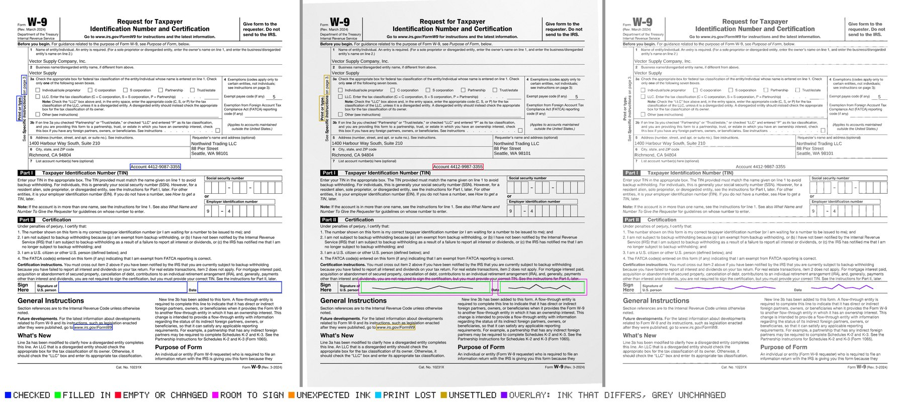
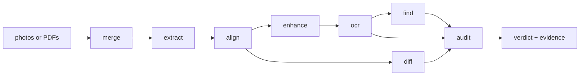

# scanmate

Tools for checking what came back. A document goes out as a PDF; a scan or a
photograph of it comes back turned, rescaled and shadowed, with something
written on it — and perhaps something changed. These packages put the two back
on the same coordinates and answer three questions: **was it signed where it
should be, is everything that must be there still there, and did anything
change?**



*The audit's evidence page. Green: a field that was filled in. Orange: the room
a signature is given to stray past its box. Red: text that reads differently —
here, one printed digit of the account number replaced by another of the same
run. Made from the [IRS Form W-9](https://www.irs.gov/pub/irs-pdf/fw9.pdf) (a
work of the United States government, in the public domain).*

## The pipeline



Seven packages. `@scanmate/scan` holds the whole pipeline; the other six stand on their own for anyone who needs one of them without the rest - and without the rest's dependencies on disk.

## Packages

| package | what it answers |
|---|---|
| [`@scanmate/scan`](packages/scan) | **All of it.** `new Scanmate(issued, returned)` with a method per comparison, each running what it needs, remembering what it did, and loading a stage package only when it is used. It also holds the stages that only make sense inside the pipeline: the [pixel comparison](packages/scan/documentation/pixel-comparison-overview.md) (what changed, which boxes are ticked), [enhancement](packages/scan/documentation/enhancement-overview.md), the [content search](packages/scan/documentation/content-search-overview.md) and the [audit](packages/scan/documentation/audit-overview.md) - one verdict with its evidence, its evidence PDF and its calibration. |
| [`@scanmate/ocr`](packages/ocr) | **Does the scan still say what the original said?** Read run by run against the original's text layer, with printed figures matched glyph by glyph against the original's own ink. |
| [`@scanmate/align`](packages/align) | **Where does this scan sit on the original?** Deskewed, rescaled and registered, with a confidence you can act on. |
| [`@scanmate/extract`](packages/extract) | **What is in this PDF, and where are its fields?** Pages as rasters at the scan's own resolution, page kind, real resolution, the text layer with its geometry - and fields placed from the labels it prints. |
| [`@scanmate/seal`](packages/seal) | **Is a signed PDF still the document that was signed?** Each signature checked against the bytes it covers: the digest, the signature, what it leaves uncovered, and who the certificate says signed. Not whether that signer is *trusted* - that is a trust list, not a file. |
| [`@scanmate/merge`](packages/merge) | **How do these photos become one document?** Without re-encoding what is already good, keeping each page's real resolution - and regions drawn onto a PDF to check them. |
| [`@scanmate/ink`](packages/ink) | The kernel: ink separation, warps, matrices, correlation, text normalisation, and the contracts the stages pass along. |

`@scanmate/diff`, `@scanmate/find`, `@scanmate/enhance` and `@scanmate/audit` were separate packages until 0.17.0; everything they exported is exported by `@scanmate/scan` from 0.18.0, under the same names. `@scanmate/image-fix`, the first version of all this, is gone. All five are deprecated on npm.

Every stage takes pages and hands the same pages back, carrying what it found:
`align` adds `aligned`, `enhance` adds `enhanced`, `ocr` adds `text`, `diff` adds
`diff`, `find` adds `find`, `audit` adds `audit`. So the stages compose in any
order their inputs allow, nothing has to be matched up again by index, and
whatever you attached to a page is still on it at the end. `extract` and `merge`
are the ends of the line: they turn documents into pages, and pages back into a
document.

## Getting started

```sh
npm install @scanmate/scan @scanmate/extract @scanmate/align
```

```ts
import { auditPages } from '@scanmate/scan'
import { alignPages } from '@scanmate/align'
import { extractPair } from '@scanmate/extract'

const { pages } = await extractPair({ original: 'fw9-issued.pdf', scanned: 'fw9-returned.pdf' })
const audit = await auditPages(await alignPages(pages), {
  // The W-9's signature row, measured off the form in points from the page's top-left.
  expected: [
    { page: 1, id: 'signature', x: 120, y: 577, width: 262, height: 22 },
    { page: 1, id: 'date',      x: 404, y: 577, width: 171, height: 22 },
  ],
})

audit.verdict                    // 'pass' | 'review'
audit.pages[0].audit.reasons     // why, one sentence each
audit.pages[0].audit.findings    // text and pixel findings, merged by place
audit.pages[0].audit.evidenceImage   // the page above
audit.pages[0].original          // the page itself is still there
```

## How it decides

Each package documents its own algorithms — what every step measures, the
decision flows, and every constant with the measurement behind it:

- [scan](packages/scan/documentation/algorithms.md) — what runs when, what is remembered, and what loads
- [audit](packages/scan/documentation/audit.md) — correlating two comparisons, and the verdict
- [ocr](packages/ocr/documentation/algorithms.md) — matching by place, the recheck, and verifying figures against the print
- [pixel comparison](packages/scan/documentation/pixel-comparison.md) — ink, tolerance, and deciding a region
- [content search](packages/scan/documentation/content-search.md) — approximate search that will not approximate a figure
- [align](packages/align/documentation/algorithms.md) — the coarse guess, features, RANSAC, and choosing a model
- [extract](packages/extract/documentation/algorithms.md) — page kind, real resolution, and the text layer
- [enhancement](packages/scan/documentation/enhancement.md) — dividing by the paper
- [merge](packages/merge/documentation/algorithms.md) — never encoding twice
- [ink](packages/ink/documentation/algorithms.md) — the primitives, and why the codec boundary is where it is

## Two things worth knowing

**A scan's resolution decides what can be verified.** Measured on real returned
documents, by the resolution the *printed content* has on the scan: at 125 dpi
every page read at 0.995–1.0 of the original with no differences at all; at 117
the white totals on coloured bars blur past reading; at 90 a third of the
printed figures fail. Below about 120 dpi, a check that reports nothing has
proved nothing — and the packages say so rather than passing the page.

**A signature is ink, a forgery may not be.** A digit replaced by another digit
of the same size cannot be seen by any pixel comparison: the glyph is the
document's own ink, and it sits inside the tolerance that alignment needs. That
is why figures are matched against the original's own glyphs instead of read.

## Working on it

```sh
npm install
npx nx run-many -t lint,typecheck,test,build   # what CI runs
npx nx sync:check                              # project references
npm run playground:start                       # the demo pipeline, end to end
```

The playground with no arguments generates a form, signs and ticks it, scans it
crooked, too big, out of focus and under a shadow, then aligns it back and
reports what it found. Point it at real files to check your own pages:

```sh
npm run playground:start -- \
  --original page1.png --scanned returned.jpg \
  --region signature:76,905,420,78 \
  --out ./out
```

An [Nx](https://nx.dev) monorepo, created with
[`@mnci/cli`](https://www.npmjs.com/package/@mnci/cli). Releases run from `main`
through `nx release`, versioned from conventional commits; `RELEASE_SPECIFIER`
overrides the bump for one run when a version is a decision rather than a sum of
its commits.
