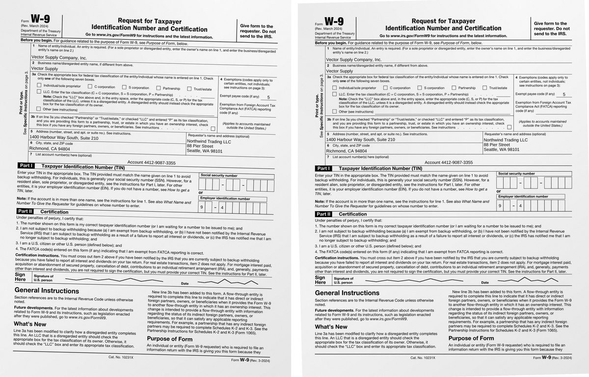

# `@scanmate/align`

Puts a scanned or photographed page back onto the original it came from: deskewed, rescaled and registered, so a rectangle in PDF points means the same place on both.



*Left: the returned scan, turned 1.4° and 3% small. Right: the same pixels on the original's canvas. Made from the [IRS Form W-9](https://www.irs.gov/pub/irs-pdf/fw9.pdf) (a work of the United States government, in the public domain): filled in as a generator would, printed, signed by hand and scanned crooked.*

## Install

```bash
npm install @scanmate/align @scanmate/extract
```

```ts
import { alignPages, alignScan } from '@scanmate/align'
import { extractPair } from '@scanmate/extract'

// A pair of documents, page by page:
const { pages } = await extractPair({ original: 'fw9-issued.pdf', scanned: 'fw9-returned.pdf' })
const aligned = await alignPages(pages)

aligned[0].scanned.raster         // left above: the scan as it came back
aligned[0].aligned.raster         // right: the same pixels on the original's canvas
aligned[0].aligned.confidence     // 0-1: how well the ink agrees after warping
aligned[0].aligned.transform      // model, scale, rotation, shear, translation
aligned[0].aligned.matrix         // original coordinates -> scan coordinates
aligned[0].aligned.inverse        // and back

// Or two images on their own:
const result = await alignScan('fw9-page-1.png', 'fw9-returned.jpg')
```

## How it works, briefly

1. **Ink separation** on both pages, so shadows, grey lids and uneven light do not take part in anything.
2. **A coarse guess** of scale, rotation and shift, tried three ways — frame to frame, content to content, and after deskewing each page — nudged by FFT phase correlation and judged on ink correlation. Descriptors only match between images of comparable size, and nothing in a scan says what resolution it is.
3. **ORB features**: FAST-9 corners, steered BRIEF descriptors, brute-force Hamming matching with a ratio test and a displacement filter.
4. **RANSAC** per transform family, re-fitted on its inliers. A page of text is full of identical-looking corners, so wrong matches are the normal case, not an accident.
5. **One warp for the winner**, at full resolution.

Everything above the per-model step is done once, so trying three models costs about 1.2× trying one.

## Choosing the model

`model: 'all'` (the default) sweeps `similarity` → `affine` → `homography`, cheapest first, and stops as soon as one reaches `confidenceTarget`. A freer model must beat the best simpler one by `modelPreferenceMargin` to replace it: eight degrees of freedom will happily overfit a flatbed scan's noise, winning on correlation by a hair while being geometrically wrong.

If no model finds a consensus — a nearly blank form has few corners — the coarse estimate is returned, scored the same way, with `method: 'coarse'`. There is always a transform and always a number saying how much to trust it.

## Reading the confidence

`confidence` is the ink correlation after warping, clamped to `[0, 1]`. Measured on real returned documents:

| | ink correlation |
|---|---|
| aligned to the wrong page | 0.01 – 0.30 |
| correctly aligned, **signed** page | 0.80 – 0.84 |
| correctly aligned, ordinary page | 0.92 – 0.97 |

A signed page scores lower because it was signed: the signature is ink the original has not, and correlation counts it as disagreement. A threshold has to leave room for that.

## Options

| option | default | |
|---|---|---|
| `model` | `'all'` | `'similarity' \| 'affine' \| 'homography' \| 'all'`. |
| `confidenceTarget` | `0.9` | Stop the sweep here. |
| `models` | all three | Restrict or reorder the sweep. |
| `modelPreferenceMargin` | `0.02` | How much better a freer model must be. |
| `workingSize` | `1400` | Longest side for features and matching. |
| `coarseSize` | `512` | Longest side for the coarse search. |
| `maxFeatures` | `1200` | Corners kept per image. |
| `ransacThreshold` | `3` px | Inlier distance. |
| `minInliers` | `12` | Below this there is no consensus. |
| `maxSkewDeg` | `12` | Largest per-page skew considered. |
| `maxScaleRatio` | `6` | Largest size ratio entertained. |
| `maxDisplacementRatio` | `0.12` | A match may not move further than this. |
| `interpolation` | `'bilinear'` | `'nearest'` for masks. |
| `output` | `'png'` | `'none'` keeps the raster only. |
| `seed` | fixed | The same input gives the same matrix. |

`alignPages` adds `onProgress`, and carries each page's metadata through untouched.

## Diagnostics

`AlignResult.diagnostics` reports the coarse score and strategy, each page's measured skew, feature and match counts, inliers and inlier ratio, reprojection error, final correlation and overlap, the selected model, every attempt, and the time taken. A low score is then a thing you can read rather than a mystery.

## Building blocks

`estimateCoarse`, `detectAndDescribe`, `matchFeatures`, `phaseCorrelate`, `ransac`, `fitSimilarity`, `fitAffine`, `fitHomography`, `findInliers` and `polishTranslation` are exported for callers who want a stage on its own.

## How it decides

[`documentation/algorithms.md`](./documentation/algorithms.md) has the algorithms in full: what each step measures, the decision flows, every constant with the measurement behind it, and what the package deliberately does not do.
