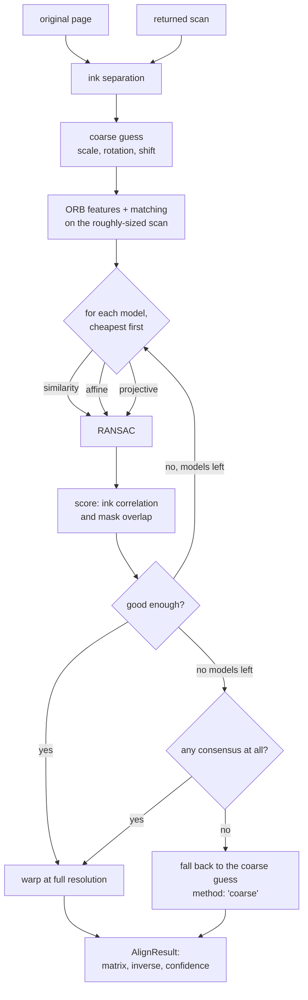
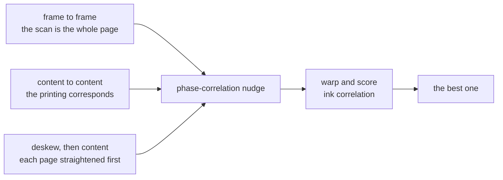
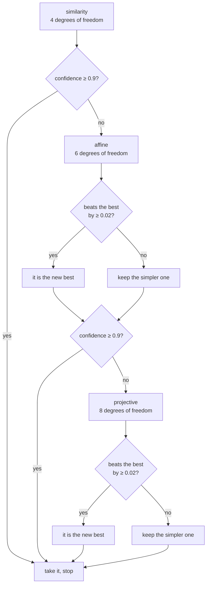

# How `@scanmate/align` decides

A returned scan is never the page that was sent. It is turned by a degree or
two, a few percent larger or smaller, shifted, and lit unevenly. Every later
question — *was this box signed?*, *does this account still read 4412-9087-3355?*
— is a question about a place on the page, and a place only means something
once both images agree where it is.

This package answers one question: **what transform puts the scan back on the
original's canvas, and how sure are we?**

Every image on this page was made from the [IRS Form W-9](https://www.irs.gov/pub/irs-pdf/fw9.pdf)
(a work of the United States government, in the public domain): filled in as a
generator would, printed, signed by hand, and scanned crooked.

*Left: the scan, turned 1.4° and 3% small. Right: the same pixels after
alignment, on the original's canvas, where a rectangle in points means the same
thing on both.*

## The shape of it

Everything above the fork is done **once**: it is nearly all of the cost, and
none of it depends on which family of transform is being fitted. RANSAC touches
no pixels at all, and scoring costs one warp of an 800-pixel copy, so trying
three models costs about 1.2 times trying one.

## Ink separation, first

Alignment never looks at the page's brightness, only at its ink. `inkMap`
divides the image by a local background — an integral-image box mean —
so a shadow across the corner, a grey scanner lid or a phone photo's uneven
light flattens out, and what is left is stroke against paper.

This matters more than any later step: correlation of raw greys would happily
align a shadow with a shadow.

## The coarse guess, and why it exists

Binary descriptors compare **fixed pixel offsets**. A corner of a letter looks
one way at 150 dpi and an unrelated way at 300, so descriptor matching between
images of different size does not merely degrade — it produces nothing. Nothing
in a JPEG says what resolution it was scanned at.

So the size is guessed three ways, on a 512-pixel copy, and the pixels judge:

- **frame** — assume the scan's edges are the page's edges. Right for a
  flatbed scan of the whole sheet, badly wrong for a photo with a desk around it.
- **content** — assume the *printed area* corresponds. Survives wide margins.
- **deskew** — measure each page's own skew by projection profile, straighten
  both, then match content. This is the one that usually wins.

Each candidate is nudged by phase correlation (an FFT cross-power peak, which
finds a pure translation in one step), warped, and scored. Guessing three times
and measuring beats one clever guess, and at 512 pixels each attempt is cheap.

`maxScaleRatio` (default 6) and `maxSkewDeg` (default 12) bound what is
entertained: beyond that it is not the same page.

## Features, matching, and RANSAC

On the roughly-sized pair, at `workingSize` 1400 pixels:

1. **FAST-9 corners**, filtered to the strongest `maxFeatures` (1200).
2. **Steered BRIEF descriptors**, 256 bits, rotated by each corner's intensity
   centroid so a turned page still matches.
3. **Brute-force Hamming matching** with a ratio test, then a displacement
   filter: a match that moves more than `maxDisplacementRatio` (0.12) of the
   page is not a match, it is a coincidence.
4. **RANSAC** over the survivors: sample the minimum for the model (2 points
   for similarity, 3 for affine, 4 for projective), fit, count inliers within
   `ransacThreshold` (3 px), keep the best consensus, then re-fit on all its
   inliers. Fewer than `minInliers` (12) is no consensus at all.

A page of text is full of genuinely identical corners — every "e" looks like
every other "e" — so wrong matches are not an accident to be avoided but the
normal case. RANSAC is what makes them harmless.

## Choosing between the models

The margin (`modelPreferenceMargin`, 0.02) is the important part. A projective
transform has eight degrees of freedom and will happily use them to overfit a
flatbed scan's noise, beating similarity on correlation by a hair while being
geometrically wrong. Being better has to mean *clearly* better.

`confidenceTarget` (0.9) stops the sweep early: past that the page is aligned,
and the remaining models can only cost time.

## How confidence is measured

The referee warps the scan onto the original at 800 pixels and returns two
numbers:

- **ink correlation** — Pearson correlation of the two ink maps. This is the
  reported `confidence`, clamped to `[0, 1]`.
- **mask overlap** — intersection over union of the binarised masks, reported
  in the diagnostics.

Measured on real returned documents:

| what | ink correlation |
|---|---|
| a page aligned to the wrong page | 0.01 – 0.30 |
| a correctly aligned **signed** page | 0.80 – 0.84 |
| a correctly aligned ordinary page | 0.92 – 0.97 |

The signed page scores lower **because it was signed**: the signature is ink
the original does not have, and correlation counts it as disagreement. A
threshold on confidence has to leave room for that — 0.6 is a reasonable floor,
0.8 is not.

## When nothing fits

If no model reaches a consensus — a nearly blank form has few corners — the
coarse estimate is returned on its own, scored the same way, with
`method: 'coarse'`. The caller always gets a transform and a number saying how
much to trust it; it is never left with nothing.

## Constants

| option | default | what it governs |
|---|---|---|
| `model` | `'all'` | Sweep similarity, affine, projective. |
| `confidenceTarget` | `0.9` | Stop the sweep here. |
| `modelPreferenceMargin` | `0.02` | How much better a freer model must be. |
| `workingSize` | `1400` | Longest side for features and matching. |
| `coarseSize` | `512` | Longest side for the coarse search. |
| `maxFeatures` | `1200` | Corners kept per image. |
| `ransacThreshold` | `3` px | Inlier distance. |
| `minInliers` | `12` | Below this there is no consensus. |
| `maxSkewDeg` | `12` | Largest per-page skew considered. |
| `maxScaleRatio` | `6` | Largest size ratio entertained. |
| `maxDisplacementRatio` | `0.12` | A match may not move further than this. |
| `seed` | fixed | The same input gives the same matrix. |

## What it does not do

- It does not correct a page that is **bent**: a projective transform is flat.
  A photo of a curled page aligns in the middle and drifts at the edges.
- It does not read anything. What the page *says* is `@scanmate/ocr`; what
  changed is the pixel comparison.
- It does not decide whether an alignment is good enough for a given purpose.
  It reports confidence; the caller sets the bar.
