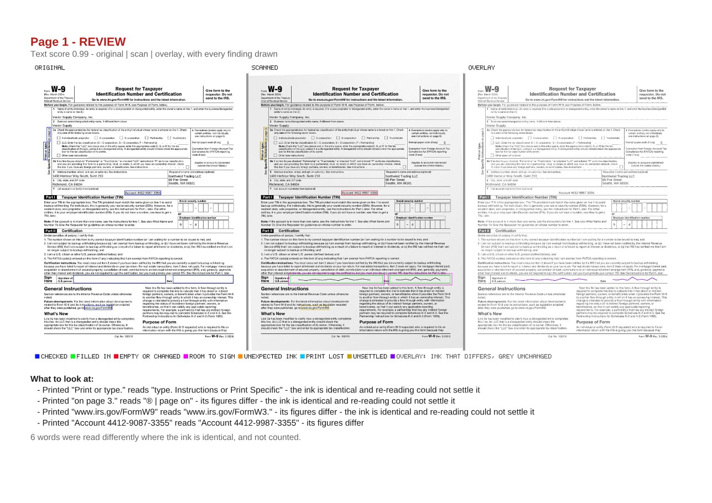

# `@scanmate/audit`

The final audit of a returned document. Every page is read in full and compared pixel by pixel. The two results are merged into one list of findings and a verdict, with a side-by-side image as evidence.


*The evidence page: the original, the returned scan and the overlay of the two, with the same places boxed on each. The original asks the questions in blue; the scan answers each in the colour of its verdict - green filled in, red changed, pink the room a signature is given to stray, olive a disagreement nothing could settle; the overlay shows violet where the ink differs and grey where it agrees, so a red box can be checked rather than taken on trust. One red box: the account number, one printed digit replaced by another. Made from the [IRS Form W-9](https://www.irs.gov/pub/irs-pdf/fw9.pdf) (a work of the United States government, in the public domain): filled in as a generator would, printed, signed by hand and scanned crooked.*

## Install

```bash
npm install @scanmate/audit @scanmate/extract @scanmate/align
```

```ts
import { extractPair } from '@scanmate/extract'
import { alignPages } from '@scanmate/align'
import { auditPages } from '@scanmate/audit'

const { pages } = await extractPair({ original: 'fw9-issued.pdf', scanned: 'fw9-returned.pdf' })
const audit = await auditPages(await alignPages(pages), {
  // The W-9's signature row, measured off the form in points from the page's top-left.
  expected: [
    { page: 1, id: 'signature', x: 120, y: 577, width: 262, height: 22 },
    { page: 1, id: 'date',      x: 404, y: 577, width: 171, height: 22 },
  ],
})

audit.verdict                  // 'pass' | 'review'
audit.pages[0].audit.reasons   // why, one sentence each
audit.pages[0].audit.findings  // text and pixel findings, merged by place
audit.pages[0].audit.noise     // read differently, printed identically - not reported
audit.pages[0].audit.settled   // how each disagreement was settled, and what each re-read said
audit.pages[0].aligned.raster  // the page itself is still there
audit.pages[0].evidenceImage   // original, scan and overlay side by side, findings drawn on each
audit.pages[0].text            // the full OCR comparison (@scanmate/ocr)
audit.pages[0].pixels          // the full pixel comparison (@scanmate/diff)
```

## Why both

Each comparison is blind where the other sees:

| Change | Reading (`@scanmate/ocr`) | Pixels (`@scanmate/diff`) |
|---|---|---|
| A digit altered: 1,250.00 → 7,250.00 | ✓ figures must match exactly | ✗ the new glyph stays within the tolerance band |
| A signature, a stamp, a tick | ✗ not writing | ✓ ink where none was |
| An expected field left empty or blacked out | - | ✓ |
| A paragraph removed | ✓ runs missing | ✓ ink lost |

So both run. Findings at the same place become one finding marked **corroborated**, for example a stray mark that also reads as words. A required value that reads wrong is a single finding, not two. Text differences that an expected region explains are set aside in `explained`, not reported: a signature read as "Ae dhe", or the "Signature" label written across. So are words over something the original prints as an image, such as a logo.

A page **passes** only when it has no findings and its text score is high enough to trust that (`minTextScore`, 0.85). A 93-dpi scan can read so poorly that silence proves nothing; such a page goes to review and says why.

## Findings

| Kind | Meaning |
|---|---|
| `unexpected-mark` | Ink added where nothing was expected. |
| `missing-ink` | Printed ink the scan lost. |
| `text-changed` / `text-missing` / `text-added` | The reading disagrees with the original where the pixels saw nothing. |
| `expected-empty` / `expected-overfilled` | An expected region left empty, or covered rather than filled in. |
| `text-unsettled` | The reading disagrees, the ink at that run is identical, and re-reading both sides could not settle it. |
| `checkbox-mismatch` | A box does not show what its `expect` asks. |
| `checkbox-struck` | A box is inked over: whether it is ticked cannot be told. |
| `checkbox-cleared` | A box ticked on the original comes back empty. |
| `checkbox-group` | Boxes answered together are not answered as their rule asks - two ticked where one may be, or none where one must be. |

**Checkboxes are read, not expected.** Pass them as `checkboxes`, with `expect: 'ticked' | 'empty'` where the answer is fixed. A tick in one is never unexpected ink, and an empty one is never a field left empty; only a box that is wrong is a finding. Each page's `checkboxes` carries every box's reading, on both sides.

Each finding carries its position in points, a one-sentence summary, and its evidence (`text`, `pixels`).

## The evidence image

Three panels with the same places boxed on each: the original, which says **where** the question is; the aligned scan, which says **what** the answer is; and the overlay of the two, which says **why** - violet where the ink of the two differs, grey where they agree.

The overlay carries no verdicts of its own: what passed and what failed is the middle panel's job. It is worth knowing what it cannot show - a printed digit replaced by another of the same size moves about 0.1 mm² of ink, nearly all of it inside the band that forgives misregistration, so a forged figure appears there as grey. That is exactly why the glyph check exists, and why a finding does not depend on the pixels agreeing.

| | on the original | on the scan |
|---|---|---|
| **blue** | every place being asked about | |
| **green** | | a field that was filled in |
| **red** | | a field left empty or covered, or a figure that changed |
| **pink** | | the band where ink still counts as a field's |
| **orange** | | ink added where nothing was expected |
| **cyan** | printed ink the scan lost | the same place, where it is not |
| **olive** | | read differently, ink identical, nothing could settle it |

Corroborated findings are drawn twice as thick, and a legend runs along the foot (`legend: false` turns it off).

## The evidence PDF

`writeEvidencePdf` puts the whole audit in one file for whoever reviews it: a cover with the verdict and, page by page, why; then a sheet for each page with its evidence image and what to look at in words - real text, searchable and copyable, running on to further sheets when there is a lot.

```ts
import { writeEvidencePdf } from '@scanmate/audit'

const pdf = await writeEvidencePdf(audit, { title: 'Order 118, returned' })
await writeFile('order-118-evidence.pdf', pdf)
```



*A sheet of the evidence PDF for the forged [IRS Form W-9](https://www.irs.gov/pub/irs-pdf/fw9.pdf) (a work of the United States government, in the public domain) used throughout these READMEs. The altered account number is the last line; above it, the sideways label, a footnote and a URL were read differently where the ink is identical, and re-reading could not settle them - so they are reported, not dropped.*

| Option | Default | |
|---|---|---|
| `title` | `'Audit evidence'` | On the cover and in the PDF's metadata. |
| `cover` | `true` | `false` writes the sheets alone, to follow a cover written with `writeEvidenceCover`. |
| `pages` | `'all'` | `'review'` gives a sheet only to the pages that need one; the cover still lists every page. |
| `format` | `'jpeg'` | How each evidence image is embedded; `'png'` was twice the size on the W-9. |
| `dpi` | `200` | Of each image at the size it is shown: the one-page W-9 came to 570 KB, against 2.3 MB at the audit's own resolution. Never enlarged. |
| `quality` | `85` | JPEG quality. |
| `createdAt` | now | Printed on the cover and set as the PDF's creation date. |

**A long document audited in batches** still gets one cover. `summariseAudit` reduces each batch's report to what the cover says, `combineSummaries` joins them, `writeEvidenceCover` writes the cover alone, and `writeEvidencePdf(report, { cover: false })` writes each batch's sheets alone, to follow it. `Scanmate.evidenceInBatches` in `@scanmate/scan` does all of that in one call.

Findings quote what was read, and OCR reads what it likes; a character the PDF's standard font cannot draw is printed as `?`, visibly, rather than losing the file. The PDF library loads only when this is called - an audit on its own never loads it.

## When the two disagree

OCR misreads small, faint and sideways print constantly - `W-9` comes back as `W 2] 9`, `I am` as `1am` - so a reading that disagrees with the original is not by itself a change. Nor is it nothing. Rather than let one comparison overrule the other, the disagreement is settled:

1. **The glyph check.** If the printed run's ink was matched against the original's own glyphs and found to be *other* glyphs, that was seen rather than read. Changed.
2. **The ink at that run.** If 0.3 mm² or more moved there, changed.
3. **Match the run's glyphs, letters and digits alike,** against the faces the page itself prints. Every glyph the one printed? Then the pages carry the same characters and the reading was simply wrong. A glyph that fails to match does *not* condemn the run: over 327 runs of four real documents that call was wrong about one time in eighty, which is fine for dismissing an argument and disgraceful for starting one.
4. **Read both sides again, and compare them with each other.** Three passes over the original's crop and the scan's. If the two read alike, the pages carry the same glyphs however wrongly they were read - a systematic misreading misreads the original exactly as it misreads the scan, so it cancels. Not reported; it lands in `noise`.
5. **Otherwise, unsettled** - reported as `text-unsettled`, in its own colour.

The glyph check in step 2 belongs to `@scanmate/ocr`, and [its documentation shows it working, in pictures](https://github.com/russoedu/scanmate/blob/main/packages/ocr/documentation/print-verification.md): the polarity test, the cell boxes, the templates it compares against, every candidate scored, and the two-candidate question a settlement actually asks.

A settlement also records whether the disagreement was **steady**: each side read the same thing on every pass, and the two still differed. A degraded read wavers; a substituted glyph does not. It does not change the verdict - a blemish in the same place reads consistently too - but a caller who knows their own documents can act on it:

```ts
audit.pages[0].audit.settled[0]   // { verdict: 'unsettled', because: 'sides-disagree', steady: true, readings }
```

Disagreement between the two sides never condemns a run on its own. The original is a clean render and the scan has been printed, posted and scanned, so it reads worse by nature; treating that as evidence turns ordinary degradation into an accusation.

On the returned W-9 above, ten disagreements: six settled as misreadings, three unsettled, and one changed - the forged digit.

```ts
audit.pages[0].settled[0]   // { verdict: 'misread', because: 'both-sides-alike', readings: { original, scanned } }
```

## Required content is asked separately

`auditPages` compares a returned copy with the one that was issued. Whether the issued copy says what it was *supposed* to say is a different question, and no comparison of two copies can answer it - issue a different form, return a faithful scan of it, and every check here passes. Ask `@scanmate/find` directly, of the reading this returns:

```ts
import { findContent } from '@scanmate/find'

const found = findContent(audit.pages, [{ page: 1, content: ['Account 4412-9087-3355'] }])
```

## Measuring the thresholds

Automatic acceptance is only as safe as the thresholds behind it, and "0.85 looks right" is not something anyone can sign off. `calibrateAudit` measures them on documents someone has checked by hand: for every combination of thresholds, which altered documents would have passed, and which genuine ones would have been held up.

```ts
import { auditPages, calibrateAudit, sampleAudit } from '@scanmate/audit'

// Once per labelled document - the slow part, hours for a real corpus:
const sample = sampleAudit(await auditPages(pages, options), { id: 'order-118', genuine: true }, options)
await save(sample)   // a few numbers per page, plain JSON

// Any time afterwards, in milliseconds:
const report = calibrateAudit(samples, { minTextScore: [0.8, 0.85, 0.9], minChangeArea: [1, 2, 4] })
report.best                       // no false accept, fewest false reviews
report.best?.falseAcceptUpper     // how far this corpus can vouch for that "no"
report.points                     // every combination, safest first
```

- **Counted by document**, because that is what is accepted: a document passes only when every page does.
- **A false accept is an altered document that passes**; a false review is a genuine one held up. The report names each, so the documents behind a rate can be looked at.
- **Each rate has an upper bound** - the top of its 95% Wilson interval - because a small corpus proves little. No false accept in 20 altered documents still allows 16%; it takes about 75 to bring that under 5%.
- **Three thresholds are swept**: `minTextScore`, and the least ink added (`minChangeArea`) or lost (`minMissingArea`), in mm², that sends a page to review. A mark the reading also saw words in is never dropped for its size, and every other finding always counts.
- **Areas can only be raised.** A mark smaller than the audit ran with was never reported, so grid values below it are listed in `unreachable` rather than guessed at. Audit the corpus with low area thresholds to leave room to sweep.
- **`best` is chosen on the corpus it is measured on**, so it flatters itself. Confirm it on documents it was not chosen on.

`Scanmate.calibrate` in `@scanmate/scan` runs the whole corpus from file paths, one document at a time.

## Options

| Option | Default | |
|---|---|---|
| `expected` | none | Regions where a change is expected, in points (`locateFields` in `@scanmate/extract` builds them from the labels the original prints). |
| `checkboxes` | none | Boxes to read as ticked or not, each with an optional `expect`. `checkbox` sets how they are read. |
| `checkboxGroups` | none | Boxes answered together, each `{ id, boxes, ticked: 'exactly-one' \| 'at-least-one' \| 'at-most-one' }`, judged across the document. The report's `groups` says how each was answered. |
| `ocr` | `@scanmate/ocr` defaults | Engine, languages and cache, the recheck, thresholds. Pass `ocr.engine` to share one engine across audits. |
| `diff` | `@scanmate/diff` defaults | Tolerances, minimum areas, form-line handling. Rectangles are always in points. |
| `settle` | `quorum: 2`, three passes | How a disagreement between the reading and the pixels is settled. |
| `minTextScore` | `0.85` | Below this, a page's text is too unreliable for it to pass. |
| `output` | `'png'` | Encoding of the evidence image and the pixel overlay; `'none'` keeps only rasters. |
| `onProgress` | none | Receives `ocr`, `diff` and `audit` stage events. |

## How it decides

[`documentation/algorithms.md`](./documentation/algorithms.md) has the algorithms in full: what each step measures, the decision flows, every constant with the measurement behind it, and what the package deliberately does not do.
