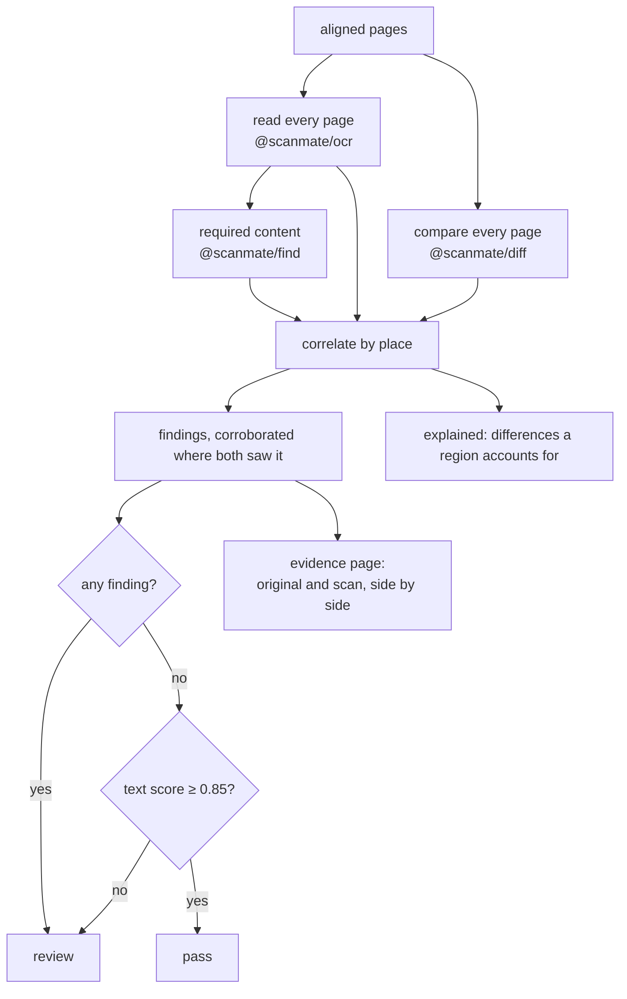
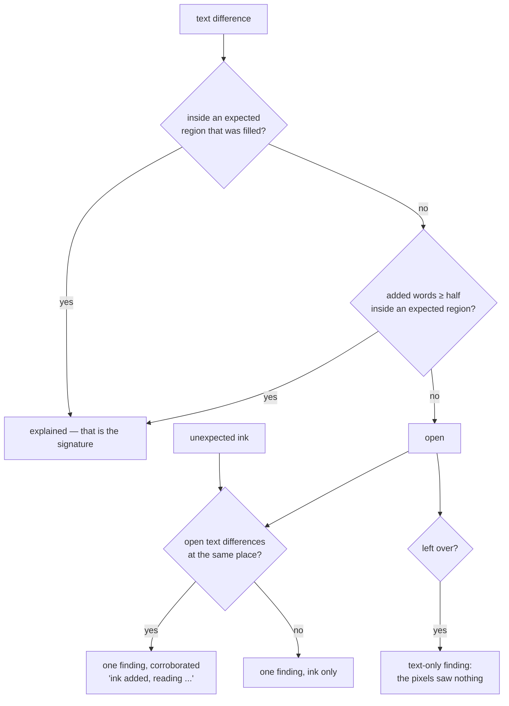
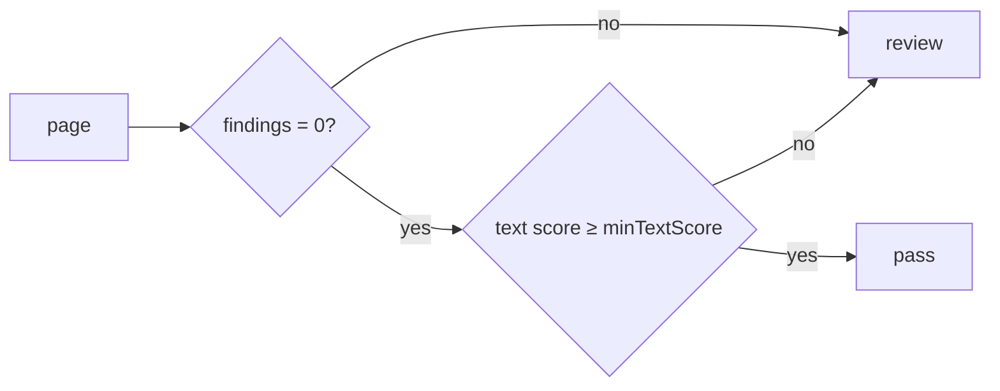

# How `@scanmate/audit` decides

Two comparisons, each blind where the other sees, and one verdict.

*The [IRS Form W-9](https://www.irs.gov/pub/irs-pdf/fw9.pdf) (public domain),
filled in, signed, scanned — and then one printed digit of the account number
replaced by another of the same run. Green: a field that was filled in. Orange:
the band where ink still counts as that field's. Red: text that reads
differently, including the altered figure.*

## Why both comparisons

| change | the reading sees it | the ink sees it |
|---|---|---|
| a digit altered: `9087` → `9987` | ✓ figures are matched glyph by glyph | ✗ the new glyph is the document's own ink |
| a signature, a stamp, a tick | ✗ it is not writing | ✓ ink where none was |
| a field left empty or blacked out | – | ✓ |
| a paragraph removed | ✓ runs missing | ✓ ink lost |
| required content in the wrong place | ✓ | – |

Neither is sufficient. Running both and merging what they saw is the whole idea
of this package.

## The shape of it

## Correlating by place

The two comparisons report in the same coordinates — PDF points on the
original's canvas — so a finding from each at the same place is one event seen
twice, not two events.

Overlap is judged with 1.5 points of slack, which is about one stroke width at
scan resolution.

**Explained, not reported**: a signature read as "Ae dhe", the word "Signature"
written across by a hand that overshot, words over a logo the original prints as
an image. These are set aside with the region that accounts for them, so the
findings list stays the list of things that are actually wrong.

**Corroborated findings are drawn twice as thick** on the evidence page,
because a reviewer's eye should go to them first: ink added *that also reads as
words* is a different kind of event from a smudge.

Required content folds into the same list rather than forming a second one. A
value that reads wrong where the document prints it becomes **one** finding —
the text difference, with " - required content" appended and the value named —
not a text finding plus a content finding about the same place.

## The verdict

The second condition is the one that is easy to leave out and dangerous to
leave out. A 93-dpi scan can read so poorly that *finding nothing* proves
nothing: silence from a comparison that cannot see is not evidence of absence.
Such a page goes to review with a reason that says exactly that — "the text
reads too poorly to trust (score 0.66 below 0.85): changes may have gone
unseen".

A document passes only when every page passes.

## Findings

| kind | meaning |
|---|---|
| `unexpected-mark` | Ink added where nothing was expected. |
| `missing-ink` | Printed ink the scan lost. |
| `text-changed` / `text-missing` / `text-added` | The reading disagrees where the pixels saw nothing. |
| `expected-empty` / `expected-overfilled` | A field left empty, or covered rather than filled in. |
| `content-missing` / `content-not-identifiable` | Required content absent, or not intact at every place it is printed. |

Each carries its place in points, a one-sentence summary, and the evidence
behind it — the text differences, the pixel change — so a report can quote
numbers rather than adjectives.

## The evidence page

The original and the aligned scan, side by side, with the same boxes drawn on
both halves in the same places:

- **green** — expected region filled in
- **orange** — the band around it where ink still counts as that region's
- **amber** — expected region left empty, or blacked out
- **magenta** — unexpected mark
- **blue** — printed ink lost
- **red** — text reading differently, or required content out of place

Side by side rather than a crop, because the question a reviewer is answering is
"is this line as it was printed?", which needs both lines in view.

## Constants

| option | default | |
|---|---|---|
| `minTextScore` | `0.85` | Below this a page cannot pass, findings or not. |
| `expected` | none | Regions where a change is expected, in points. |
| `content` | none | Content that must be on each page. |
| `ocr` / `diff` / `find` | their own defaults | Passed straight through. |
| `output` | `'png'` | Encoding of the evidence page. |
| — | `1.5` pt | Slack when deciding two boxes are the same place. |

## What it does not do

- It does not decide what happens next. `pass` and `review` are statements
  about the document, not about a workflow.
- It does not rank findings by severity. A stray tick and a changed total are
  both reported; which matters is the caller's judgement.
- It does not look at anything but the two documents it was given.
