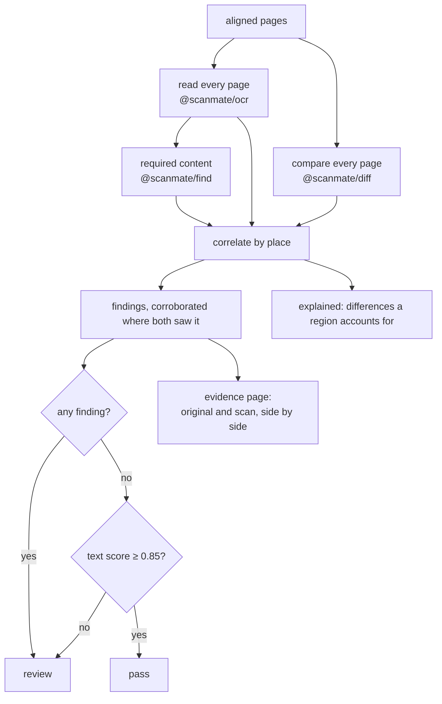
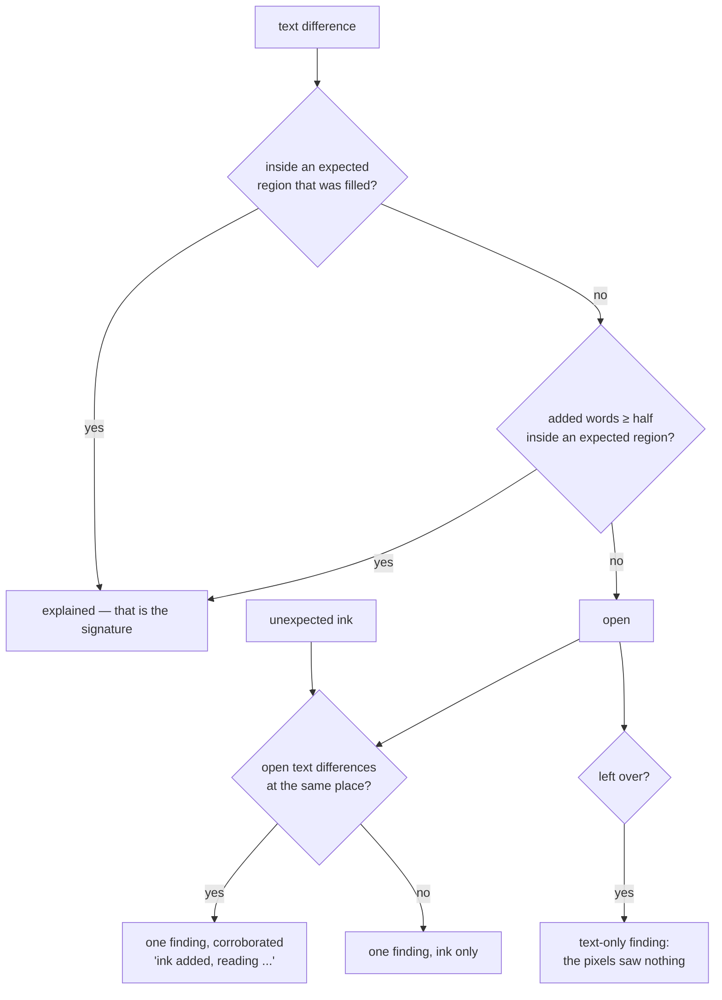
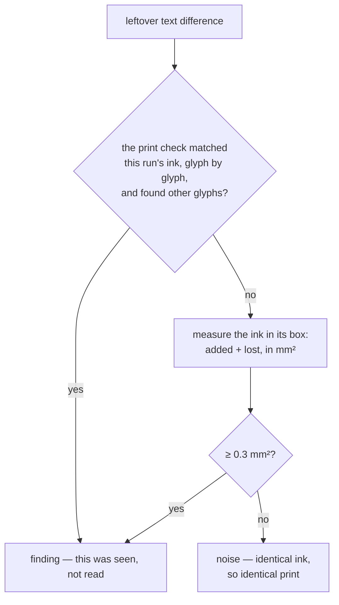
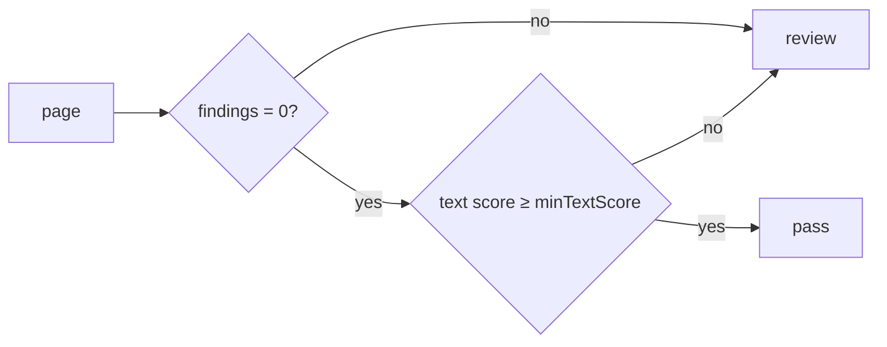

# How `@scanmate/audit` decides

Two comparisons, each blind where the other sees, and one verdict.

*The [IRS Form W-9](https://www.irs.gov/pub/irs-pdf/fw9.pdf) (public domain),
filled in, signed, scanned — and then one printed digit of the account number
replaced by another of the same run. Green: a field that was filled in. Orange:
the band where ink still counts as that field's. Red: text that reads
differently, including the altered figure.*

## Why both comparisons

| change | the reading sees it | the ink sees it |
|---|---|---|
| a digit altered: `9087` → `9987` | ✓ figures are matched glyph by glyph | ✗ the new glyph is the document's own ink |
| a signature, a stamp, a tick | ✗ it is not writing | ✓ ink where none was |
| a field left empty or blacked out | – | ✓ |
| a paragraph removed | ✓ runs missing | ✓ ink lost |
| required content in the wrong place | ✓ | – |

Neither is sufficient. Running both and merging what they saw is the whole idea
of this package.

## The shape of it

## Correlating by place

The two comparisons report in the same coordinates — PDF points on the
original's canvas — so a finding from each at the same place is one event seen
twice, not two events.

Overlap is judged with 1.5 points of slack, which is about one stroke width at
scan resolution.

### A reading is not a change until the ink agrees

The rule above leaves one gap, and it is the gap that produces red boxes over
text a reviewer can see is identical. OCR misreads small, faint and sideways
print constantly: `W-9` comes back as `W 2] 9`, `Specific Instructions` as
`[=] O O If 1400`. Nothing changed on the paper; the reader simply failed.

So every leftover text difference is put back to the pixels, at its own box:

`diffPages` takes a `probes` option for exactly this: rectangles to measure
whether or not anything changed there, returning added, lost and shared ink for
each. Identical ink under a word means identical characters, however they were
read, and the difference is set aside as **noise** — reported on the page for
the curious, never as a finding.

The first branch matters as much as the second. A figure the print check
matched against the original's own glyphs and found to be *different* glyphs was
seen rather than read, and needs no second opinion. What it does **not** cover
is a run it never checked: a difference is exempt because the ink was measured,
not because the reading happens to contain a digit.

**Explained, not reported**: a signature read as "Ae dhe", the word "Signature"
written across by a hand that overshot, words over a logo the original prints as
an image. These are set aside with the region that accounts for them, so the
findings list stays the list of things that are actually wrong.

**Corroborated findings are drawn twice as thick** on the evidence page,
because a reviewer's eye should go to them first: ink added *that also reads as
words* is a different kind of event from a smudge.

Required content folds into the same list rather than forming a second one. A
value that reads wrong where the document prints it becomes **one** finding —
the text difference, with " - required content" appended and the value named —
not a text finding plus a content finding about the same place.

## The verdict

The second condition is the one that is easy to leave out and dangerous to
leave out. A 93-dpi scan can read so poorly that *finding nothing* proves
nothing: silence from a comparison that cannot see is not evidence of absence.
Such a page goes to review with a reason that says exactly that — "the text
reads too poorly to trust (score 0.66 below 0.85): changes may have gone
unseen".

A document passes only when every page passes.

## Findings

| kind | meaning |
|---|---|
| `unexpected-mark` | Ink added where nothing was expected. |
| `missing-ink` | Printed ink the scan lost. |
| `text-changed` / `text-missing` / `text-added` | The reading disagrees where the pixels saw nothing. |
| `expected-empty` / `expected-overfilled` | A field left empty, or covered rather than filled in. |
| `content-missing` / `content-not-identifiable` | Required content absent, or not intact at every place it is printed. |

Each carries its place in points, a one-sentence summary, and the evidence
behind it — the text differences, the pixel change — so a report can quote
numbers rather than adjectives.

## The evidence page

Three panels, the same places boxed on each, because a reviewer is asking three
different questions and one image cannot answer them in one colour scheme:

| panel | question | what it draws |
|---|---|---|
| the original | **where** is the question? | every checked place, all in one colour |
| the aligned scan | **what** is the answer? | each place in the colour of its verdict |
| the overlay | **why** should I believe it? | violet where the ink differs, grey where it agrees |

The third panel is what makes a red box arguable rather than an accusation: a
reviewer can see for themselves that the ink under it is grey — the same ink,
in the same place — and that only the reading differed. It carries no verdicts
of its own; repeating the middle panel's answers on it would turn the one
independent piece of evidence into a restatement of the other two.

It is worth knowing what that panel *cannot* show. A printed digit replaced by
another of the same size moves about **0.11 mm²** of ink, measured, nearly all
of it inside the band that forgives misregistration — so a forged figure appears
there as grey. That is why the glyph check exists, and why a finding never
depends on the pixels agreeing.

| colour | on the original | on the scan |
|---|---|---|
| blue `#0017FC` | every place being asked about | required content that reads correctly |
| green `#00FC11` | | a field that was filled in |
| red `#FC0027` | | a field left empty or covered, content or a figure that changed |
| pink `#F500FC` | | the band where ink still counts as a field's |
| orange `#FF8A00` | | ink added where nothing was expected |
| cyan `#00C8FC` | printed ink the scan lost | the same place, where it is not |

The left panel deliberately carries **one** colour. A verdict belongs to the
returned copy, not to the document that asked the question, and colouring both
sides by verdict invites a reviewer to read the original as though it were also
at fault.

A legend runs along the foot, drawn from a 5x7 bitmap font carried in
`@scanmate/ink` rather than a font file: an evidence page whose legend silently
vanished in a container with no fonts installed would be worse than a plain one.
Turn it off with `legend: false`.

Side by side rather than a crop, because the question a reviewer is answering is
"is this line as it was printed?", which needs both lines in view.

## Constants

| option | default | |
|---|---|---|
| `minTextScore` | `0.85` | Below this a page cannot pass, findings or not. |
| `expected` | none | Regions where a change is expected, in points. |
| `content` | none | Content that must be on each page. |
| `ocr` / `diff` / `find` | their own defaults | Passed straight through. |
| `output` | `'png'` | Encoding of the evidence page. |
| — | `1.5` pt | Slack when deciding two boxes are the same place. |
| — | `0.3` mm² | Ink at a text difference below which the print counts as identical. A glyph of 9 pt text covers roughly 1 mm², so a changed character moves several times this; scanner grain does not. |
| `expectedMargin` | `6` pt | How far outside a region its ink still counts - a signature leaves its box. |

## What it does not do

- It does not decide what happens next. `pass` and `review` are statements
  about the document, not about a workflow.
- It does not rank findings by severity. A stray tick and a changed total are
  both reported; which matters is the caller's judgement.
- It does not look at anything but the two documents it was given.
- It does not treat a reading as evidence on its own. A difference the pixels
  cannot corroborate is reported as `noise`, not as a finding - which means a
  change made with no change of ink at all is, by construction, not something
  this can see.
