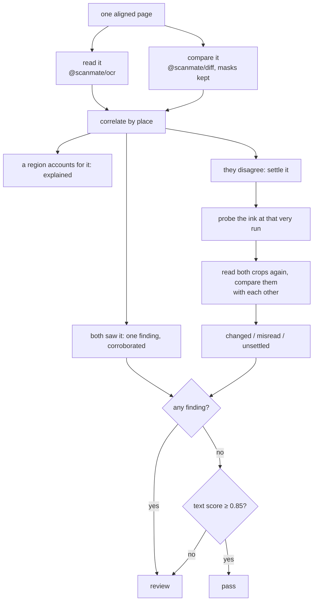
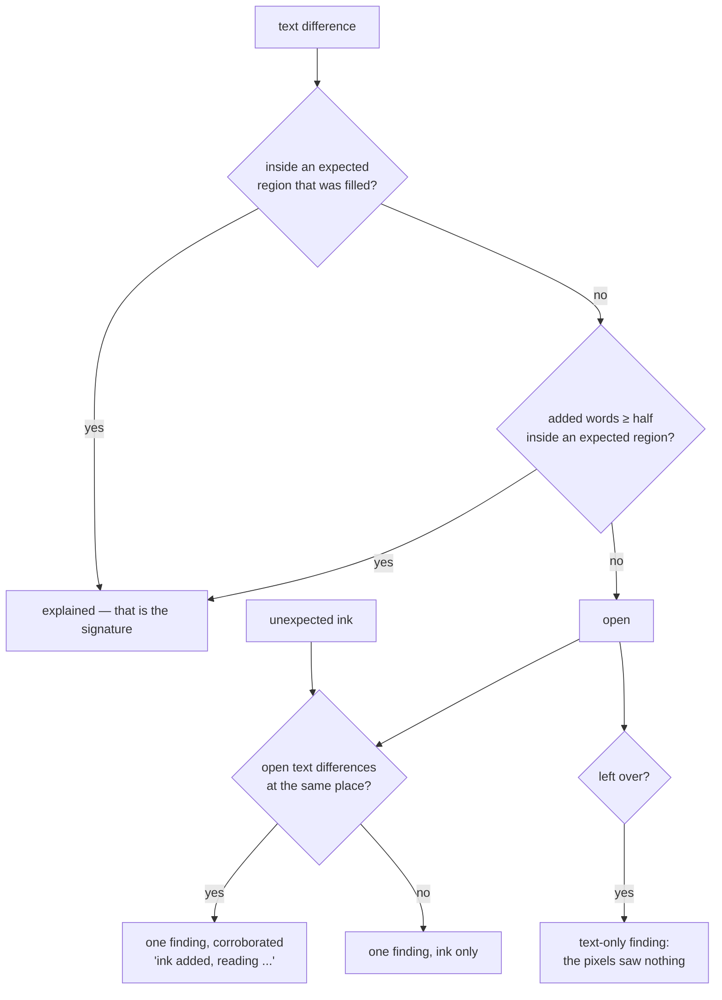
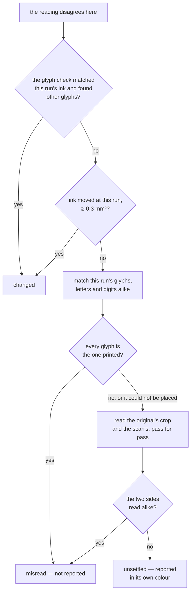
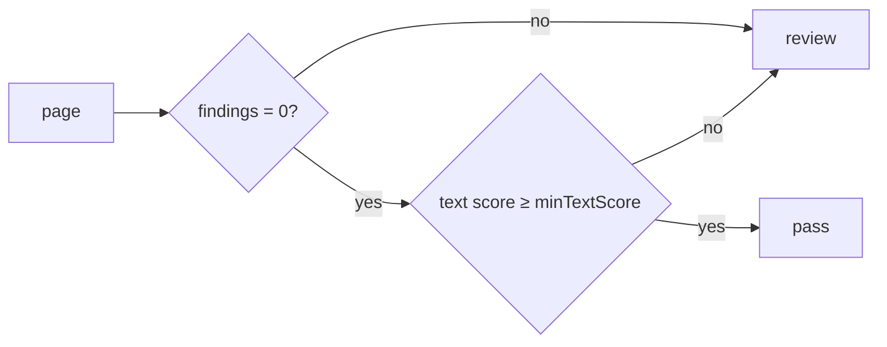
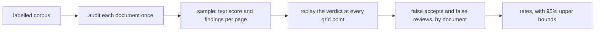

# How `@scanmate/audit` decides

Two comparisons, each blind where the other sees, and one verdict.

*The [IRS Form W-9](https://www.irs.gov/pub/irs-pdf/fw9.pdf) (public domain),
filled in, signed, scanned — and then one printed digit of the account number
replaced by another of the same run. One red box: the altered figure, the only
thing on the page anything is being accused of. Four olive boxes: runs the
reading disagreed about that nothing could settle either way. Five further
disagreements are not drawn at all — they were settled as misreadings.*

## Why both comparisons

| change | the reading sees it | the ink sees it |
|---|---|---|
| a digit altered: `9087` → `9987` | ✓ figures are matched glyph by glyph | ✗ the new glyph is the document's own ink |
| a signature, a stamp, a tick | ✗ it is not writing | ✓ ink where none was |
| a field left empty or blacked out | – | ✓ |
| a paragraph removed | ✓ runs missing | ✓ ink lost |

Neither is sufficient, and neither is authoritative. Running both, merging what
they agree on and **settling what they disagree about** is the whole idea of
this package.

Required content is not here. Whether the *original* says what it was supposed
to say is a question no comparison of two copies can answer — issue a different
form, return a faithful scan of it, and every check on this page passes. That
is `@scanmate/find`'s question, asked separately, of the reading this returns.

## The shape of it

Per page, the two comparisons start together. The engine reads in its own
worker while the masks are built here, so the pair costs about what one did.

## Correlating by place

The two comparisons report in the same coordinates — PDF points on the
original's canvas — so a finding from each at the same place is one event seen
twice, not two events.

Overlap is judged with 1.5 points of slack, which is about one stroke width at
scan resolution.

### Settling a disagreement

The rule above leaves the case that produces red boxes over text a reviewer can
see is identical. OCR misreads small, faint and sideways print constantly:
`W-9` comes back as `W 2] 9`, `I am` as `1am`. Nothing changed on the paper;
the reader simply failed.

So a leftover difference is not reported on the reading's word alone. It is put
to the ink at its own run, and if the ink says nothing moved, to a second
reading of both sides:

**The glyph match comes before the re-reading** because it is the better
instrument and the cheaper one: it asks *are these the same glyphs?* of the ink
itself, where re-reading asks an engine what it sees and hopes the answer is
stable. The match itself belongs to `@scanmate/ocr`, and
[its documentation shows the whole of it in pictures](https://github.com/russoedu/scanmate/blob/main/packages/ocr/documentation/print-verification.md)
- which way round the print is, where one character ends and the next begins,
what each glyph is compared against, and what a refusal looks like. It settles the W-9's certification line — fifty-two characters the
reading mangled into `1am` — in about 120 ms.

**It may clear a run; it may not condemn one.** Swept over 327 runs of four real
documents it called about one in eighty changed that had not changed, a `t` read
as a `k`. That is a fine rate for dismissing an argument and a disgraceful one
for starting it, so a glyph that fails to match sends the run on rather than
reporting it. Digits keep their own verdict, from the page-wide figures check,
which has made no false call on any scan measured here.

**Why compare the two readings with each other** rather than with the text
layer: a systematic misreading — a face, a size, a resolution the engine handles
badly — misreads the *original* exactly as it misreads the scan. It cancels.
Both sides come back wrong in the same way, and wrong in the same way means the
same glyphs. A real change does not cancel, because only one side carries it.

**Only agreement clears a run; disagreement never condemns one.** That asymmetry
is a correction. An earlier version of this table also asked *does the original's
crop read as printed?* and called the run changed when it did — but the original
is a clean render and the scan has been through a printer, a sheet of paper and
a scanner, so it reads as printed almost always. On the returned W-9 that branch
called three runs changed, of which two were `I am` read as `1am` and `FormW9`
read as `FormW3.`, with nothing whatever having happened to either.

**A steady disagreement is not the same as an unsteady one.** Three passes a
side, each side internally unanimous, the two differing, is a different state
from passes that wander — `380.00`, `380.90`, `38O.00`. A degraded read wavers
because the engine is guessing at damaged ink; a substituted glyph does not,
because it is a different character and reads like one every time. The
settlement records which it saw as `steady`, and says so in the finding.

It does not change the verdict, and deliberately: a blemish in the same place on
every pass reads consistently too, so steadiness is a signal and not a proof. A
caller who knows their own documents can act on it; this package will not. On
the returned W-9 none of the unsettled runs are steady — `W 2] 9` and
`® | page on` are exactly the wandering kind.

**And "we could not tell" is reported as itself.** The alternative is to keep
changing the reading until the two agree, which finds agreement whether or not
it is there: on a 93 dpi scan, accepting a run on a single agreeing pass cleared
4 of 61 forged digits. Three passes a side, two must agree, and what is left
over is a finding of its own kind — `text-unsettled`, drawn in olive.

On the returned W-9 above, ten disagreements: six settled as misreadings — five
because both sides read alike, one because its glyphs matched — three unsettled,
and one changed, the forged digit. The three that remain are unsettleable on
this document rather than unlucky: two are printed up the margin, where the page
prints too little sideways text to offer rivals, and one is in a face the page
uses nowhere else.

What this leaves uncovered is a change too small to move 0.3 mm² of ink in a run
the glyph check does not cover; it checks figures, not letters. Such a run lands
in `unsettled`, which is reported, so it is looked at rather than dismissed.

## The verdict

The second condition is the one that is easy to leave out and dangerous to
leave out. A 93-dpi scan can read so poorly that *finding nothing* proves
nothing: silence from a comparison that cannot see is not evidence of absence.
Such a page goes to review with a reason that says exactly that — "the text
reads too poorly to trust (score 0.66 below 0.85): changes may have gone
unseen".

A document passes only when every page passes.

## Findings

| kind | meaning |
|---|---|
| `unexpected-mark` | Ink added where nothing was expected. |
| `missing-ink` | Printed ink the scan lost. |
| `text-changed` / `text-missing` / `text-added` | The reading disagrees, and the ink or the glyph check agrees that something moved. |
| `text-unsettled` | The reading disagrees, the ink at that run is identical, and reading both sides again could not settle it. |
| `expected-empty` / `expected-overfilled` | A field left empty, or covered rather than filled in. |

Each carries its place in points, a one-sentence summary, and the evidence
behind it — the text differences, the pixel change — so a report can quote
numbers rather than adjectives.

## The evidence page

Three panels, the same places boxed on each, because a reviewer is asking three
different questions and one image cannot answer them in one colour scheme:

| panel | question | what it draws |
|---|---|---|
| the original | **where** is the question? | every checked place, all in one colour |
| the aligned scan | **what** is the answer? | each place in the colour of its verdict |
| the overlay | **why** should I believe it? | violet where the ink differs, grey where it agrees |

The third panel is what makes a red box arguable rather than an accusation: a
reviewer can see for themselves that the ink under it is grey — the same ink,
in the same place — and that only the reading differed. It carries no verdicts
of its own; repeating the middle panel's answers on it would turn the one
independent piece of evidence into a restatement of the other two.

It is worth knowing what that panel *cannot* show. A printed digit replaced by
another of the same size moves about **0.11 mm²** of ink, measured, nearly all
of it inside the band that forgives misregistration — so a forged figure appears
there as grey. That is why the glyph check exists, and why a finding never
depends on the pixels agreeing.

| colour | on the original | on the scan |
|---|---|---|
| blue `#0017FC` | every place being asked about | |
| green `#00FC11` | | a field that was filled in |
| red `#FC0027` | | a field left empty or covered, or a run that changed |
| pink `#F500FC` | | the band where ink still counts as a field's |
| orange `#FF8A00` | | ink added where nothing was expected |
| cyan `#00C8FC` | printed ink the scan lost | the same place, where it is not |
| olive `#C8A000` | | read differently, ink identical, nothing could settle it |

The left panel deliberately carries **one** colour. A verdict belongs to the
returned copy, not to the document that asked the question, and colouring both
sides by verdict invites a reviewer to read the original as though it were also
at fault.

A legend runs along the foot, drawn from a 5x7 bitmap font carried in
`@scanmate/ink` rather than a font file: an evidence page whose legend silently
vanished in a container with no fonts installed would be worse than a plain one.
Turn it off with `legend: false`.

Side by side rather than a crop, because the question a reviewer is answering is
"is this line as it was printed?", which needs both lines in view.

## Calibration

The verdict is a decision rule with thresholds in it, and a threshold is a
claim about a corpus: that at this value, altered documents are caught and
genuine ones are not. `calibrateAudit` checks that claim against documents
someone has labelled by hand.

**Audit once, sweep many times.** Auditing is the slow part - the reading, the
pixel comparison, the settled disputes. What a threshold decides on is a few
numbers per page: the text score, and each finding's kind, its ink area when it
is a mark added or lost, and whether the reading saw words there. That sample
is plain data, so a corpus audited overnight can be swept again in milliseconds
with any thresholds.

**The replay is the verdict.** A page goes to review when its text score is
below `minTextScore`, or when some finding counts. A mark added counts when its
area reaches `minChangeArea`, ink lost when it reaches `minMissingArea`, and a
mark the reading saw words in always counts - an overwritten figure can be
small. Every other finding always counts. It is the audit's own rule, applied
to what the audit reported.

**Raise, never lower.** The pixel comparison reports nothing below its own area
thresholds, so a sweep cannot know what a lower one would have seen. Grid
values below what any sample ran with are dropped and listed as unreachable.

**By document, with a bound.** Both mistakes are counted per document, because
a document is accepted whole. Each rate carries the upper end of its 95% Wilson
score interval: with no false accept among n altered documents it is about
3.84 / (n + 3.84), so 20 documents vouch for no better than 16% and it takes
about 75 to get under 5%. The rate that matters for automatic acceptance is
the false accept rate's bound, not the rate.

**The best point is only a candidate.** It is the one with no false accept and
the fewest false reviews - on the corpus it was chosen from. Confirm it on
documents it was not chosen on before relying on it.

## Constants

| option | default | |
|---|---|---|
| `minTextScore` | `0.85` | Below this a page cannot pass, findings or not. |
| `expected` | none | Regions where a change is expected, in points. |
| `ocr` / `diff` | their own defaults | Passed straight through. |
| `settle.quorum` | `2` | Readings that must agree before a side is believed. |
| `settle.passes` | 400, 400 stretched, 600 stretched | How each side is read when a dispute is settled. |
| `settle.maxDisputes` | `40` | Disputes re-read per page; beyond it they are unsettled. |
| `output` | `'png'` | Encoding of the evidence page. |
| — | `1.5` pt | Slack when deciding two boxes are the same place. |
| — | `0.3` mm² | Ink at a text difference below which the print counts as identical. A glyph of 9 pt text covers roughly 1 mm², so a changed character moves several times this; scanner grain does not. |
| `bleed` | `6` pt | How far outside a region its ink still counts - a signature leaves its box. Set per side with `bleedTop`, `bleedRight`, `bleedBottom`, `bleedLeft`. Passed through `diff` options and drawn on the evidence page with the same rule. |

## What it does not do

- It does not decide what happens next. `pass` and `review` are statements
  about the document, not about a workflow.
- It does not rank findings by severity. A stray tick and a changed total are
  both reported; which matters is the caller's judgement.
- It does not look at anything but the two documents it was given, and it does
  not check that the original says what it should. That is `@scanmate/find`.
- It does not treat a reading as evidence on its own, and it does not treat a
  disagreement between the two comparisons as evidence either. What it cannot
  settle it reports as unsettled rather than deciding.
