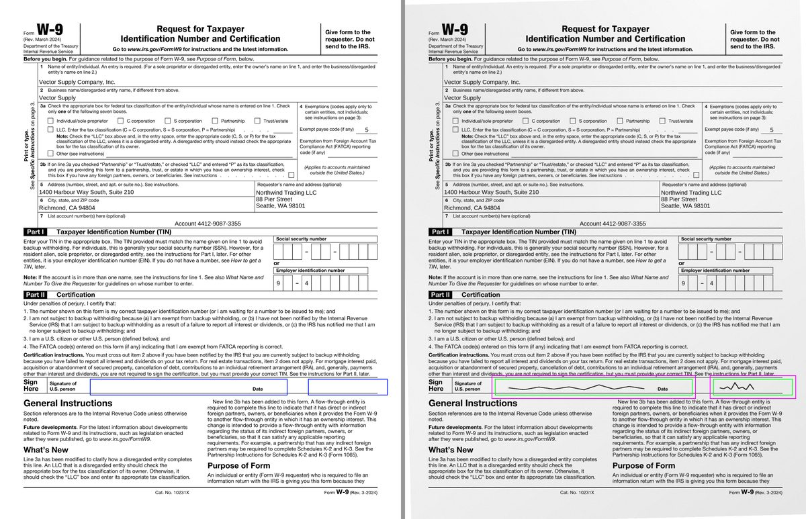

# `@scanmate/diff`

What changed between an original and its aligned scan: which expected regions were filled in, what ink was added where nothing was expected, what printed ink the scan lost — and a picture of all three.



*Green: a field that was filled in. Orange: the band around it where ink still counts as that field's. Made from the [IRS Form W-9](https://www.irs.gov/pub/irs-pdf/fw9.pdf) (a work of the United States government, in the public domain): filled in as a generator would, printed, signed by hand and scanned crooked.*

## Install

```bash
npm install @scanmate/diff @scanmate/extract @scanmate/align
```

```ts
import { alignPages } from '@scanmate/align'
import { diffPages } from '@scanmate/diff'
import { extractPair } from '@scanmate/extract'

const { pages } = await extractPair({ original: 'fw9-issued.pdf', scanned: 'fw9-returned.pdf' })
// The W-9's signature row, measured off the form in points from the page's top-left.
const changes = await diffPages(await alignPages(pages), [
  { page: 1, id: 'signature', x: 120, y: 577, width: 262, height: 22 },
  { page: 1, id: 'date',      x: 404, y: 577, width: 171, height: 22 },
], { sideBySide: true })

// Every page comes back carrying its comparison, so nothing has to be matched
// up again by index - and everything the page already had is still on it.
changes[0].diff.expected     // [{ id, identified, addedInk, overfilled, ink: { ... } }]
changes[0].diff.unexpected   // [{ x, y, width, height, inkArea, pixels }]
changes[0].diff.missing      // printed ink the scan lost
changes[0].diff.diffImage    // the overlay: violet where the ink differs, grey where it agrees
changes[0].aligned.raster    // still the page you handed in
```

Rectangles are in PDF points from the page's top-left by default, the same frame `@scanmate/extract` reports text in; `units: 'pixels'` switches to the original's rendered pixels.

## What it measures

- **Ink, not brightness.** Both pages are divided by their own local background before anything is compared, so a shadow or a grey scanner lid takes no part.
- **In square millimetres, not shares of a box.** A signature is a few tens of mm² whether its box is a stamp or the width of the page, and the same mark is four times the pixels at twice the resolution.
- **Two thresholds on the scan.** A normal one for what counts as *added*, and a faint one at a quarter of it for what is *still there at all*. Printed ink counts as lost only where the scan shows nothing even at the lower bar: a pale photocopy has lighter ink, not missing ink.
- **Tolerance for the alignment.** The original's ink is fattened by `tolerance` (2 px) before subtraction, so stroke edges do not become a halo of confetti. A change that stays inside that band cannot be seen here — a digit swapped for another digit is exactly such a change, which is why `@scanmate/ocr` matches figures glyph by glyph.

## Deciding a region

A region is **identified** when it has at least `minFillArea` (2 mm²) of new ink and is not **overfilled** — covered or struck through, which `maxFill` (0.5) draws the line on. Form rules showing through a slight misregistration are discounted: a component spanning 90% of the region and no thicker than 0.6 mm is the box's own printed line.

People sign past the box they are given, so each region also claims the ink within its **bleed** - 6 points on every side unless told otherwise - and the regions claim it **together**, so one stroke running through two fields is not left over as an unexpected mark. What a region reports is still the rectangle it was given; the band is drawn in pink.

The bleed can be set per side: `bleed` for all four, and `bleedTop`, `bleedRight`, `bleedBottom` or `bleedLeft` to override one. A signature descends more than it climbs, so `{ bleedTop: 2, bleedBottom: 12 }` keeps a field clear of the printed line above it and gives the pen room below. `Scanmate.mark` in `@scanmate/scan` draws exactly this band on the original, so a region can be checked before anything is measured with it.

Each region reports its shape too — how many separate changes, the largest, the bounds as a share of the box, how much ink touches the border — so a signature can be told from a stray line without looking at the picture.

## Checkboxes

A form is full of boxes, and the question about each is plain: ticked or not. It is not the question an expected region answers - a region asks whether ink was *added*, so a box ticked before the form was issued reads as untouched, and an empty one, often the right answer, reads as a field someone forgot. `readCheckboxes` reads each side on its own:

```ts
import { readCheckboxes } from '@scanmate/diff'

const boxes = await readCheckboxes(alignedPages, [
  { page: 1, id: 'consent',    x: 36, y: 612, width: 13, height: 13, expect: 'ticked' },
  { page: 1, id: 'newsletter', x: 36, y: 640, width: 13, height: 13 },
])
boxes[0].scanned     // { state: 'ticked', ink: 1.8, fill: 0.31 }
boxes[0].satisfied   // true: it shows what it must
boxes[1].changed     // whether the scan's state differs from the original's
```

- **Past the frame.** A fifth of the box's side is set aside all round (`inset`), so the printed square - and a pixel or two of misalignment - is never a mark.
- **Three states.** `empty`; `ticked` for any mark of at least `minTickArea` (0.6 mm²) - a tick, a cross, a dot; `struck` once half the inside is inked, because a box blacked out or scribbled over gives no answer that can be read.
- **Both sides.** A box ticked on the original and on the scan is not a change; one ticked on the original and empty on the scan is.
- **`expect`** says what the returned document must show; `satisfied` says whether it does.
- **Groups.** `checkGroups(readings, groups)` judges boxes answered together - `'exactly-one'`, `'at-least-one'` or `'at-most-one'` ticked. A box inked over is no answer, so a group holding one is not satisfied; a group whose boxes were not all read is left unjudged.

Measured on synthetic scans at 150 dpi in 4.6 mm boxes: a 0.34 mm pen tick leaves 0.75-1.8 mm² inside the box, mid-grey to dark; an empty box under sensor noise far past a real scanner's, at most 0.23 mm², and none at all through ordinary noise or a 2-pixel misalignment. A very light stroke - soft pencil, about a third grey - can fall under the threshold.

## Options

| option | default | |
|---|---|---|
| `units` | `'points'` | Or `'pixels'`. |
| `tolerance` | `2` px | How much misregistration is forgiven. |
| `faintInk` | `0.25` | Fraction of the normal threshold for "still there". |
| `minFillArea` | `2` mm² | New ink a region needs. |
| `maxFill` | `0.5` | Above this the region is covered, not filled. |
| `bleed` | `6` pt | How far outside a region its ink may lie, every side. `bleedTop`, `bleedRight`, `bleedBottom` and `bleedLeft` override one side. |
| `formLineSpan` | `0.9` | Span that makes a component a printed rule... |
| `formLineThickness` | `0.6` mm | ...if it is no thicker than this. |
| `minChangeArea` | `1` mm² | Smallest change reported. |
| `minMissingArea` | `4` mm² | Smallest loss reported. |
| `mergeGap` | `3` mm | Boxes closer than this become one. |
| `regionOverlap` | `0.5` | Share of a change's ink that must fall inside a region. |
| `maxChanges` | `50` | Cap on a confetti page; the report says it was capped. |
| `assumeDpi` | `150` | Used when the page does not say. |
| `output` | `'png'` | `'none'` keeps rasters only. |
| `annotate` | `false` | Draw the report onto the overlay. |
| `sideBySide` | `false` | Also compose the two pages side by side. |
| `probes` | none | Rectangles to measure the ink at, changed or not - added, lost and shared, in mm². |
| `keepMasks` | `false` | Keep the ink masks on the result, so `probeInk` can ask about places found later. |

## Building blocks

`buildMasks`, `connectedComponents`, `labelComponents`, `mergeBoxes`, `measureRegionInk`, `annotateOverlay`, `composeSideBySide`, `compareRegions`, `diffDocument` and `renderDiff` are exported for callers who want a stage on its own, along with the annotation colours.

## How it decides

[`documentation/algorithms.md`](./documentation/algorithms.md) has the algorithms in full: what each step measures, the decision flows, every constant with the measurement behind it, and what the package deliberately does not do.
