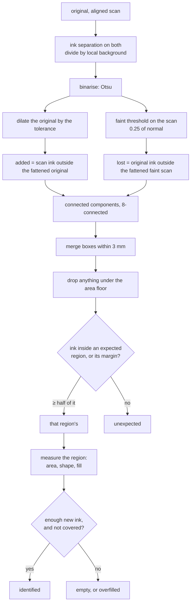
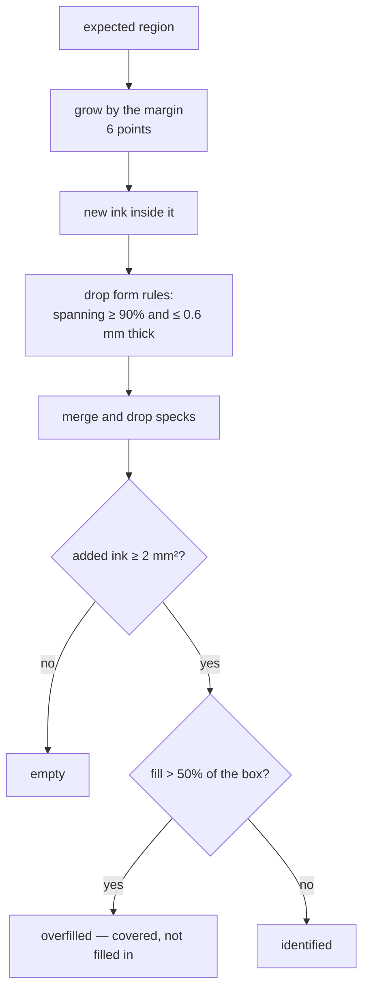
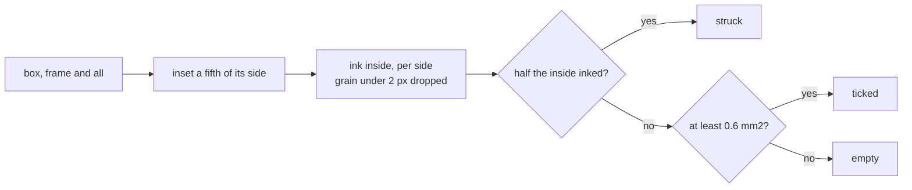

# How `@scanmate/diff` decides

Two questions, both about ink:

1. **Was the box at (x, y) filled in?** — a signature, a date, initials.
2. **Did anything else change?** — a mark added, a clause struck out, a
   paragraph that went missing.

Both are asked of a scan already aligned onto the original's canvas, so that a
rectangle in PDF points means the same place on both.


*Made from the [IRS Form W-9](https://www.irs.gov/pub/irs-pdf/fw9.pdf) (public
domain): filled in, printed, signed and scanned crooked. Blue: the place in
question, as the original poses it. Green: a field that was filled in. Pink: the
band around it where ink still counts as that field's. Orange would mark ink
nobody expected, cyan printed ink the scan lost.*

## The shape of it



## Ink, not brightness

Both pages go through `inkMap`: divide by a local background (an integral-image
box mean), so a shadow, a grey lid or a phone photo's uneven light flattens
out. Then Otsu picks the threshold per page.

Two thresholds are taken on the scan:

- the **normal** one, for what counts as *added*;
- a **faint** one at 0.25 of it, for what is *still there at all*.

Printed ink counts as lost only where the scan shows nothing even at the faint
bar. A photocopy that came out pale has lighter ink, not missing ink; an erased
word leaves bare paper, which fails both.

## Tolerance: how a warp is forgiven

The original's mask is fattened by `tolerance` (2 px) before subtraction. No
alignment is perfect to the pixel, and without this every stroke edge on the
page would be "added ink" — a halo of confetti around every letter.

The cost is real and worth stating: a change that stays inside that band cannot
be seen here. A digit replaced by another digit of the same size is exactly such
a change, which is why `@scanmate/ocr` matches figures glyph by glyph instead.

## From pixels to findings

Connected components (8-connected, union-find over a flat `Int32Array`) turn
changed pixels into boxes. Boxes within `mergeGap` (3 mm) are merged, so the
strokes and dots of one signature become one finding rather than forty.

Then the floors, all in **square millimetres of actual ink**, not in share of a
box:

| floor | default | why |
|---|---|---|
| `minChangeArea` | 1 mm² | Below this it is scanner grain. Measured: the largest noise speck on real scans came to 0.31–0.85 mm² after merging. |
| `minMissingArea` | 4 mm² | Lost ink needs more evidence than added ink: thin printed rules drop out easily. |
| `minFillArea` | 2 mm² | New ink a region needs to count as filled in. A tick is about 5 mm², initials a little more. |

Physical units matter here. The same mark is four times the pixels at twice the
resolution, and a share-of-the-box rule calls a signature in a page-wide box
"empty" while calling a speck in a tiny box "signed".

## Deciding an expected region



**The bleed** (6 points ≈ 2 mm on every side unless told otherwise) is there
because people sign past the box they are given: a descender below the rule, a
flourish out to the side. Without it that ink is reported as a mark nobody
expected. Regions claim ink **together**, so one stroke running through two
fields is not left over as unexpected either. What a region *reports* is still
the rectangle it was given; the band is drawn in pink on the overlay so a
reviewer can see the allowance.

**It is set per side, because a pen does not overshoot evenly.** `bleed` sets all
four; `bleedTop`, `bleedRight`, `bleedBottom` and `bleedLeft` each override one.
It used to be one uniform number, and drawing that uniform band on the W-9 shows
why that was not enough: six points above the signature field runs straight
through the printed line that ends *"See the instructions for Part II, later"*.
Harmless to detection - that ink is the original's, so it never counts as added
- but it is a region claiming ground it has no business in, while the same six
points below leaves a descender short. `{ bleedTop: 2, bleedBottom: 12 }` fits the
field. Leaving every side unset reproduces the old uniform six exactly.

**One rule decides it everywhere.** The bleed is resolved by `resolveBleed` in
`@scanmate/ink`, and the same function sizes the band the comparison measures,
the band the evidence page draws, and the band `Scanmate.mark` draws on the
original. They cannot drift apart, which is the point of a band a reviewer is
shown: it is the band that was checked.

**Form rules are discounted**: a component spanning at least 90% of the region
and no thicker than 0.6 mm is the box's own printed rule showing through a
slight misregistration, not a signature.

**Overfilled** is its own answer. A field blacked out or struck through has
plenty of new ink and is not a field that was filled in; `maxFill` (0.5) draws
that line, and the finding says "covered, not filled in".

Each region also reports its shape — how many separate changes, the largest,
the bounds as a share of the box, how much of the ink touches the border — so a
caller can tell a signature from a stray line without looking at the picture.

## Probes: measuring ink where nothing changed

Everything above starts from a change and asks where it is. `probes` asks the
opposite question — *how much ink is here?* — at rectangles the caller names,
changed or not, and answers with added, lost and shared ink in square
millimetres.

It exists for one job: settling whether a reading that disagrees is a change or
a misreading. OCR mangles small, faint and sideways print, and a reader's
disagreement is not evidence that the paper differs. `@scanmate/audit` puts
every text difference the pixels did not already account for through here, as
the first step of settling it.

Two ways in. `probes` takes the rectangles up front, when the caller already
knows where to ask. When it does not — and it usually does not, because the
places worth asking about are the ones the *reading* disputes, and the reading
runs alongside this rather than before it — `keepMasks` leaves the ink masks on
the result and `probeInk` asks afterwards:

```ts
const page = await diffPage(aligned, expected, { keepMasks: true })
const probes = probeInk(page.masks, differences, { dpi: 150 })
probes[0]         // { rect, addedInk: 0.04, lostInk: 0.02, sharedInk: 12.8 }
page.masks = null // four binary images the size of the page; drop them when done
```

A probe is measured on the same masks as everything else, so it is forgiven the
same misregistration and reads in the same units.

## The overlay and the panels

The overlay is the picture of the comparison itself: violet (`#7F00FC`) where
the two pages' ink differs — added by the scan or lost from the print — and grey
where they agree. Violet rather than red because red means "changed" everywhere
else in the palette, and one colour cannot mean two things on the same page.

One colour for both directions is deliberate. Which side the ink came from is a
question for the report, where `added` and `missing` are listed separately and
measured in millimetres; on the picture it would be a second colour carrying a
distinction the eye does not need at this zoom. With `annotate`, the report is
drawn on it in the palette the whole pipeline shares:

| colour | meaning |
|---|---|
| blue `#0017FC` | the place in question, as the original poses it |
| green `#00FC11` | a region filled in |
| red `#FC0027` | a region left empty or covered, a figure or content that changed |
| pink `#F500FC` | the margin band where ink still counts as a region's |
| orange `#FF8A00` | ink added where nothing was expected |
| cyan `#00C8FC` | printed ink the scan lost |

`sideBySide` puts the original and the aligned scan next to each other with the
same places boxed on both halves — not "what changed" in the abstract, but
"here is the line as printed, and here is the line as it came back". The
original's half is drawn in blue alone: a verdict belongs to the copy that came
back, not to the document that asked the question.

`composePanels` is the same machinery with the count left open, which is how
`@scanmate/audit` adds the overlay itself as a third panel.

## Reading a checkbox



A checkbox is read, not compared. The original's ink mask and the scan's are
each measured inside the box, past its frame, and each side gets a state of its
own. Measuring the *added* ink instead - which is what an expected region does -
cannot tell a box ticked before issue from an untouched one, and has no answer
for a box whose tick was erased.

The scan's mask is its normal-threshold one, not the faint one. The faint mask
sees a hairline the normal one misses, but it also turns heavy sensor noise into
0.6-0.8 mm² of speckle inside an empty box - enough to invent a tick.

## Constants

| option | default | |
|---|---|---|
| `units` | `'points'` | Rectangles in and out. |
| `tolerance` | `2` px | How much misregistration is forgiven. |
| `faintInk` | `0.25` | Fraction of the normal threshold for "still there". |
| `minFillArea` | `2` mm² | New ink a region needs. |
| `maxFill` | `0.5` | Above this the region is covered, not filled. |
| `bleed` | `6` pt | How far outside a region its ink may lie, every side. `bleedTop`, `bleedRight`, `bleedBottom` and `bleedLeft` override one side. |
| `formLineSpan` | `0.9` | Span that makes a component a rule. |
| `formLineThickness` | `0.6` mm | ...if it is no thicker than this. |
| `minChangeArea` | `1` mm² | Smallest change reported. |
| `minMissingArea` | `4` mm² | Smallest loss reported. |
| `mergeGap` | `3` mm | Boxes closer than this become one. |
| `regionOverlap` | `0.5` | Share of a change's ink that must fall inside a region. |
| `maxChanges` | `50` | Cap on a confetti page; the report says it was capped. |
| `assumeDpi` | `150` | Used when the page does not say. |
| `probes` | none | Rectangles to measure the ink at, changed or not. |
| `keepMasks` | `false` | Keep the ink masks on the result, for `probeInk` afterwards. |

## What it does not do

- It does not read. A changed digit of the same size is invisible here by
  construction — that is `@scanmate/ocr`'s print check.
- A probe reports ink, not meaning. That the ink is identical says the
  characters are identical; it says nothing about whether they are the right
  characters, which is what the reading is for.
- It does not align. Both images must already be on one canvas; it refuses
  mismatched sizes rather than guessing.
- It does not judge a document. It reports what changed and where;
  `@scanmate/audit` merges that with the reading and reaches a verdict.
