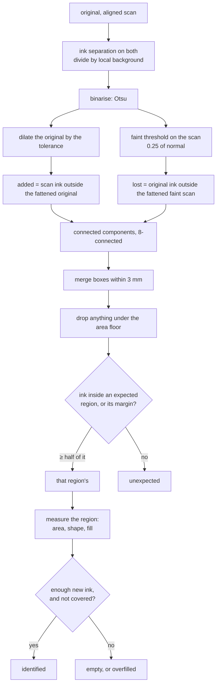
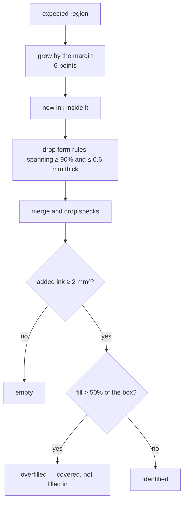

# How `@scanmate/diff` decides

Two questions, both about ink:

1. **Was the box at (x, y) filled in?** — a signature, a date, initials.
2. **Did anything else change?** — a mark added, a clause struck out, a
   paragraph that went missing.

Both are asked of a scan already aligned onto the original's canvas, so that a
rectangle in PDF points means the same place on both.

*Made from the [IRS Form W-9](https://www.irs.gov/pub/irs-pdf/fw9.pdf) (public
domain): filled in, printed, signed and scanned crooked. Green: a field that
was filled in. Orange: the band around it where ink still counts as that
field's. Magenta would mark a change nobody expected, blue printed ink the scan
lost.*

## The shape of it

## Ink, not brightness

Both pages go through `inkMap`: divide by a local background (an integral-image
box mean), so a shadow, a grey lid or a phone photo's uneven light flattens
out. Then Otsu picks the threshold per page.

Two thresholds are taken on the scan:

- the **normal** one, for what counts as *added*;
- a **faint** one at 0.25 of it, for what is *still there at all*.

Printed ink counts as lost only where the scan shows nothing even at the faint
bar. A photocopy that came out pale has lighter ink, not missing ink; an erased
word leaves bare paper, which fails both.

## Tolerance: how a warp is forgiven

The original's mask is fattened by `tolerance` (2 px) before subtraction. No
alignment is perfect to the pixel, and without this every stroke edge on the
page would be "added ink" — a halo of confetti around every letter.

The cost is real and worth stating: a change that stays inside that band cannot
be seen here. A digit replaced by another digit of the same size is exactly such
a change, which is why `@scanmate/ocr` matches figures glyph by glyph instead.

## From pixels to findings

Connected components (8-connected, union-find over a flat `Int32Array`) turn
changed pixels into boxes. Boxes within `mergeGap` (3 mm) are merged, so the
strokes and dots of one signature become one finding rather than forty.

Then the floors, all in **square millimetres of actual ink**, not in share of a
box:

| floor | default | why |
|---|---|---|
| `minChangeArea` | 1 mm² | Below this it is scanner grain. Measured: the largest noise speck on real scans came to 0.31–0.85 mm² after merging. |
| `minMissingArea` | 4 mm² | Lost ink needs more evidence than added ink: thin printed rules drop out easily. |
| `minFillArea` | 2 mm² | New ink a region needs to count as filled in. A tick is about 5 mm², initials a little more. |

Physical units matter here. The same mark is four times the pixels at twice the
resolution, and a share-of-the-box rule calls a signature in a page-wide box
"empty" while calling a speck in a tiny box "signed".

## Deciding an expected region

**The margin** (`expectedMargin`, 6 points ≈ 2 mm) is there because people sign
past the box they are given: a descender below the rule, a flourish out to the
side. Without it that ink is reported as a mark nobody expected. Regions claim
ink **together**, so one stroke running through two fields is not left over as
unexpected either. What a region *reports* is still the rectangle it was given;
the band is drawn in orange on the overlay so a reviewer can see the allowance.

**Form rules are discounted**: a component spanning at least 90% of the region
and no thicker than 0.6 mm is the box's own printed rule showing through a
slight misregistration, not a signature.

**Overfilled** is its own answer. A field blacked out or struck through has
plenty of new ink and is not a field that was filled in; `maxFill` (0.5) draws
that line, and the finding says "covered, not filled in".

Each region also reports its shape — how many separate changes, the largest,
the bounds as a share of the box, how much of the ink touches the border — so a
caller can tell a signature from a stray line without looking at the picture.

## The overlay and the side-by-side

The overlay is the classic three-colour picture: red where ink was added, blue
where it was lost, grey where the two agree. With `annotate`, the report is
drawn on it — green for a region filled in, amber for one left empty, orange for
the margin band, magenta around every unexpected change.

`sideBySide` puts the original and the aligned scan next to each other with the
same boxes on both halves, which is what a reviewer actually wants: not "what
changed" in the abstract, but "here is the line as printed, and here is the line
as it came back".

## Constants

| option | default | |
|---|---|---|
| `units` | `'points'` | Rectangles in and out. |
| `tolerance` | `2` px | How much misregistration is forgiven. |
| `faintInk` | `0.25` | Fraction of the normal threshold for "still there". |
| `minFillArea` | `2` mm² | New ink a region needs. |
| `maxFill` | `0.5` | Above this the region is covered, not filled. |
| `expectedMargin` | `6` pt | How far outside a region its ink may lie. |
| `formLineSpan` | `0.9` | Span that makes a component a rule. |
| `formLineThickness` | `0.6` mm | ...if it is no thicker than this. |
| `minChangeArea` | `1` mm² | Smallest change reported. |
| `minMissingArea` | `4` mm² | Smallest loss reported. |
| `mergeGap` | `3` mm | Boxes closer than this become one. |
| `regionOverlap` | `0.5` | Share of a change's ink that must fall inside a region. |
| `maxChanges` | `50` | Cap on a confetti page; the report says it was capped. |
| `assumeDpi` | `150` | Used when the page does not say. |

## What it does not do

- It does not read. A changed digit of the same size is invisible here by
  construction — that is `@scanmate/ocr`'s print check.
- It does not align. Both images must already be on one canvas; it refuses
  mismatched sizes rather than guessing.
- It does not judge a document. It reports what changed and where;
  `@scanmate/audit` merges that with the reading and reaches a verdict.
