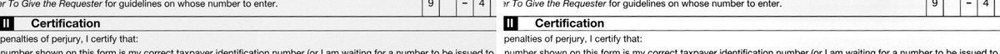
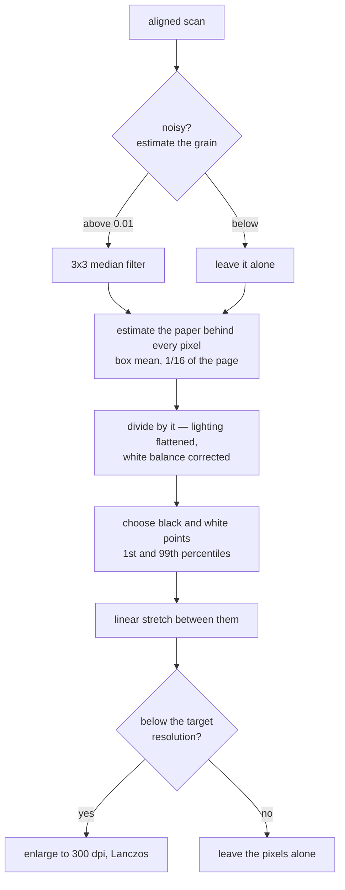

# How `@scanmate/enhance` decides

A scan comes back with the lamp's shadow across one corner, paper that is grey
or yellow rather than white, and text that has lost half its contrast. None of
that is a change to the document, and all of it makes reading harder.

This package answers: **what does this page look like with the scanner taken
out of it?**

*Left: the aligned scan. Right: the same lines enhanced. From the
[IRS Form W-9](https://www.irs.gov/pub/irs-pdf/fw9.pdf) (public domain),
printed, signed and scanned.*

## The shape of it

## Dividing by the paper

The core is one idea: **every pixel is divided by an estimate of the paper
behind it**. That estimate is a box mean a sixteenth of the page wide — far
wider than any stroke, so no letter can pull its own background down, but
narrow enough to follow a shadow's gradient.

The mean is computed from an integral image, so its cost does not grow with the
window, and the window is clipped at the page edge rather than extended: a
scanner's dark border strip must not be allowed to invent dark paper outside the
page.

In colour mode each channel is divided by its own background, which corrects the
white balance as a side effect — yellowed paper goes white while a blue pen
stays blue.

## Choosing the clamp points

After the division, a linear stretch maps the black point to 0 and the white
point to 1. Both are taken from the page's own histogram: the darkest 1% and
the lightest 99%, with a guard (`MAX_RATIO`) so a page that is nearly blank —
where those percentiles nearly touch — is not stretched into noise.

Automatic is the default because it was measured to be better, not assumed:

> OCR word recall on three real returned scans (93, 120 and 144 dpi, 21 pages)
> enlarged to 300 dpi. Automatic clamp points: **0.738** mean, against 0.728
> unenhanced — and the gain is largest where reading is hardest, 0.448 against
> 0.397 at 93 dpi.

## Despeckling, and why it is not on

A 3×3 median filter removes scanner grain. It also erases a stroke one or two
pixels wide, which is what text is at scan resolution:

> Forcing despeckle cost recall at **every** resolution tried, and badly at the
> scans' own: 0.141 against 0.392 at 93 dpi.

So it is `'auto'`: the page's noise is estimated first, and the filter runs only
above `despeckleThreshold` (0.01 on the 0–1 grey scale). The median itself is
exact — a nine-element selection network for interior pixels, not an
approximation.

## Enlarging to 300 dpi

Tesseract is trained near 300 dpi and reads worse below it. Enlarging adds no
information, but it does let the engine's model see the shapes it expects, so a
page below `targetDpi` is resampled up with Lanczos. A page already finer is
left alone: reducing it would throw away what it has.

The enhanced image is for **reading only**. The pixel comparison keeps working
on the aligned scan, because enhancement moves edges by a fraction of a pixel
and a diff is a question about edges.

## Constants

| option | default | |
|---|---|---|
| `backgroundFraction` | `1/16` | Width of the box mean, as a share of the page. |
| `whitePoint` / `blackPoint` | `'auto'` | 99th and 1st percentiles of the page. |
| `mode` | `'color'` | Per-channel division; `'gray'` for one channel. |
| `despeckle` | `'auto'` | Only on a page that measures noisy. |
| `despeckleThreshold` | `0.01` | Noise level that turns it on. |
| `despeckleRadius` | `1` | 3×3 median. |
| `targetDpi` | `300` | Enlarge up to this; never reduce. |

## What it does not do

- It does not deskew or align. That is `@scanmate/align`, and it must happen
  first.
- It does not binarise. Thresholding is the pixel comparison's business, on its
  own terms.
- It does not touch the original. Only the returned scan is enhanced; the
  original is already clean, and "enhancing" both would invent differences.
