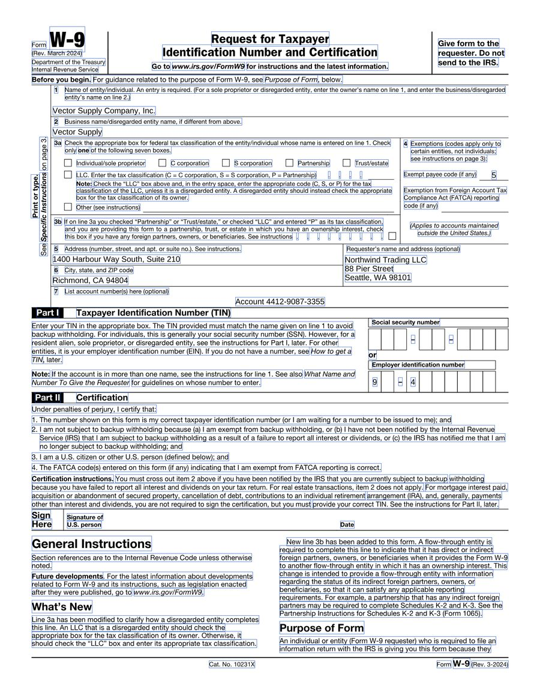

# `@scanmate/extract`

PDF pages as rasters with their metadata: what kind of page it is, what resolution it really holds, and the text layer with every run's place, face and size — and an original paired with its returned scan.



*Each box is one run of the text layer, with the text, face and size it carries: exact, and free. Made from the [IRS Form W-9](https://www.irs.gov/pub/irs-pdf/fw9.pdf) (a work of the United States government, in the public domain), filled in as a generator would.*

## Install

```bash
npm install @scanmate/extract
```

```ts
import { extractPages, extractPair, inspectDocument } from '@scanmate/extract'

// What is in this file, without rendering anything:
const inspection = await inspectDocument('fw9-returned.pdf')
inspection.pages[0].metadata?.kind          // 'vector' | 'scanned' | 'scanned-with-text-layer' | 'empty'
inspection.pages[0].metadata?.effectiveDpi  // what the scan really holds

// One document - the boxes in the picture above:
const pages = await extractPages('fw9-issued.pdf', { dpi: 150 })
pages[0].image.raster                        // decoded RGBA
pages[0].metadata.textItems                  // every run, in points from the top-left

// Or a pair, ready for @scanmate/align:
const { pages: pairs, unpaired } = await extractPair({ original: 'fw9-issued.pdf', scanned: 'fw9-returned.pdf' })
```

## What it decides

- **Whether a page is a scan**, from two signals: how much of the page the image operators actually cover (80% is the line), and whether there is any text. A generated form's letterhead covers 1.2% of the page; every page of three real scans of it covered 100%. A scan with an OCR text layer over it is its own kind, because its text must never be trusted.
- **What resolution to render at.** `'match'` — the default for a pair — renders **both** sides at the scan's own resolution. Measured on real scans at 93, 120 and 144 dpi, that beat every fixed choice from 150 to 300 on alignment confidence, on overlap, on false "added ink", and on time. Rendering the original finer than the scan adds no information; it just makes the two disagree at every stroke edge.
- **What a scan holds when its page is not its paper.** A photo stored at one pixel per point says 72 dpi of itself. Under `'match'` the scan is measured against the *original's* page size, so a 3024 × 4032 picture of an A4 sheet is read as the ~345 dpi it is, and its own pixels are never resampled.

## The text layer

Each run carries its text, its box in points from the page's top-left **as displayed** (after `/Rotate`), its baseline, its font size, pdf.js's name for the face, its angle, and whether it ends a line. The box comes from the font's ascent and descent rather than a guess, which is what lets `@scanmate/ocr` claim read words by position and file glyph templates by face and size.

Only the **original's** text layer is meant to be trusted. A returned document's is reported and never used: it can be stale, or planted, and it is not what the person signing the paper saw.

## Pairing

Scans lose pages and gain cover sheets, so `extractPair` reports what it could pair **and** what it could not, rather than throwing or truncating silently:

```ts
const { pages, unpaired, pageCount } = await extractPair({ original, scanned }, { pairing: 'index' })
unpaired.original   // [7]  - no scanned page for these
unpaired.scanned    // [1]  - a cover sheet, say
```

`pairing` is `'index'`, `'page-number'`, or an explicit list of `[originalPage, scannedPage]`.

## Options

| option | default | |
|---|---|---|
| `dpi` | `'match'` for pairs, `'native'` for one document | Or a number. |
| `fallbackDpi` | `200` | For a page with no native resolution. |
| `minDpi` / `maxDpi` | `72` / `400` | Bounds on a resolution read from a file. |
| `pages` | all | Numbers, or a range string like `'1-3,5'`. |
| `output` | `'png'` | `'jpeg'`, or `'none'` to keep rasters only. |
| `quality` | `92` | For lossy output. |
| `background` | white | PDF pages are transparent where nothing is drawn. |
| `includeText` | `true` | Read the text layer. |
| `pairing` | `'index'` | How scanned pages match original ones. |
| `onProgress` | — | Called before and after each page. |

`extractPairStream` yields pages as they are rendered, for documents too large to hold at once.

## Rendering

Pages are rendered with `pdfjs-dist` onto `@napi-rs/canvas`. The standard-14 fonts ship inside `pdfjs-dist`, so nothing needs system fonts or fontconfig in a container. Both are prebuilt, with no system package to install.

> `pdf.js` detaches the buffer it is given. This package passes a copy; any caller doing its own `getDocument` should too, or it will find its own bytes empty afterwards.

## How it decides

[`documentation/algorithms.md`](./documentation/algorithms.md) has the algorithms in full: what each step measures, the decision flows, every constant with the measurement behind it, and what the package deliberately does not do.
