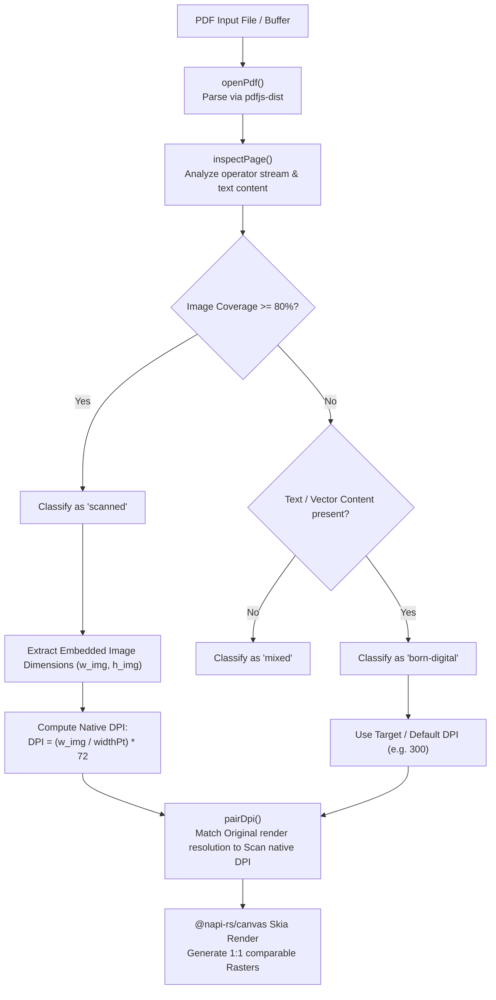
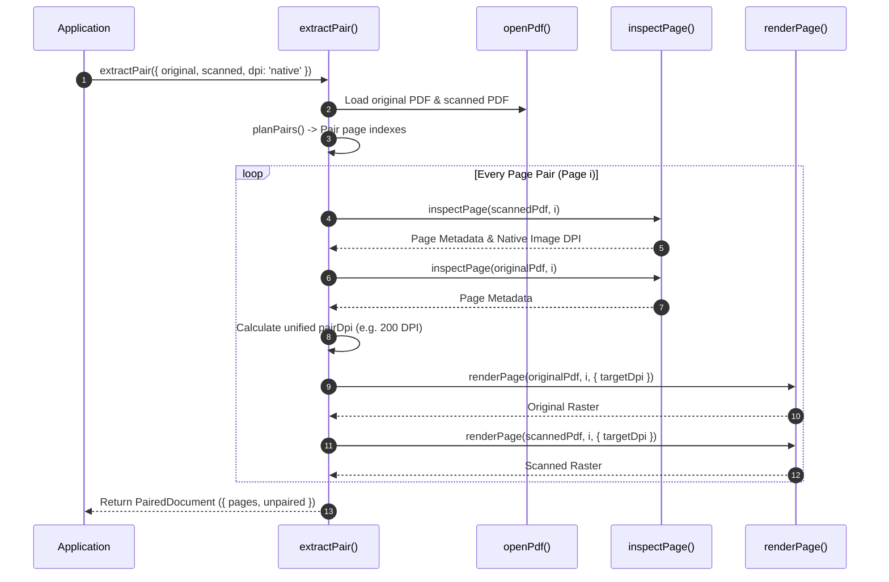

# `@scanmate/extract`

> PDF document parsing, page structure inspection, native DPI determination, and Skia canvas rasterization.

`@scanmate/extract` converts single-page or multi-page PDF documents into pixel-perfect RGBA `Raster` pairs ready for document alignment and comparison. Powered by `pdfjs-dist` for PDF object parsing and `@napi-rs/canvas` (prebuilt Skia bindings) for drawing, it inspects embedded vector layers vs. raster images, automatically determines native scanner DPI, and pairs original templates with incoming scans.

---

## Features

- 📑 **Page Structure Classification (`classifyPage`)**: Inspects PDF operators to determine if a page is `'born-digital'`, `'scanned'`, or `'mixed'` based on image coverage ($>80\%$).
- 📏 **Native DPI Auto-Resolution (`pairDpi`)**: Calculates native DPI of embedded scan streams so both template and scan are rendered at identical 1:1 pixel resolutions.
- 🎨 **Skia Canvas Engine**: Uses `@napi-rs/canvas` for fast, zero-system-dependency PDF vector and image rasterization.
- 🔗 **Document & Stream Pairing (`extractPair`)**: Pairs multi-page original PDFs with returned multi-page scans, supporting custom page ranges and memory-efficient async streams.
- 🧪 **Synthetic PDF Generator (`createSyntheticPdf`)**: Renders vector test PDFs with text, lines, tables, and images for test suites and smoke testing.

---

## Installation

```bash
# Using npm
npm install @scanmate/extract @scanmate/ink

# Using pnpm
pnpm add @scanmate/extract @scanmate/ink

# Using yarn
yarn add @scanmate/extract @scanmate/ink
```

---

## Quick Start

```ts
import { extractPair } from '@scanmate/extract'

const { pages } = await extractPair({
  original: 'template.pdf',
  scanned: 'returned_scan.pdf',
  dpi: 'native',
})
```

---

## Architecture & Algorithm Deep-Dive

### 1. Classification & DPI Resolution Workflow



---

### 2. Document Pair Extraction Sequence (`extractPair`)



---

## Comprehensive API Reference

### 1. Document Extraction & Pairing

#### `extractPair(options: ExtractPairOptions): Promise<PairedDocument>`
Primary function to parse, inspect, match DPI, and render original and scanned PDF documents.
- **Parameters (`ExtractPairOptions`)**:

| Option | Type | Default | Description & Impact |
|---|---|---|---|
| `original` | `PdfInput` | *(Required)* | Original template PDF (`filePath` string, `Buffer`, `Uint8Array`, or URL). |
| `scanned` | `PdfInput` | *(Required)* | Scanned PDF file or buffer. |
| `dpi` | `DpiChoice` | `'native'` | Target render DPI. `'native'` calculates embedded scan image DPI; number (e.g. `300`) forces fixed DPI. |
| `pageSelection` | `PageSelection` | `'all'` | Page filtering selection (`'all'`, single index `1`, array `[1, 3]`, or range string `'1-5'`). |

- **Returns**: `Promise<PairedDocument>` (`{ pages: PairedPage[], unpaired: { original: ExtractedPage[], scanned: ExtractedPage[] } }`).

#### `extractPairStream(options: ExtractPairOptions): AsyncIterable<PairedPage>`
Memory-efficient async generator yielding paired pages one by one for large multi-page documents.

#### `extractPages(options: ExtractOptions): Promise<ExtractedPage[]>`
Extracts and renders all pages from a single PDF document.
- **Parameters (`ExtractOptions`)**:
  - `input`: PDF document source.
  - `pageSelection` *(default: `'all'`)*: Page selection filter.
  - `targetDpi` *(default: 300)*: Render resolution DPI.
- **Returns**: `Promise<ExtractedPage[]>` (`{ pageNumber, raster, metadata }`).

#### `extractPageStream(options: ExtractOptions): AsyncIterable<ExtractedPage>`
Async generator stream for single PDF page rendering.

---

### 2. PDF Document Loading & Structure Inspection

#### `openPdf(input: PdfInput): Promise<OpenedPdf>`
Loads PDF document and initializes `pdfjs-dist` worker handle.
- **Parameters**: `input` (`string` file path, `Buffer`, `Uint8Array`, or URL).
- **Returns**: `Promise<OpenedPdf>` object (`{ pageCount, getPage(index), close() }`).

#### `inspectPage(pdf: OpenedPdf, pageIndex: number): Promise<PageMetadata>`
Inspects PDF operators, text content, and embedded images without rendering pixels.
- **Parameters**:
  - `pdf`: `OpenedPdf` instance.
  - `pageIndex`: 1-based page number.
- **Returns**: `Promise<PageMetadata>` (`{ widthPt, heightPt, rotationDeg, kind, hasTextLayer, imageCoverage, images: EmbeddedImage[] }`).

#### `classifyPage(metadata: PageMetadata): PageKind`
Classifies page structural type based on image coverage:
- `'scanned'`: Embedded raster image covers $\ge 80\%$ of page area (`SCAN_COVERAGE`).
- `'born-digital'`: Vector text / line art with $< 80\%$ image coverage.
- `'mixed'`: Combination of digital vector text and embedded images.

---

### 3. DPI Auto-Resolution & Rendering

#### `renderPage(pdf: OpenedPdf, pageIndex: number, options?: RenderOptions): Promise<Raster>`
Renders PDF page to an 8-bit RGBA `Raster` at target resolution using Skia (`@napi-rs/canvas`).
- **Parameters**:
  - `pdf`: `OpenedPdf` instance.
  - `pageIndex`: 1-based page index.
  - `options` *(optional)*:
    - `targetDpi` *(default: 300)*: Target resolution DPI.
- **Returns**: `Promise<Raster>`

#### `nativeDpi(metadata: PageMetadata): number | null`
Calculates native scanner resolution in DPI from embedded scan image dimensions and point size:
$$\text{DPI} = \frac{\text{imageWidth}}{\text{widthPt}} \times 72$$
Returns `null` if page contains no full-page embedded image.

#### `pageDpi(metadata: PageMetadata, choice?: DpiChoice): number`
Resolves target DPI for a single page based on metadata and user preference.

#### `pairDpi(originalMeta: PageMetadata, scannedMeta: PageMetadata, choice?: DpiChoice): number`
Resolves the render resolution of both sides of a page pair. With `'match'` the original renders at the scan's resolution *on the paper it shows* - the scan's pixels over the original's page size - and the scan at its own pixels, never resampled. A phone photo stored at one pixel per point says 72 dpi of itself; a 3024 x 4032 picture of an A4 sheet holds about 345 on the sheet, and that is what the original is rendered at.

---

### 4. Page Pairing & Selection Helpers

#### `planPairs(originalPdf: OpenedPdf, scannedPdf: OpenedPdf, selection?: PageSelection): PagePairing[]`
Calculates 1-to-1 page pairing index map between original and scanned documents.

#### `selectPages(pdf: OpenedPdf, selection?: PageSelection): number[]`
Parses page selection expressions (e.g. `'1-3, 5'`) into an array of 1-based page numbers.

#### `createSyntheticPdf(options?: SyntheticPdfOptions): Promise<Uint8Array>`
Generates a vector test PDF file byte array containing customizable text, lines, tables, and images.

---

## License

MIT © [ScanMate Team](https://github.com/russoedu/scanmate)
