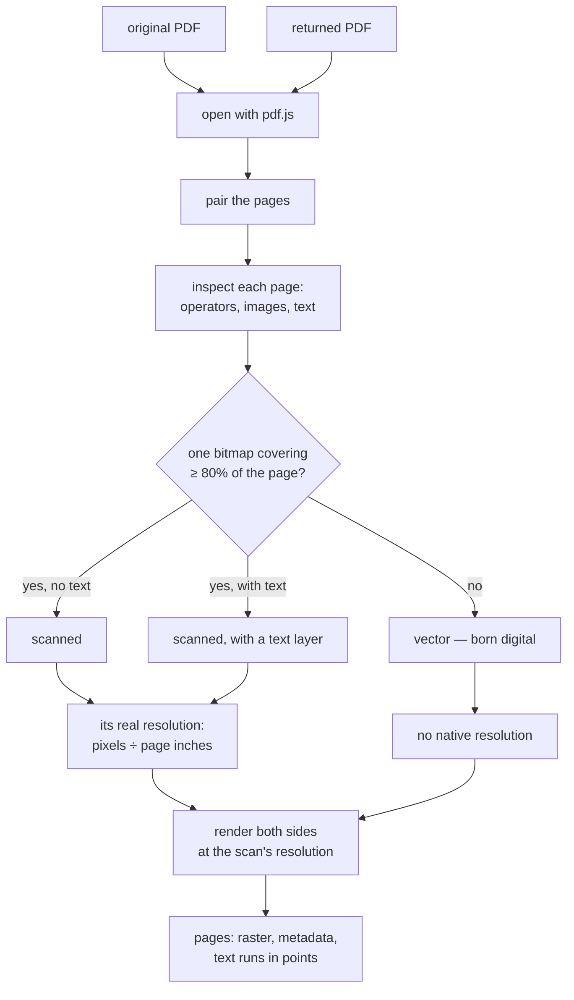
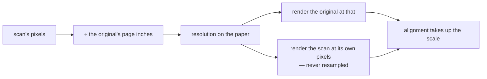
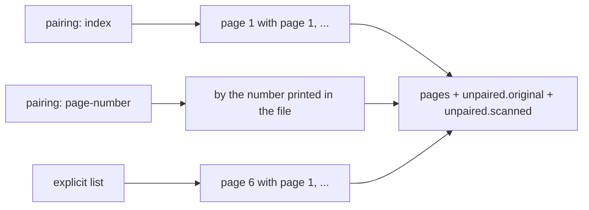
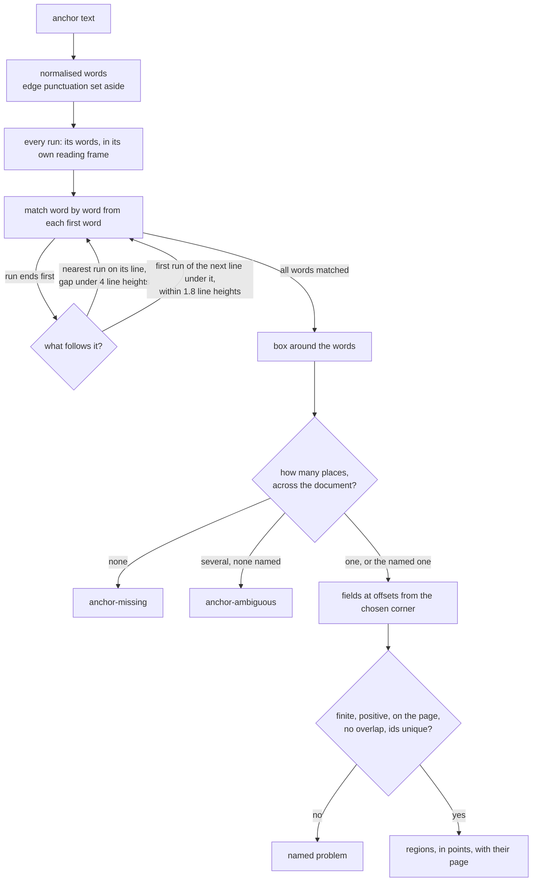

# How `@scanmate/extract` decides

Everything downstream compares two pages pixel for pixel or run for run. This
package makes those two pages, and answers three questions about each:

1. **What kind of page is this?** — born-digital, a scan, or a scan with an OCR
   text layer over it.
2. **What resolution should it be rendered at?**
3. **What does the original say, and exactly where?**

*Each blue box is one run of the text layer of the
[IRS Form W-9](https://www.irs.gov/pub/irs-pdf/fw9.pdf) (public domain), with the
text it carries and the face and size it is set in. Exact, and free: no reading
involved.*

## The shape of it

## Telling a scan from a document

There is no `isScanned()` in any PDF library, and the obvious test — "does it
have images?" — fails immediately: almost every generated form has a logo.

Two signals from pdf.js decide it:

- **How much of the page the images actually cover**, measured from the
  transform at each paint operator rather than counted. The threshold is 80%.
- **Whether there is any text**, which separates a plain scan from a scan an
  OCR tool has already put a text layer over.

Measured on real documents: a generated order form scored **1.2%** image
coverage — that is its letterhead — and every page of three different scans of
it scored **100%**.

The distinction matters later: a page with a text layer has an exact side to
compare against, and a page without one must be read on both sides, with twice
the reading error.

## The resolution question

Nothing in a JPEG says what it was scanned at, but a PDF does, implicitly: a
scan's real resolution is **its pixels divided by the page's inches**. For a
page with several images the largest is the scan, and the two axes are combined
as a geometric mean, because rendering needs one number and that is the one that
resamples an anamorphic scan least overall.

`'match'`, the default for a pair, renders **both** sides at the scan's
resolution. This was measured, not assumed:

| scan | native | confidence at native | at 150 | at 200 | at 300 | false "added ink" at native | at 300 |
|---|---|---|---|---|---|---|---|
| A | 120 dpi | **0.891** | 0.857 | 0.870 | 0.872 | 0.00% | 0.01% |
| B | 93 dpi | **0.889** | 0.867 | 0.884 | 0.884 | 0.00% | **0.18%** |
| C | 144 dpi | **0.944** | 0.910 | 0.937 | 0.932 | 0.00% | 0.00% |

Rendering the original finer than the scan does not add information the scan
never had. It makes the two disagree at every stroke edge, and that disagreement
is exactly what a pixel comparison reports as a change. Native is also about
twice as fast as 300 dpi.

### A scan whose page is not its paper

A photo stored at one pixel per point — a 3024-pixel-wide picture of an A4 sheet
on a 42-inch page — says 72 dpi of itself, and taking that at face value throws
away everything the photo holds. So under `'match'` the scan's resolution is
measured **against the original's page size**, long side to long side and short
to short, taking the fit:

A scan stored at its paper's size is unchanged by this, and paper sizes a few
percent apart — A4 against Letter — are not treated as a difference in
resolution.

## The text layer, and its geometry

Each run is reported with its text, its box in PDF points from the page's
top-left **as displayed** (after `/Rotate`), its baseline, its font size, the
face pdf.js resolved, its angle, and whether it ends a line.

Two details are load-bearing:

- The box comes from the **font's ascent and descent**, not from a guess: that
  is what makes a run's box tight enough to claim OCR words by position.
- The transform is composed with the page's scale-1 viewport, so a rotated page
  reports its runs where a reader sees them, not where the file stores them.

The face and size travel with the run because `@scanmate/ocr` files glyph
templates by them: a figure on a total bar is matched against digits set in that
same bold face, not against the body text.

## Pairing

Scans lose pages and gain cover sheets. `extractPair` therefore reports what it
could pair **and** what it could not, rather than throwing or silently
truncating:

## One trap, documented

`pdf.js` **detaches the buffer it is given**. Reading a file and passing those
bytes leaves the caller holding a zero-length array; this package passes a copy,
and any caller doing its own `getDocument` should too.

## Finding a field from its label

**Words, not characters.** A label is matched word for word, so it can never be
found inside another word - `Date` is not in `Update` - and the punctuation at a
word's edges is set aside on both sides, so `Signature:` is still `Signature`.
Punctuation inside a word is kept: `U.S.` is not `US`.

**Runs, then lines.** A text layer splits a phrase wherever the generator changed
anything, and a form wraps a long label. From the end of a run the match may
continue into exactly two places: the nearest run after it on its line, and the
first run of the next line that sits under it. At most one of each, so no run is
ever skipped. On the W-9, "Signature of" and "U.S. person" are two runs 8.4
points apart on 8.35-point lines - well inside the 1.8 line heights allowed; a
paragraph further down is not.

**Each run in its own frame.** A run's box is projected onto its own baseline and
its own "down", so a label turned a quarter reads down the page and continues on
the line beside it, exactly as upright text reads across and continues below.
Runs turned differently are never joined.

**Boxes are exact where the runs are.** A run's width is known; its words' widths
are not. Where the label starts or ends inside a run, that edge is placed in
proportion to its characters, and the match says `estimated: true`. Where it
starts and ends with its runs, the box is the runs' own.

**Ambiguity is a named outcome.** Occurrences are counted across the document in
page order, and top to bottom within a page. Zero matches and two matches are
different problems, both the caller's to handle, and neither is guessed at.

## Constants

| option | default | |
|---|---|---|
| `dpi` | `'match'` for pairs, `'native'` for one document | See the table above. |
| `fallbackDpi` | `200` | For a page with no native resolution. |
| `minDpi` / `maxDpi` | `72` / `400` | Bounds on a resolution read from a file. |
| `output` | `'png'` | `'none'` keeps rasters only. |
| `background` | white | PDF pages are transparent where nothing is drawn. |
| `includeText` | `true` | Read the text layer. |
| — | `0.8` | Image coverage that makes a page a scan. |

## What it does not do

- It does not read a scan. There is nothing to read: a scan has no text layer,
  and `@scanmate/ocr` does that job.
- It does not use a **returned** document's text layer for anything. It is
  reported, and never trusted.
- It does not align, enhance or compare.
