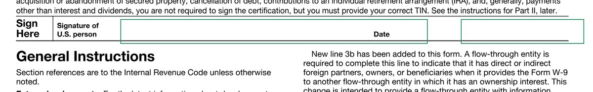

# `@scanmate/find`

Checks whether the content that must be on each page is there, and whether it's where the original puts it.



*The signer fields, resolved from the words the form itself prints rather than from coordinates typed into a config. Made from the [IRS Form W-9](https://www.irs.gov/pub/irs-pdf/fw9.pdf) (a work of the United States government, in the public domain): filled in as a generator would, printed, signed by hand and scanned crooked.*

## Install

```bash
npm install @scanmate/find @scanmate/ocr
```

```ts
import { ocrPages } from '@scanmate/ocr'
import { findContent } from '@scanmate/find'

const report = await ocrPages(alignedPages)
const found = findContent(report, [
  { page: 1, content: ['The Resistance', '17 September 2026', '27,211,380.00'] },
  { page: 2, content: ['Comm Specs', '4,080,300.00'] },
])

found.allFound                    // every item present on its page
found.allIdentifiable             // every item present where the original prints it
found.pages[0].content[2]         // { found, identifiable, foundBy, score, excerpt, box, occurrences, foundOnPages }
```

## How it decides

1. **Where the original prints it.** The content is located in the original's text, which is exact, at every place it occurs.
2. **Whether the scan reads it there.** At each of those places, the scan's reading (as `@scanmate/ocr` read it, including its recheck) is searched for the content. If it's found at every place, the content is **identifiable**. If an amount is printed twice and one copy was altered, it's still found, because the other copy is genuine, but it isn't identifiable, and `occurrences` shows which copy changed.
3. **Otherwise, anywhere on the page.** Content that moved, or that the original never printed (a handwritten note, for example), is found `on-page`.
4. **Which pages.** Every page of the scan is searched, so `foundOnPages` shows a clause that moved to another page.

The search is approximate (Sellers' algorithm), so OCR's slips in words are forgiven, up to `minScore` (0.85). Two things are never forgiven:

- **Figures:** a match must carry exactly the same digits, and can't run into further digits, so `1,250.00` isn't found inside `11,250.00`.
- **Lone letters:** "Schedule A" isn't "Schedule B".

On two real scans of an order form (120 and 144 dpi), every one of 7 amounts with a single digit forged was reported as not identifiable. On the unaltered 144-dpi scan, every required value was found in place.

## Regions from anchors

Field boxes move with the document's content, but not relative to their labels. `resolveRegions` works in three steps:

1. It finds an anchor in the original's text items, joining runs on one line.
2. It places fields at offsets from the anchor's top-left corner.
3. It checks that each field is on the page, finite, and not overlapping another.

The result feeds `@scanmate/diff`'s expected regions:

```ts
import { extractPages } from '@scanmate/extract'
import { resolveRegions } from '@scanmate/find'

const [page] = await extractPages('contract.pdf', { pages: [6] })
const { regions, problems } = resolveRegions(page.metadata.textItems, { width: 595.28, height: 841.89 }, {
  anchor: 'For and on behalf of Customer',
  fields: {
    name:      { dx: 39, dy: 20, width: 200, height: 16 },
    signature: { dx: 57, dy: 40, width: 480, height: 40 },
  },
})
// problems: anchor missing or ambiguous, fields off the page or overlapping - empty when all is well
```

An anchor must occur exactly once unless `occurrence` names which one to use.

## How it decides

[`documentation/algorithms.md`](./documentation/algorithms.md) has the algorithms in full: what each step measures, the decision flows, every constant with the measurement behind it, and what the package deliberately does not do.
