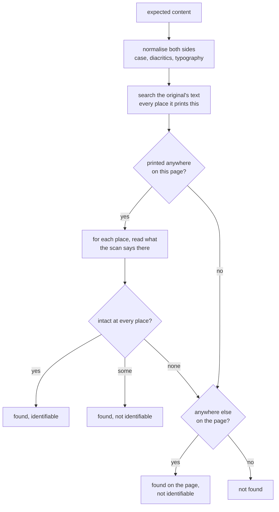
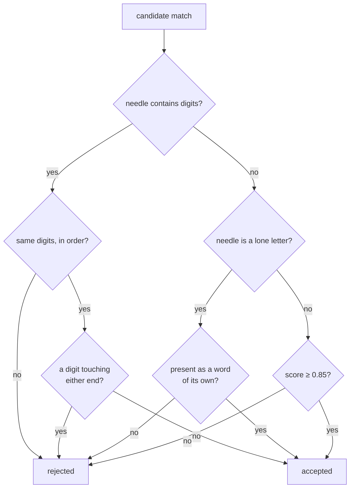

# How `@scanmate/find` decides

One question: **is the content that must be on this page actually on it?** -
the company name, the order number, the total.

Where a field is - the box beside "Signature of U.S. person" - used to be
answered here too. It reads only the original's text layer, so it moved to
`@scanmate/extract` as `locateFields`, and its algorithm is documented there.

## Finding content

The order matters. The **original's** text is searched first, because it is
exact: it says where the document prints this content, and how many times. Only
then is the scan's reading of those places checked.

That gives the strongest statement available — *this value is present at every
place the document prints it* — and it distinguishes two cases that a plain
search cannot:

- An amount printed twice, altered once: **found** (the other copy is genuine)
  but **not identifiable**.
- An amount that appears somewhere else on the page but not where it belongs:
  found `on-page` rather than `in-place`, and not identifiable.

`foundOnPages` lists every page whose reading contains it, so a value that
turns up on the wrong page — pages swapped, a substituted sheet — is visible.

## Approximate, but not about figures

OCR of a real scan never reproduces a phrase character for character. An exact
`includes` would report a perfectly good scan as incomplete because one letter
came back wrong. So matching is **Sellers' algorithm**: Levenshtein distance
where the match may begin and end anywhere in the text — the first row of the
table is zero, so skipping ahead is free, and the best ending is read off the
last row. Score is `1 - distance / needle length`, and `minScore` (0.85) is the
floor.

Two kinds of content are held to more than closeness:

- **Figures must keep their digits.** `1,250.00` is not an approximate match for
  `7,250.00`, however similar the strings are — one edit in eight characters
  scores 0.875, comfortably over any sensible threshold. And a figure must not
  run into more digits: `1,250.00` is not "found" inside `11,250.00`.
- **A lone letter must be a word of its own.** The "A" of "Schedule A" is an
  identifier; one letter in ten characters is 90% similar to any other letter,
  so fuzzy matching would find "Schedule B" just as happily.

Both sides go through the same normalisation as `@scanmate/ocr` — reusing it
rather than reimplementing it, because a mismatch between the two would be a
silent correctness bug.

## Only the original is trusted

One rule is a security rule: **only the original's text layer is ever read**. A
returned scan can carry a text layer of its own, stale or planted, and nothing
here will use it.

## Constants

| option | default | |
|---|---|---|
| `minScore` | `0.85` | Least similarity for a match; figures and lone letters are exact regardless. |
| `normalise` | the suite's, from `@scanmate/ink` | Case, diacritics, typography, hyphens. |

## What it does not do

- It does not read the scan. It works from `@scanmate/ocr`'s report.
- It does not look at ink. Whether a field was *filled in* is
  `@scanmate/diff`'s question.
- It does not invent a location for content it cannot find in the original: if
  the document does not print it, there is no "place" for it to be.
