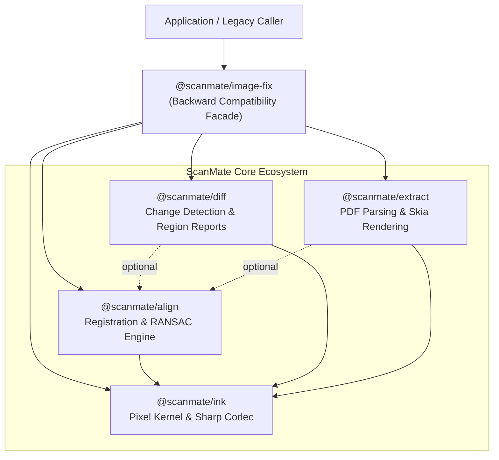

# `@scanmate/image-fix`

> **Deprecated Facade Package.** `@scanmate/image-fix` has been split into focused, modular packages. This package remains available as a backward-compatible facade re-exporting all core APIs.

---

## Modern Package Structure

For all new projects and upgrades, prefer importing directly from the focused packages:

| You used in `@scanmate/image-fix` | Now lives in package | Primary Purpose |
|---|---|---|
| `alignScan`, `alignPages`, `polishTranslation`, estimators | **[`@scanmate/align`](../align)** | Geometric registration & alignment |
| `compareRegions`, `diffDocument`, `renderDiff`, `diffPage` | **[`@scanmate/diff`](../diff)** | Visual change detection & form region verification |
| `decodeImage`, `encodeImage`, `inkMap`, `warpRaster`, `Matrix3` | **[`@scanmate/ink`](../ink)** | Low-level pixel kernel, illumination division & geometry |
| `extractPair`, `extractPages`, `inspectPage`, `renderPage` | **[`@scanmate/extract`](../extract)** | PDF document rendering, inspection & DPI auto-resolution |

---

## Architectural Changes & Breaking Notes

1. **Asynchronous Codec Operations**: All functions that encode or decode images (`decodeImage`, `encodeImage`, `alignScan`, `compareRegions`, `diffDocument`, `renderDiff`) are now **asynchronous** (`Promise`-based) because the image codec migrated to libvips via `sharp`. This yields a **~20x speedup** when encoding full-page PNGs and enables native support for TIFF, HEIF, WebP, and AVIF formats.
2. **Metadata Inspection**: `sniffFormat` has been replaced by `readImageMetadata` in `@scanmate/ink`.

---

## Installation

```bash
# Using npm
npm install @scanmate/image-fix

# Or install the modular packages directly:
npm install @scanmate/align @scanmate/diff @scanmate/ink @scanmate/extract
```

---
> What follows is the reasoning. For the full algorithm - the formulae, every
> constant, the coordinate-frame algebra and the measured error - see
> [`documentation/fix.md`](https://github.com/russoedu/scanmate/blob/main/documentation/fix.md).

### 1. Ink, not greyscale

A scan differs from its source in ways that have nothing to do with geometry:
the lamp is brighter in the middle, the phone cast a shadow down one side, the
JPEG quantiser smeared the strokes. So nothing downstream looks at greyscale.
It looks at **ink**: greyscale divided by its own slowly varying background,
then inverted. Near zero on paper, near one on print, whatever the lighting did.

Division, not subtraction, because illumination is multiplicative — a shadow
halves what reaches the sensor, it does not subtract a constant. Think of it as
reading the page through tracing paper: you lose the tint of the paper and the
angle of the lamp, and you keep the writing.

### 2. A coarse guess, because descriptors are not scale invariant

Binary descriptors compare pixels at fixed offsets, so a corner at 300 dpi and
the same corner at 150 dpi produce two unrelated bit strings. Something has to
establish roughly how big the scan is before matching can work, and nothing in
a JPEG header says.

So the library guesses three ways and lets the pixels judge:

| strategy | assumption | when it wins |
| --- | --- | --- |
| `frame` | the scan is the whole page, so the frames correspond | edge-to-edge scans |
| `content` | the *printing* corresponds | scans with different margins |
| `deskew` | measure each page's own skew, then match the printing straight | usually |

Skew is measured by rotating until the rows of text stack up: at the right
angle every line falls into one bin of the projection histogram and the profile
is a comb of tall spikes; a degree off and each line smears across several.

Each guess gets a phase-correlation nudge for leftover translation, and all of
them are warped and scored on ink correlation. Guessing several times and
measuring beats one clever guess, and at 512 px each attempt is nearly free.

### 3. Features, on the *corrected* scan

FAST corners, oriented by the intensity centroid of their patch, described by
256 steered BRIEF bits — an ORB, written out, because the native one is
unavailable here.

## Quick Start

```ts
import { alignScan, compareRegions, decodeImage } from '@scanmate/image-fix'
import { readFile } from 'node:fs/promises'

const original = await decodeImage(await readFile('contract_p1.png'))
const scanned = await decodeImage(await readFile('returned_scan.jpg'))

const result = await alignScan(original, scanned, { model: 'similarity' })

const [sigReport] = compareRegions(original, result.raster, [
  { id: 'signature', rect: { x: 76, y: 905, width: 420, height: 78 } },
])
```

---

## Facade Architecture & Dependency Topology



---

## Comprehensive Re-Export API Reference

### 1. Alignment Methods (Delegates to [`@scanmate/align`](../align))

#### `alignScan(original, scanned, options?: AlignOptions): Promise<AlignResult>`
Resamples scanned page onto original canvas.
- **Options**:
  - `model` (`'similarity'` | `'affine'` | `'homography'`, default: `'similarity'`): Geometric model.
  - `workingSize` (default: 1400): Longest dimension for feature matching.
  - `coarseSize` (default: 512): Initial coarse sweep resolution.
  - `maxFeatures` (default: 1200): ORB keypoint cap per image.
  - `ransacThreshold` (default: 3.0): Inlier reprojection error bound in px.
  - `minInliers` (default: 12): Minimum inliers needed to trust feature stage.
  - `interpolation` (`'bilinear'` | `'bicubic'` | `'nearest'`): Resampling kernel.
  - `output` (`'png'` | `'jpeg'` | `'none'`): Encoded output format.

#### `alignPages(pages, options?: AlignPagesOptions): Promise<AlignedPage[]>`
Multi-page document batch alignment handler.

---

### 2. Diffing & Change Detection (Delegates to [`@scanmate/diff`](../diff))

#### `compareRegions(original, aligned, regions, options?: RegionOptions): RegionReport[]`
Evaluates form fields to check if signatures or checkboxes were filled.
- **Options**:
  - `tolerance` (default: 2): Morphological dilation radius in pixels.
  - `threshold` (default: 0.02): Added ink ratio for `filled: true`.

#### `diffDocument(original, aligned, regions?, options?: RegionOptions): DocumentDiff`
Computes whole-page and per-region ink addition/subtraction metrics in one pass.

#### `renderDiff(original, aligned, options?: RegionOptions): Raster`
Renders 4-color RGBA visual overlay (Red = scan additions, Blue = template deletions, Grey = matched ink).

#### `diffPage(options: DiffOptions): Promise<PageDiff>`
Full page change detection isolating unexpected handwritten edits via 2-pass connected component analysis.

---

### 3. Kernel & Pixel Operations (Delegates to [`@scanmate/ink`](../ink))

#### `decodeImage(buffer, options?: DecodeOptions): Promise<Raster>`
Decodes image bytes to RGBA `Raster` via `sharp`.
- **Options**: `pageNumber` (for multi-page TIFF), `maxWidth`, `maxHeight`.

#### `encodeImage(raster, options?: EncodeOptions): Promise<Uint8Array>`
Encodes RGBA `Raster` to PNG/JPEG bytes via `sharp`.
- **Options**: `format` (`'png'`, `'jpeg'`, `'webp'`, `'avif'`), `quality` (1-100), `compression` (0-9).

#### `inkMap(gray, options?: InkOptions): GrayImage`
Performs background division ($I_{ink} = 1 - I / I_{bg}$).
- **Options**: `blurRadius` (default: 25), `invert` (default: true).

#### `warpRaster(raster, output, invMatrix, options?: WarpOptions): void`
Resamples input `Raster` using inverse 3x3 homography matrix.
- **Options**: `interpolation` (`'bilinear'`, `'bicubic'`, `'nearest'`), `background` (`RGBA`).

---

### 4. PDF Extraction & Inspection (Delegates to [`@scanmate/extract`](../extract))

#### `extractPair(options: ExtractPairOptions): Promise<PairedDocument>`
Parses, auto-detects scan DPI, and renders paired original/scanned PDF pages.
- **Options**: `original`, `scanned`, `dpi` (`'native'` or fixed number), `pageSelection`.

#### `inspectPage(pdf, pageIndex): Promise<PageMetadata>`
Inspects PDF operator streams and classifies page as `'scanned'`, `'born-digital'`, or `'mixed'`.

---

## License

MIT © [ScanMate Team](https://github.com/russoedu/scanmate)

## Where the algorithms went

[`documentation/algorithms.md`](./documentation/algorithms.md) maps every algorithm this package used to carry to the package that documents it now.
