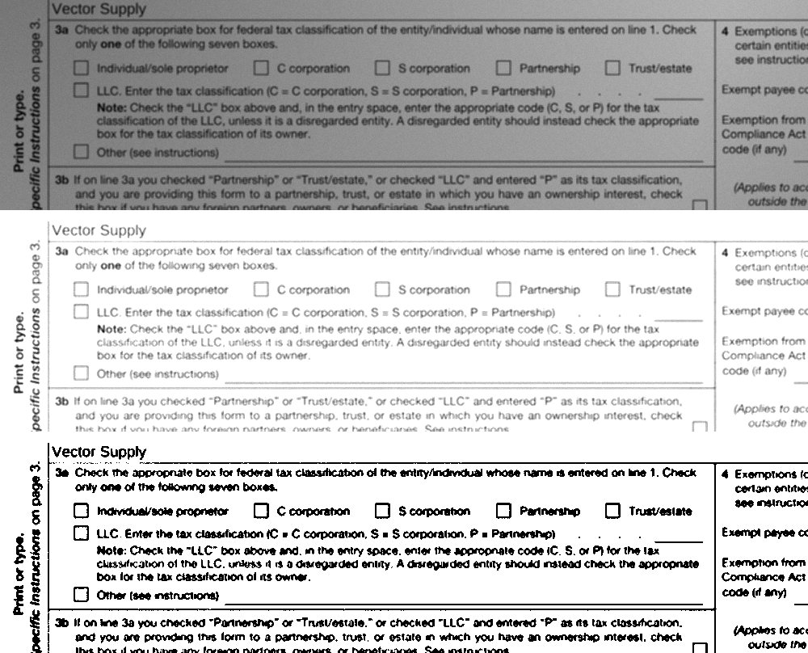

# `@scanmate/ink`

The pixel and geometry kernel the rest of ScanMate is built on: separating ink from paper, moving pixels from one frame to another, measuring how alike two pages are — and the contracts the pipeline passes along.



*The same lines three ways: as scanned under uneven light, divided by the paper behind them, and thresholded. Made from the [IRS Form W-9](https://www.irs.gov/pub/irs-pdf/fw9.pdf) (a work of the United States government, in the public domain).*

## Install

```bash
npm install @scanmate/ink
```

```ts
import { binarize, correlation, decodeImage, inkMap, toGrayscale, warpRaster } from '@scanmate/ink'

// The three rows of the picture above, in order:
const scan = await decodeImage('fw9-returned.jpg')  // any format libvips reads, EXIF rotation applied
const ink = inkMap(toGrayscale(scan))               // lighting divided out: stroke against paper
const mask = binarize(ink)                          // Otsu, on the page's own histogram

// And the rest of the kernel:
const straight = warpRaster(scan, matrix, 1700, 2200)   // inverse-mapped, onto a fixed canvas
correlation(inkA, inkB)                                  // how well two pages' ink agrees
```

## What is in it

| | |
|---|---|
| **raster codec** | `decodeImage`, `encodeImage`, `resampleRaster`, `blurRaster`, `readImageMetadata`, `countPages`. PNG, JPEG, TIFF, WebP, HEIF, AVIF, GIF; EXIF rotation applied; density and page count reported. |
| **ink separation** | `inkMap`, `toGrayscale`, `otsuThreshold`, `binarize`, `dilate`, `coverage`, `boxBlur`, `integralImage`. |
| **geometry** | `warpRaster`, `warpGray`, `resizeGray`, `downscaleGray`, `sampleGrayBilinear`, and 3×3 matrices: `multiply`, `invert`, `decompose`, `rebase`, `similarity`, `translation`, `isPlausible`, `applyPoint`. |
| **similarity** | `correlation`, `intersectionOverUnion`. |
| **content geometry** | `contentExtent`, `estimateSkew`, `profileSharpness`. |
| **frequency** | `fft1d`, `fft2d`, and the helpers phase correlation needs. |
| **deterministic sampling** | `createRandom`, `gaussian` — so RANSAC and BRIEF give the same answer every run. |
| **synthetic documents** | `createSyntheticDocument`, `drawSignature`, `drawTick`, `simulateScan`, `fillRect`, `drawLine`, `strokeRect`. |
| **pipeline contracts** | `PageImage`, `ScanPage`, `AlignedPage`, `ReadablePage`, `TextRun`, `PdfTextRun`, `PageRegion`, `StageEvent`, `ProgressCallback`, `ScanmateRect`, `ScanmateOrientedRect`, `Matrix3`. |
| **text normalisation** | `normaliseText`, `tokenise`, `DEFAULT_NORMALISE`, `foldDiacritics`, `foldConfusables`: the one normaliser every package compares text with - OCR's words, the content search, and the labels fields are found by. |
| **what a stage accepts** | `ScanmateSource`, `ScanmateBinarySource`, `ImageWithResolution` - one union for every stage, instead of one per package. |

## The two ideas that matter

**Ink is a ratio, not a difference.** A scan's lighting is multiplicative: paper in shadow reflects a fraction of what paper in light does. `inkMap` divides each pixel by a wide local box mean — a sixteenth of the page, computed from an integral image, clipped at the page edge rather than extended — so a shadow flattens out and what is left is stroke against paper. Clipping matters: extending the border would smear a scanner's dark edge strip inward as "paper" and invent ink where the page ends.

**Warps are inverse-mapped onto a fixed canvas.** For each output pixel, ask where it came from. Forward mapping leaves holes; inverse mapping cannot, and a fixed canvas is what makes a scan land on the *original's* page rather than on a canvas sized to fit it. Minifying prefilters first, so shrinking a 300 dpi scan does not alias text into stripes.

## One dependency, at the boundary

`sharp` — prebuilt libvips, nothing to install on the host — and only for decoding, encoding, resampling and metadata. Every algorithm above is plain TypeScript over typed arrays, because libvips has no image ÷ image division, no Otsu, no clipped-area box mean, its convolution extends the border instead of dividing by the real window area, its affine transform cannot render onto a fixed canvas, and a float round trip through it truncates.

`Raster` is `Uint8ClampedArray` RGBA, which is sharp's native format and round-trips byte-exact; `GrayImage` is `Float32Array` and never crosses that boundary.

## Synthetic documents, for tests with ground truth

`createSyntheticDocument` makes a form with known field rectangles; `drawSignature` and `drawTick` put ink in known places; `simulateScan` turns, rescales, blurs, adds noise and uneven lighting with a fixed seed. Every package downstream tests against facts it constructed — "the signature is in this rectangle and nowhere else" — rather than against golden images.

## How it decides

[`documentation/algorithms.md`](./documentation/algorithms.md) explains each primitive: what it measures, why it is built that way, every constant, and why the codec boundary sits where it does.
