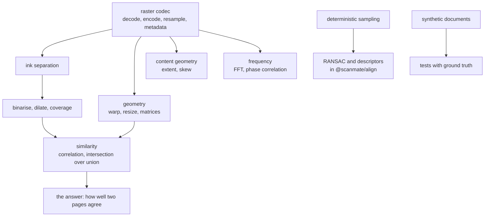
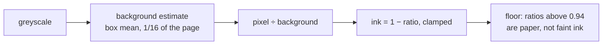
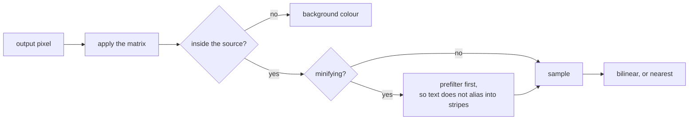

# How `@scanmate/ink` decides

This package makes no decisions about documents. It is the kernel the packages
that *do* are built from: separate ink from paper, move pixels from one frame to
another, and say how alike two images are.

Everything here is deliberately small, deliberately hand-written, and
deliberately dependency-free apart from the codec.

## What is in it, and why each piece exists

## Ink separation: dividing by the paper

The single most important operation in the whole pipeline.

Why a **ratio** and not a difference: a scan's lighting is multiplicative. The
lamp illuminates the page, and paper in shadow reflects a fraction of what paper
in light does. Dividing removes that fraction; subtracting does not.

Why the window is **a sixteenth of the page**: far wider than any stroke, so no
letter can drag its own background down with it, but narrow enough to follow a
shadow's gradient across a corner.

Two implementation details that matter more than they look:

- The mean comes from an **integral image**, so the cost does not grow with the
  window — a 155-pixel radius on an A4 page at 300 dpi costs the same as a
  4-pixel one.
- The window is **clipped at the page edge**, dividing by the real area rather
  than extending the border. A scanner's dark strip down the edge would
  otherwise be smeared inward as "paper", inventing ink where the page ends.

`otsuThreshold` then picks the split between ink and paper from the page's own
histogram — the threshold that maximises between-class variance, over 256 bins —
and `binarize` applies it. `dilate` fattens a mask by a radius, which is how
every "allow for a pixel of misregistration" rule in the pipeline is expressed.

## Geometry: moving pixels without inventing them

Warping is **inverse-mapped**: for each output pixel, ask where it came from in
the source. Forward mapping leaves holes; inverse mapping cannot.

Matrices are 3×3 and homogeneous, so similarity, affine and projective are one
type with different constraints, and `decompose` reports what a matrix actually
does — scale, rotation, shear, translation, perspective — which is what makes an
alignment auditable rather than a black box.

## Similarity: how alike, in two ways

- **Pearson correlation** over ink maps. Invariant to how dark the scan is,
  which matters because no two scanners agree about that.
- **Intersection over union** over binary masks. Answers a different question —
  how much of the ink lands in the same place — and the two disagreeing is
  itself informative.

## Content geometry

- **`contentExtent`** — the box the printing actually occupies, from row and
  column ink profiles. This is what lets a page be matched by its *content*
  when its margins differ.
- **`estimateSkew`** — the angle whose projection profile is sharpest. Text
  lines projected onto an axis give tall, narrow peaks when they are horizontal
  and a smear when they are not; the sharpest profile is the page's true angle.

## Frequency: finding a shift in one step

Phase correlation multiplies one image's FFT by the conjugate of the other's,
normalises the magnitude away, and transforms back: the peak is the translation
between them. A radix-2 FFT on power-of-two padded copies, hand-written, because
translation is exactly the part of alignment that a search would spend the most
time on and a transform gets in one pass.

## Deterministic sampling

RANSAC and BRIEF both need randomness. Both use a seeded generator from this
package, so **the same input gives the same matrix**, every run, on every
machine. An alignment that cannot be reproduced cannot be evidence of anything.

## Synthetic documents

`createSyntheticDocument`, `drawSignature`, `drawTick`, `simulateScan` — a form
with known field rectangles, ink drawn in known places, and a scan of it with
known rotation, scale, noise, blur and uneven lighting.

This is how the rest of the pipeline is tested against **ground truth** rather
than against golden images: "the signature is in this rectangle and nowhere
else" is a fact the test constructs, so a test can assert the answer rather than
assert that nothing changed.

## Constants

| where | default | |
|---|---|---|
| `inkMap.backgroundFraction` | `1/16` | Width of the background window. |
| `inkMap.floor` | `0.06` | Ratios above 0.94 are paper. |
| `otsuThreshold` | 256 bins | Over the page's own histogram. |
| `estimateSkew.maxAngleDeg` | `12` | Largest skew searched. |
| warp `interpolation` | `'bilinear'` | `'nearest'` for masks. |

## The dependency rule

One runtime dependency: **sharp**, and only at the codec boundary —
`decodeImage`, `encodeImage`, `resampleRaster`, `readImageMetadata`. Everything
else is plain TypeScript over typed arrays.

That boundary is not fussiness. libvips has no image ÷ image division, no Otsu,
and no clipped-area box mean; its blur is a fixed 3×3 box or a Gaussian, and its
convolution **extends** the image at the border instead of dividing by the real
window area — which at a 155-pixel radius over-weights the edge column by about
78×, precisely the dark scanner strip the ink map exists to exclude. Its affine
transform is 6 degrees of freedom and cannot render onto a fixed canvas, so it
cannot express a projective alignment or land on the original's page. And a
float round trip through it truncates: `[0, 10.5, 20.25, 30.125]` comes back
`[0, 10, 20, 30]`.

So sharp does what it is outstanding at — reading and writing images, fast,
with prebuilt binaries and nothing to install on the host — and the algorithms
stay here.
