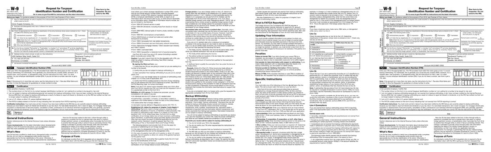
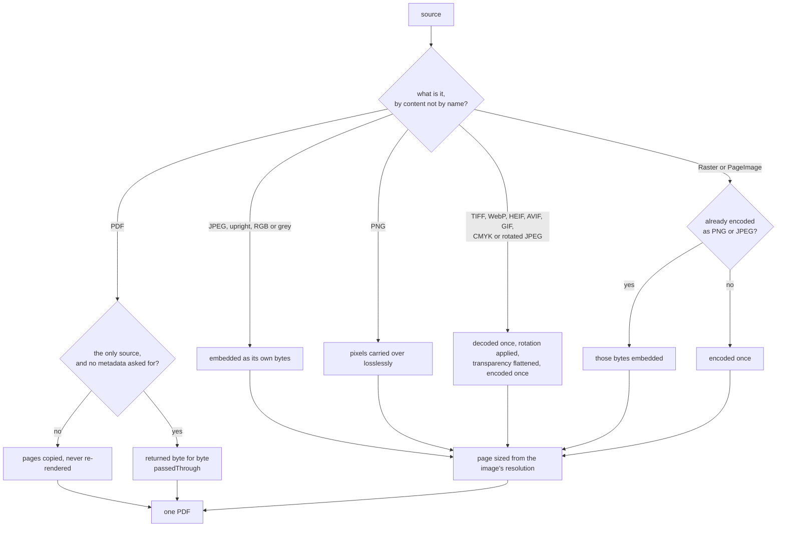
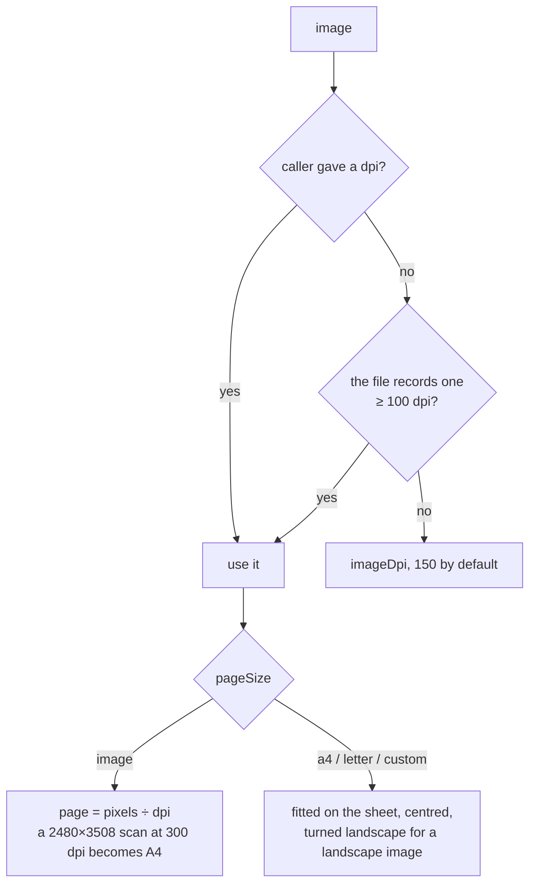

# How `@scanmate/merge` decides

One question: **what should each source become, as a page of one PDF?**

It sounds trivial and is not, because every wrong answer costs something later.
Re-encode a JPEG and it loses detail the check needed. Put a photo on a page the
size of its pixel count and every later stage reads its resolution as 72 dpi.
Re-render a PDF and the signatures in it stop being the signatures that were
signed.

*Pages of the [IRS Form W-9](https://www.irs.gov/pub/irs-pdf/fw9.pdf) (public
domain) as images, plus the PDF itself, in one file.*

## The shape of it

## Never encode twice

A JPEG that is already upright and RGB is embedded **as its own bytes**. No
decode, no re-encode, no second generation of blocking artefacts over the text
a checker will later try to read. The same holds for a PNG's pixels, and for a
raster that arrives with its encoded bytes alongside it — which is what every
`PageImage` in this pipeline is.

Only what cannot be embedded as it stands is decoded: a JPEG whose EXIF says it
is rotated (the rotation is applied, once), a CMYK JPEG, a TIFF — every page of
it — WebP, HEIF, AVIF, GIF, or a bare raster.

A single PDF on its own comes back **byte for byte**: stored exactly as it was
scanned, signatures and all. Asking for metadata is the one thing that turns
that off, because writing a title means writing a new file.

## Page size carries the resolution

The default — the page is the image at its resolution — exists so that a reader
who divides pixels by page inches, as `@scanmate/extract` does, gets the scan's
real resolution back. That is the number every later decision depends on:
whether the text can be verified at all, what to render the original at, how
much detail there is to compare.

Files that claim 72 or 96 dpi are ignored (`MIN_RECORDED_DPI` is 100): those are
software defaults, not measurements, and a phone photo carrying "72 dpi" holds
far more than that on the paper.

## Constants

| option | default | |
|---|---|---|
| `pageSize` | `'image'` | Or `'a4'`, `'letter'`, or a size in points. |
| `imageDpi` | `150` | For images that record no usable resolution. |
| `encoding` | `'png'` | For what must be re-encoded; `'jpeg'` is much smaller. |
| `quality` | `92` | JPEG quality. |
| `passThrough` | `true` | A lone PDF comes back unchanged. |
| `metadata` | none | Title, author, subject, keywords, creator. |
| — | `100` dpi | Least recorded resolution that is believed. |

Measured: three 120-dpi page JPEGs plus a 7-page PDF merged in 20 ms (0.73 MB);
seven aligned pages made a 3.3 MB PNG or 0.74 MB JPEG evidence file.

## What it does not do

- It does not reorder anything. Upload order is page order, because that is the
  only order that reconstructs a document someone scanned sheet by sheet.
- It does not OCR, compress for size, or "improve" an image.
- It does not repair a corrupt PDF. An encrypted one is decrypted rather than
  refused - see [Encrypted PDFs](#encrypted-pdfs).

## Encrypted PDFs

Signed documents usually arrive encrypted: an owner password restricting what
may be done with them, and no password needed to read them. pdf-lib refuses
those outright, and its error suggests loading with `ignoreEncryption: true`.
Three ways of handling one were measured, by drawing a box on a one-line
encrypted page, saving, and rendering the result with pdf.js:

| how it is loaded | original text | the drawn box |
|---|---|---|
| `ignoreEncryption: true` | intact | **missing** |
| for incremental update, decrypted | **missing** | drawn |
| decrypted with the empty password | intact | drawn |

**`ignoreEncryption` is wrong for anything that writes.** The document loads,
saves and opens, with its text intact - and whatever was drawn is silently gone,
written unencrypted into a file that still declares itself encrypted, so a
viewer "decrypts" it into nothing. For `markPages` that is a clean-looking PDF
with no marks and no error, the worst failure a checking tool can have. It is
not offered.

**Incremental update is tempting and also wrong here.** It keeps the original
bytes intact as a prefix, which is what would keep an existing digital signature
valid over its revision - but on an encrypted document the original page content
does not survive it. A marked copy is for looking at, not the signed document,
and does not pretend to be.

**Decrypting is right, and free in the common case.** The empty password opens
an owner-password-only document, so a signed PDF needs nothing given. `password`
is for one that needs a password to be read at all.

A given password is tried first and then none. That matters for `mergeDocuments`,
where one password is tried on every encrypted source: tried alone, it would
lock out an owner-password-only source that needed nothing - which a test caught
before release. The empty password only opens what anyone may read anyway.

A merged document is a new one, so it comes out unencrypted whatever went in.
