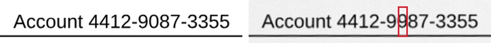
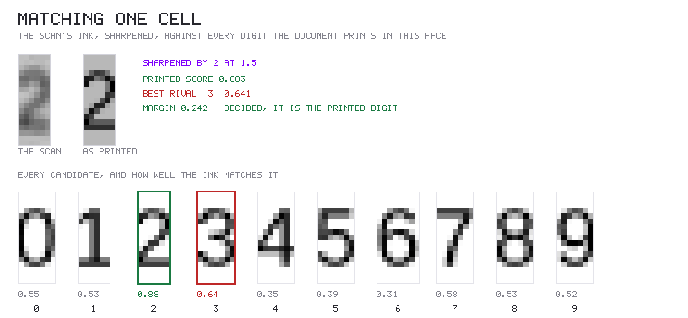

# `@scanmate/ocr`

Measures how closely a scan's text matches the original's: a score per page and for the document, ten measures, both texts in full, and every difference with its position on the page.



*A printed account number, and the same line on the returned scan where one digit has been replaced by another of the same run. `@scanmate/ocr` matches printed figures against the original's own glyphs, so it reads this for what it is. Made from the [IRS Form W-9](https://www.irs.gov/pub/irs-pdf/fw9.pdf) (a work of the United States government, in the public domain): filled in as a generator would, printed, signed by hand and scanned crooked.*

## Install

```bash
npm install @scanmate/ocr @scanmate/extract @scanmate/align
```

```ts
import { alignPages } from '@scanmate/align'
import { extractPair } from '@scanmate/extract'
import { ocrPages } from '@scanmate/ocr'

const { pages } = await extractPair({ original: 'fw9-issued.pdf', scanned: 'fw9-returned.pdf' })
const report = await ocrPages(await alignPages(pages))

// The account number above, read for what it is:
report.pages[0].text.differences // [{ kind: 'changed', expected: 'Account 4412-9087-3355',
                                 //    found: 'Account 4412-9987-3355', reason: 'numbers',
                                 //    verified: true, x, y, width, height }]
report.pages[0].text.printChecks // { checked, different, skipped }: figures matched against the original's glyphs
report.score                     // document score, weighted by characters
report.pages[0].text.metrics     // levenshtein, jaccard, dice, cosine, CER, WER, word recall, ...
report.pages[0].text.original.text   // the original's text
report.pages[0].text.scanned.text    // the scan's
report.pages[0].aligned.raster   // the page itself comes back too
```

## How it reads

- **The original's side** comes from its PDF text layer whenever it has one. The layer is exact, so every error counted belongs to the scan. The scan's own text layer is never used, because hidden or stale text must not vouch for what the paper shows.
- **The scan** is read with tesseract, at 300 dpi (it is enlarged first if lower), or from its `enhanced` image when `@scanmate/enhance` ran first.
- **Matching by place, not order.** Alignment puts the scan on the original's canvas, so each word read is claimed by the run of the original printed where it was read. A two-column page read column by column is therefore not a page of errors, and every difference has a position.
- **Figures must keep their digits.** A run whose digits read back differently has changed, however similar the rest is: "Total 1,250.00" read as "Total 7,250.00" is 93% similar. A figure whose separators alone differ ("5.768.700 00") is the same figure. Words keep OCR's tolerance (`matchThreshold`, 0.8).
- **Figures are matched, not only read.** Every printed figure is checked glyph by glyph against the original's own ink and against the other digits the page prints, at the scan's own sharpness. That settles what no reading of a coarse scan can: whether this is still the digit that was printed. On real returned scans it verified 35 of 40 printed figures at 125 dpi with no false calls, and read a digit replaced by another of the same run for what it is.
- **It says why it abstained.** `printChecks.skipped` counts each reason - `no-figure`, `unplaceable`, `few-rivals`, `too-coarse`, `undecided` - because "checked and agreed" and "never looked at" are otherwise the same silence, and telling them apart by inference is slow and can come out wrong.
- **It abstains rather than confirm.** A page that prints too few digits to offer a full set of rivals, a run too small to segment, a cell too soft to call: each is left to the reading, and the answer is applied only to the cells it actually decided. Confirming a digit that had in fact been altered would be worse than saying nothing, so every threshold is set to fail that way.
- **What is not an addition.** Words over something the original prints without text, such as a logo, are not additions. Nor are specks under 4 pt tall.

## The recheck

Before a run counts as a difference, it is cropped and re-read on its own, in up to six passes:

- enlarged to 300–600 dpi;
- read as a line or as a single word;
- read as digits only, when the run is a figure;
- with contrast stretched, and with light-on-dark text inverted.

A run is cleared only when **two** passes agree with the original, judged by the same rules as the page. A single agreeing pass let forged digits through on a 93-dpi scan. Set `recheck: false` to report the page reading as it is.

Measured on three real scans of a 7-page order form, with the text layer as ground truth:

| Scan | Score | False differences | One-digit forgeries flagged |
|---|---|---|---|
| 144 dpi | 0.997 | 0 | 4/4 |
| 120 dpi | 0.934 | 20 (217 without the recheck) | 4/4 |
| 93 dpi | 0.660 | many: below what OCR can verify | 4/4, among many misreadings |

## Text normalisation

Text is normalised the same way on both sides before comparing: NFKC, typography (quotes, dashes, spaces), line-end hyphens, diacritics (the project's 86-base table), case, and OCR noise such as table rules and specks. Punctuation and OCR confusables (`0/o`, `1/l`, `rn/m`) are **kept** by default. Folding them hides exactly the substitutions a forger makes. Every step is an option (`normalise`).

The normaliser itself - `normaliseText`, `tokenise`, `DEFAULT_NORMALISE` and the folding tables - lives in `@scanmate/ink` from 0.10.0, so that `@scanmate/extract` can match labels exactly as this package matches words without loading an OCR engine. Import it from there; it is no longer exported here.

## The engine, and writing nothing to disk

tesseract.js 7 (WebAssembly) with the English best_int model, which read as well as the standard model on real scans at a quarter of the size. Other languages: `npm install @tesseract.js-data/<code>` and pass `tesseract: { languages: ['eng', 'por'] }`.

Nothing is downloaded and, by default, nothing is written. This matters where deployments are read-only, as on Azure Functions: tesseract.js would otherwise cache language data in the current directory. The only writes are explicit:

| Option | Default | |
|---|---|---|
| `tesseract.cache.method` | `'none'` | `'write'` keeps unpacked data for reuse; `'readOnly'` uses data a previous run left; `'refresh'` rewrites it. |
| `tesseract.cache.path` | `<os temp>/scanmate-ocr` | Where anything written goes, including language files staged when more than one language is read. |
| `tesseract.model` | `'best'` | `'standard'` for the larger 4.0.0 model. |
| `tesseract.languageData` | the data packages | A folder of `<code>.traineddata.gz` files instead. |

`createTesseractEngine()` returns an engine whose `settings` report exactly what was resolved. Pass it as `engine` to share one across calls and pay the start-up once. Any other OCR engine can be used by implementing `OcrEngine`.

## Options

| Option | Default | |
|---|---|---|
| `original` | `'auto'` | Text layer when the original has one; `'text-layer'` insists on it; `'ocr'` always reads the original. |
| `targetDpi` | `300` | Enlarge below this before reading; `null` reads the image as it is. |
| `scoreMetric` | `'levenshteinSimilarity'` | Or `'wordRecall'`, `'jaccard'`, `'dice'`, `'cosine'`. |
| `matchThreshold` | `0.8` | Word similarity below which a run has changed. |
| `minWordConfidence` | `60` | For words to count as added. |
| `recheck` | on | `{ passes, agree }`, or `false`. |

## How it decides

[`documentation/algorithms.md`](./documentation/algorithms.md) has the algorithms in full: what each step measures, the decision flows, every constant with the measurement behind it, and what the package deliberately does not do.

[`documentation/print-verification.md`](./documentation/print-verification.md) shows the glyph check working, in pictures: which way round the print is, where one character ends and the next begins, what each glyph is compared against, every candidate scored, why the template is never blurred, and what a refusal looks like. Same machine, lid off.



*The scan's ink for one digit, the original's ink in the same place, and that ink scored against every digit the document prints in this face. The printed `2` takes 0.883 and the nearest rival manages 0.641, so the cell is decided - and decided as what was printed.*
