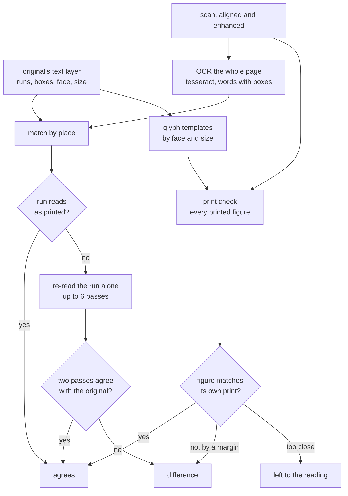
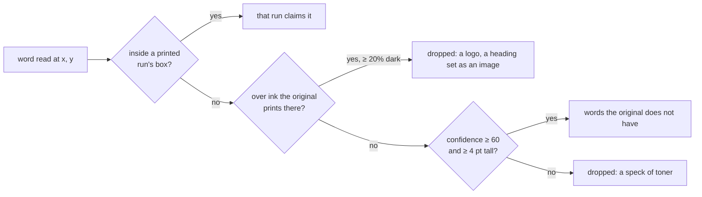
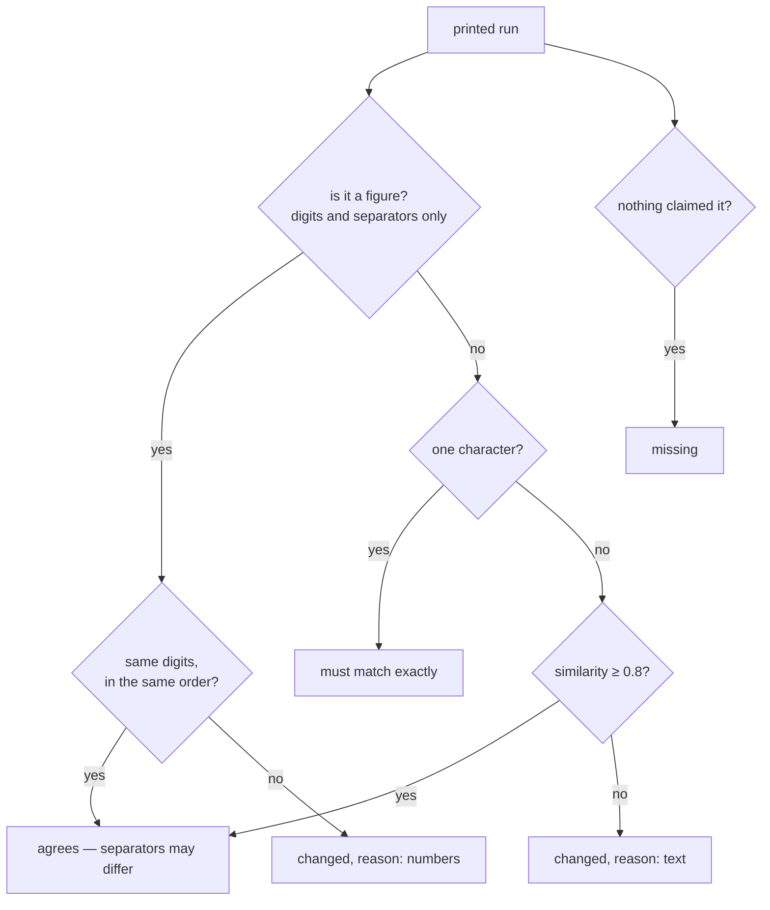
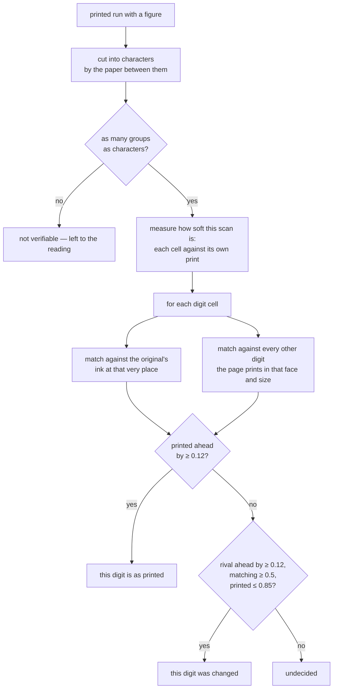

# How `@scanmate/ocr` decides

The question is never "what does this scan say?" — it is **"does this scan
still say what the original said?"** That is a much easier question, and this
package is built around the difference.

The original is usually born-digital and carries its text layer: exact text, in
exact places, with no reading error at all. So only one side is ever read, and
every error counted is the scan's.

Every image here was made from the [IRS Form W-9](https://www.irs.gov/pub/irs-pdf/fw9.pdf)
(public domain), filled in, printed, signed and scanned.

## The shape of it

## Reading the scan, and only the scan

The scan is read from its enhanced image when there is one, otherwise from the
aligned scan enlarged to `targetDpi` (300 by default, upscale only — enlarging
never adds information, but tesseract is trained near 300 dpi and reads better
there).

The engine is tesseract.js (WebAssembly, offline), with the English
`4.0.0_best_int` model and `OEM.LSTM_ONLY`. Nothing is downloaded at run time.

A returned scan's own text layer — if it has one — is **never read**. It can be
stale, or planted, and it is not what a person signing the paper saw.

## Matching by place, not by order

Reading order is a property of the OCR engine, not of the document. A two-column
page read column-first and a page read row-first produce different strings from
identical ink, and a naive diff of those strings is nonsense.

So every word the engine read is placed back on the original's canvas — the
alignment makes the two share coordinates — and claimed by the printed run
whose box it sits in:

The 20% rule (`PRINTED_SHARE`) is worth explaining. Printed words — a logo's
letters — cover a third of their box or more; a form rule or checkbox edge
crossing a handwritten word covers a tenth. Only the first explains a word away,
and ink over something the original prints is `@scanmate/diff`'s business, not
the reading's.

## Judging a run

Each printed run is compared with whatever was claimed for it:

Figures are held to their digits: `1,250.00` read as `1.250,00` is the same
figure written another way, and `1,250.00` read as `7,250.00` is not. A lone
letter must match exactly, because at 0.85 similarity "A" and "B" are one edit
apart and a four-letter needle can absorb one edit.

## The recheck

Read as part of a whole page, a short run — a figure in a table, a word on a
shaded bar — is at the mercy of the engine's layout analysis. Cropped to itself
and enlarged it often reads cleanly. So every doubted run gets up to six more
looks:

| pass | resolution | layout | extras |
|---|---|---|---|
| 1 | 300 dpi | line | |
| 2 | 400 dpi | line | |
| 3 | 400 dpi | line | contrast stretched |
| 4 | 500 dpi | line | |
| 5 | 400 dpi | word | |
| 6 | 600 dpi | line | contrast stretched |

A figure is re-read with a digits-only character whitelist. A run the original
prints **light on a dark bar** — a white total on a coloured row — is inverted
first, and inverting leaves the bar's grey behind the text, so such a run is
contrast-stretched on every pass. Which way round a run is printed is taken from
the original, where it is certain, not guessed from the scan: a washed-out bar
is pale, and a rule that inverts "dark crops" never fires on it.

**A run clears only when two separate passes read it as the original prints it.**
That number matters: on a 93-dpi scan a single agreeing pass accepted 4 of 61
forged digits. Try enough readings and one will eventually land on the answer by
chance.

## The print check: figures are matched, not read

OCR asks an open question — *what does this say?* — and answers it badly on a
returned scan. The closed question is far easier: **of the ten digits this
document prints, which one is this?**

*Left: the original. Right: the scan, where one printed digit has been replaced
by another of the same run — the same ink, a few points along. The pixel
comparison cannot see this: the glyph is the document's own. The reading may not
see it either. The print check reads it for what it is.*

Four things make this work:

1. **Segmentation from the original's own rendering.** A generated PDF leaves a
   column of paper between characters, so a column profile of the run finds
   them. No font metrics, no advance widths, no kerning — a text layer does not
   carry those, and every face does them differently. The ink threshold is set
   against the run's **own** background, so a white figure on a coloured total
   bar segments as readily as black on white.
2. **The printed candidate is the original's ink at that exact place** — same
   face, same size, same position. A scan of it correlates highly however grey
   or grainy it is.
3. **The rivals come from the page itself.** Every other digit the document
   prints in that face and size, collected once per page. Nothing is rendered,
   no font is embedded, and a face the page never prints has no rivals — so
   nothing is claimed about it.
4. **The print is softened to the scan's sharpness** before any comparison, by
   the amount that best fits the cells whose answer is known. Without this a
   blurred 0 matches a crisp 8 as well as it matches a crisp 0.

Correlation is Pearson, on both glyphs scaled to 16 pixels tall, with the
template slid one pixel each way to absorb a cell landing a fraction out. It is
correlation rather than a difference of pixels because a scan is darker or
lighter than its print, and that must not decide anything.

### Measured

Pages 1 and 2 of three real returned documents, every printed digit:

| content resolution | figures verified | reported different |
|---|---|---|
| 125 dpi | 36 of 40 | 0 |
| 117 dpi | 34 of 40 | 0 |
| 90 dpi | 1 of 40 | 0 |

And on the forged page above, the rival won by **0.17**, where a genuine digit's
own print wins by 0.13 or more. At 90 dpi, where a badly scanned digit does lose
to a rival, it loses by 0.03 or less — which is why the margin is 0.12 and why
everything closer is left undecided rather than guessed at.

## Scoring the page

After matching, the claimed text is assembled in the original's order and
compared with the original's own text. Ten measures are reported —
Levenshtein and its similarity, Jaccard, Dice, Jaro-Winkler, character and word
error rates, word recall, length ratio — because they fail differently:
Levenshtein punishes reflow, Jaccard ignores order and so survives it, and
CER/WER are what an OCR person expects to see. The headline `score` is
`levenshteinSimilarity` unless `scoreMetric` says otherwise.

Text is normalised on both sides before comparison: Unicode NFKC, typography,
line-end hyphens, diacritics, case, and OCR noise. Punctuation stripping and
confusable folding (`0↔O`, `1↔l`, `rn↔m`) are **off**: they raise scores by
hiding exactly the substitutions a forger would make.

## Constants

| option | default | what it governs |
|---|---|---|
| `targetDpi` | `300` | Enlarge the scan to this before reading; never reduce. |
| `matchThreshold` | `0.8` | Similarity a word needs to count as the printed one. |
| `minWordConfidence` | `60` | Below this a read word is not evidence of anything. |
| `recheck.agree` | `2` | Passes that must agree before a doubted run clears. |
| `printCheck.minMargin` | `0.12` | How far a glyph match must win by. |
| `printCheck.minScore` | `0.5` | How well a rival must match to overturn the print. |
| `printCheck.maxPrinted` | `0.85` | A near-perfect match to the print is not a forgery. |
| `printCheck.minDigits` | `2` | Digits in a row before it counts as a figure. |
| — | `0.2` | Share of a word's box that must be dark to call it printed. |
| — | `4` pt | Smallest word height that is not a speck. |

## What it does not do

- It does not read handwriting. A signature is ink, not text; whether a field
  was filled in is `@scanmate/diff`'s question.
- It does not verify letters glyph by glyph — only figures. Rival letters are a
  much larger set, and a changed word changes the ink, which the pixel
  comparison sees.
- It does not check that required content is present. That is `@scanmate/find`.
