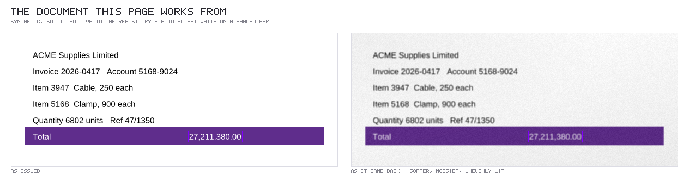
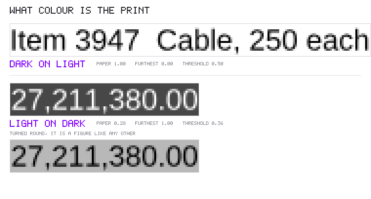
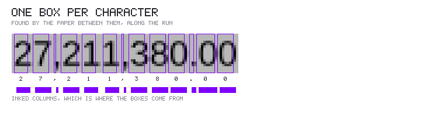
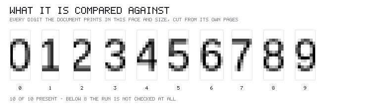
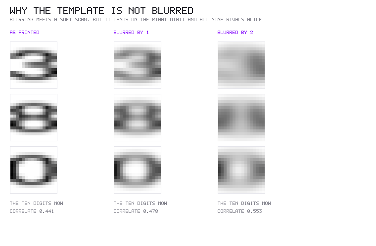
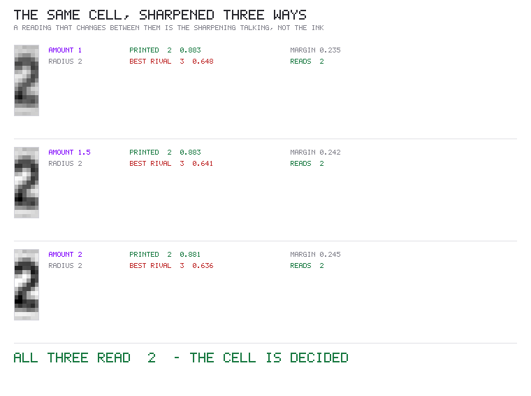
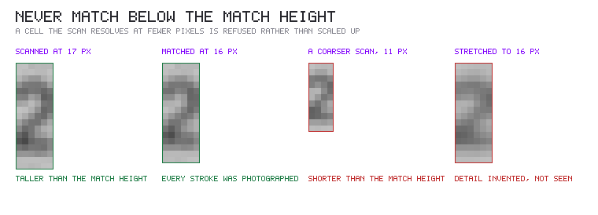
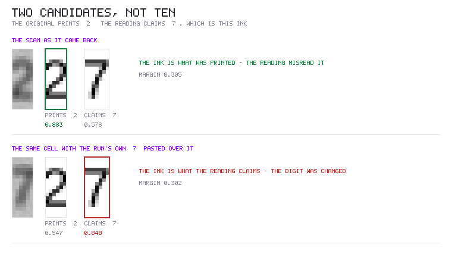

# Matching a figure against its own print, in pictures

A returned scan is not evidence of what was printed — it is evidence of what a
scanner saw. When the reading disagrees with the original, something has to
decide whether the paper changed or the reader was wrong, and the only thing
that can is the ink itself.

This page shows what that looks like at every step: which way round the print
is, where one character ends and the next begins, what each glyph is compared
against, and how a verdict is reached or refused. The reasoning behind the
constants, and the measurements that set them, are in
[`algorithms.md`](./algorithms.md); this is the same machine with the lid off.

Everything below is a real run of the code. Nothing is drawn by hand.

## The document

Synthetic, and deliberately so: a real customer document cannot live in a public
repository. It is a PDF rendered at 120 dpi in a real typeface, with a total set
white on a shaded bar — the case that matters most, because a figure on a
coloured band is exactly where a document puts the number worth changing. The
returned copy is the same page softened, speckled and unevenly lit.

## 1. Which way round is the print?

Every step afterwards assumes ink is darker than paper, so the first question is
whether that is true here. The run's own pixels answer it: the median is its
paper, the far extreme is its ink, and the threshold between them is half that
distance — **measured per run**, not a fixed level, so a pale bar and white
paper are treated alike.

The body line reads paper 1.00 and ink 0.00, so its threshold is 0.50. The total
reads paper 0.28 and ink 1.00, so its threshold is 0.36 — proportionally the
same decision on a third of the contrast. Turned round, the total is a figure
like any other, and everything downstream can stop caring about the colour.

## 2. One box per character

Characters are separated by the paper between them. Reading along the run's own
axis, a column counts as inked if any pixel in it stands far enough from the
run's paper; the inked columns group into runs, and the groups become cells.

The count has to come out right. When the glyphs touch and the groups cannot be
made to match the characters the text layer says are there, the run is refused
rather than divided up hopefully — a cell that straddles two digits would
compare the wrong ink against the wrong template.

## 3. What each glyph is compared against

Nothing is rendered and no font is consulted. Every template is a piece of the
original's own page, cut from somewhere the document actually prints that
character in that face and size. They are gathered across **every page** before
any page is read, because a figure is often set in a face its own page uses for
little else.

The bar is eight of the ten digits. Below that the run is not examined at all:
if the character actually on the scan has no template to lose to, it wins by
default, and a forgery would be confirmed by the tool meant to catch it.
Abstaining is the honest answer.

## 4. Matching one cell

The scan's ink for one cell, the original's ink in the very same place, and the
same scan ink scored against every candidate. Correlation rather than a
difference of pixels, because a scan is lighter or darker than the print it came
from and that must never decide anything.

Two numbers matter: how well the ink matches what was printed, and how well the
best rival did. Here the printed `2` scores 0.883 and the nearest rival — the
`3` — manages 0.641. A margin of 0.241 against a bar of 0.12, so the cell is
decided, and decided as the digit that was printed.

Being closest is not enough on its own. A confirmation also needs an absolute
match of 0.7 or better, so a cell that matches nothing well cannot be cleared by
matching the truth slightly less badly than the alternatives.

## 5. Why the template is not blurred

This is the one worth dwelling on, because the obvious approach is wrong.

A scan is softer than the print it came from, so the natural move is to blur the
template until it matches. It works — and it destroys the comparison, because
the blur lands on the correct digit **and on all nine rivals alike**. Above
about one pixel a `3` and an `8` are the same grey lump, and the ten digits'
correlation with one another climbs from 0.441 to 0.553 on this page. They stop
being ten different things.

That failure is invisible from outside: the printed glyph still matches well, so
nothing looks broken. It simply stops being possible for anything to win by the
required margin, and every cell comes back undecided. On a real order
confirmation this reached its limit — 0.937 against the printed digit, 0.928
against the best rival, and not one of 109 cells decidable.

So the scan is sharpened to meet the print instead of the print softened to meet
the scan. Both close the same gap; only one leaves the thing that tells the
digits apart intact.

## 6. A verdict has to survive being sharpened harder

Sharpening can also invent a stroke that was never photographed, and an invented
stroke flatters whichever rival it happens to resemble. So the cell is judged at
three strengths and the reading must be the same at all of them.

This is never a search for the strength that produces an answer — the gentlest
pass does not get to win an argument, and disagreement abstains. Here all three
read `2`, with margins of 0.235, 0.242 and 0.245, so the cell is settled and its
confidence is the narrowest of them.

## 7. Nothing is matched below the height it is matched at

Cells are compared at a fixed sixteen pixels. A cell the scan resolves at more
than that is reduced, which only discards detail. A cell it resolves at fewer
would have to be **enlarged**, and the strokes that separate two digits would
then be interpolated rather than photographed — invented, and an invented stroke
favours whichever rival it resembles.

So a cell shorter than the match height is refused outright, reported as
`too-coarse`. Across three scans of a real document the only false call this
check ever produced came from cells of fourteen pixels, on a 93 dpi scan; that
scan now declines every run and says why.

## 8. Two candidates, not ten

Everything above answers "which of ten digits is this?", and that needs most of
the alphabet to answer safely. A settlement asks something narrower. The reading
has already named its answer: the original prints `2`, the scan says `7`. Which
of those two is this ink?

Two templates answer that, and answer it either way. On the scan as it came
back, the ink matches the printed `2` by 0.305 — the reading misread it. With
the run's own `7` pasted over that cell, the same comparison swings to the claim
by 0.301, and the substitution is reported with the strongest evidence the
package has.

This is sound with two candidates where open identification would not be,
because a wrong verdict now requires the ink to match **the other specifically
named character** better — not merely to be hard to read.

## When it says nothing

Refusing is a normal outcome, and the refusal says which one it is rather than
returning a bare silence — otherwise "checked and agreed" and "never looked at"
are indistinguishable from outside, and telling them apart by inference is slow
and can come out wrong.

| reason | what happened |
|---|---|
| `no-figure` | the run holds no group of digits long enough to be a figure |
| `unplaceable` | the glyphs could not be cut apart |
| `few-rivals` | the document prints too little of this face to rule other characters out |
| `too-coarse` | the scan resolves the cell below the height it is matched at |
| `undecided` | measured, and nothing won by enough to say |
| `no-claim` | a two-candidate check with no reading to test against |

They are counted per page on `printChecks.skipped`.

## What these pictures are, and are not

The page is synthetic and the scan is simulated - a PDF built by
`createSyntheticPdf`, rendered at 120 dpi, its total recoloured white on violet,
then degraded by `simulateScan`. That is what lets the whole demonstration live
in a public repository, where a real returned document could not.

What it is not is a mock-up. Every box, every template and every score on these
pages came from running this package over that document: `printPolarity` drew
the polarity verdicts, `placeGlyphs` the cells, `collectInto` the templates, and
the correlations are the same ones `verifyPrintedRun` decides on.

The constants themselves — the 0.12 margin, the eight-rival bar, the 0.7 floor,
the sixteen-pixel match height — were not set here. They come from measurements
over real returned documents, and those measurements, with the false-call rates
that justify each one, are in [`algorithms.md`](./algorithms.md).
