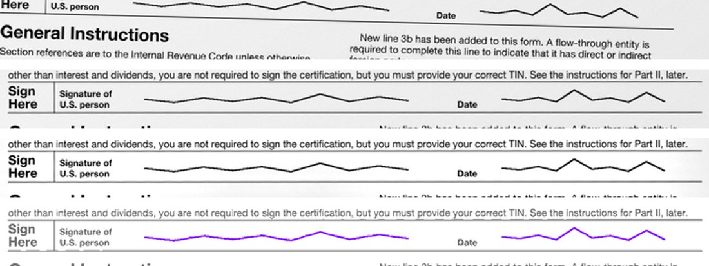
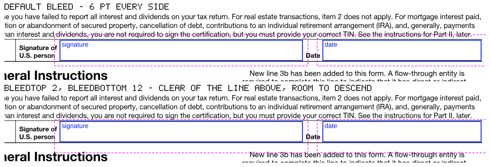

# `@scanmate/scan`

One class over the whole pipeline: hand it the document you issued and the one that came back, and ask it questions.



*One page through one session, top to bottom: the returned scan as it arrived - crooked and offset - then put back on the original's canvas, then cleaned for reading, then the overlay of the two, violet where the ink differs. Made from the [IRS Form W-9](https://www.irs.gov/pub/irs-pdf/fw9.pdf) (a work of the United States government, in the public domain): filled in as a generator would, printed, signed by hand and scanned crooked.*

```bash
npm install @scanmate/scan
```

```ts
import { Scanmate } from '@scanmate/scan'

const scan = new Scanmate('fw9-issued.pdf', 'fw9-returned.pdf', {
  // The W-9's signature row, measured off the form in points from the page's top-left.
  expected: [
    { page: 1, id: 'signature', x: 120, y: 577, width: 262, height: 22 },
    { page: 1, id: 'date',      x: 404, y: 577, width: 171, height: 22 },
  ],
})

const report = await scan.audit()
report.verdict                     // 'pass' | 'review'
report.pages[0].audit.reasons      // why, one sentence each
report.pages[0].audit.evidenceImage   // original, scan and overlay, findings drawn
report.pages[0].aligned.raster     // the page itself is still there

await scan.dispose()
```

## What it does for you

**You never align or enhance yourself.** To check a returned document against the one you issued, call `audit()`, `diff()`, `ocr()` or `find()` and nothing else. Extraction, alignment and preparation happen underneath, once, in the right order:

```ts
const report = await scan.audit()   // extracts, aligns, prepares, reads and compares
```

`align()` and `enhance()` remain part of the API because they are useful on their own - inspecting an alignment, producing a cleaned page to look at - but they are **not steps in a validation**. Calling them first changes nothing except when you are choosing the treatment yourself, and calling `enhance()` explicitly turns the automatic choice off.

**Every method runs what it needs.** `diff()` on a fresh session extracts and aligns first. Each stage is remembered, so the next question costs only the new work, and asking the same one twice costs nothing:

```ts
await scan.align()      // extracts, then aligns
await scan.diff()       // reuses the alignment
await scan.align()      // free
```

Change an option and that stage runs again, dropping whatever was computed from its old answer. Per-call options merge over the constructor's, which is handy for trying something:

```ts
await scan.align({ model: 'homography' })   // realigns, and the old diff is dropped
```

**The document chooses how it is prepared.** A soft scan reads far better levelled and sharpened; a good one reads better left alone. There is no default that suits both, so the session tries each treatment on a few pages spread across the document, scores them against the original's own text layer, and applies the winner to the rest:

```ts
await scan.ocr()
scan.preparation   // { chosen: { id: 'levelled-sharpened' }, tried: [...], on: [1, 4, 7] }
```

Measured on three scans of one order confirmation, scored by what the reading agreed with:

| scan | as scanned | levelled | levelled and sharpened |
|---|---|---|---|
| 93 dpi | 0.6603 | 0.6485 | **0.8047** |
| 120 dpi | **0.9362** | 0.9220 | 0.9222 |
| 144 dpi | 0.9968 | **0.9984** | 0.9848 |

Three documents, three different winners - which is why this is chosen rather than configured. Each of the three picks its own best treatment, so the 93 dpi scan gains 0.14 and neither good scan loses anything.

Three pages, because one is not enough and that is measured too: on the 93 dpi scan, page 2 is the single page where sharpening loses; on the 120 dpi one, page 1 is the single page where levelling wins. Either alone would have chosen wrongly.

`prepare: 'none'` reads the aligned pages as they are.

It cannot bias a verdict. The choice is between three fixed treatments scored over a whole page, and it never reaches the evidence: `diff()` and the glyph check read the aligned page, never the prepared one.

**One OCR engine for the session.** `ocrPages` and `auditPages` each start a tesseract worker when they are not given one, and a language model is tens of megabytes into a fresh WASM heap. The session makes one, hands it to every stage that reads, and terminates it in `dispose()` - and never terminates an engine you supplied yourself.

**Nothing loads until it is used.** The stages are pulled in with dynamic imports, so a session that only aligns never evaluates tesseract, never reads a language model, never loads a PDF library:

```
two images in, align only  ->  @scanmate/scan, @scanmate/ink, @scanmate/align, sharp
Scanmate.extract(pdf)      ->  @scanmate/scan, @scanmate/extract
Scanmate.merge(images)     ->  @scanmate/scan, @scanmate/merge
Scanmate.mark(pdf, marks)  ->  @scanmate/scan, @scanmate/merge
```

That is measured, not asserted: a test spawns a child process with a module hook that logs every specifier Node resolves, and fails if any of the other stages appear.

`sharp` is the floor. Every stage stands on `@scanmate/ink`, which loads libvips when it loads, so there is no pure-JavaScript path.

## The methods

| method | returns | consumes |
|---|---|---|
| `pages(options?)` | page pairs | the constructor's inputs |
| `align(options?)` | the scan on the original's canvas | `pages` |
| `enhance(options?)` | a cleaned copy alongside | `align` - and it overrides the automatic choice |
| `ocr(options?)` | how closely the text matches | prepared pages, or `enhance` if you ran it |
| `diff(expected?, options?)` | what changed, and whether it should have | `align` |
| `find(content?, options?)` | whether required content is there | `ocr` |
| `audit(options?)` | the verdict, with its evidence | prepared pages, or `enhance` if you ran it |
| `report()` | everything known, joined by page | whatever has run |
| `dispose()` | — | — |

And two that need no session at all, because there is nothing to compare:

| method | returns | loads |
|---|---|---|
| `Scanmate.merge(sources, options?)` | `MergeResult` — `pdf`, `pageCount`, `pages`, `passedThrough` | `@scanmate/merge` only |
| `Scanmate.extract(pdf, options?)` | `ExtractedPage[]` — each with `page`, `image`, `metadata` | `@scanmate/extract` only |
| `Scanmate.mark(pdf, marks, options?)` | `MarkResult` — `pdf`, `drawn`, `warnings` | `@scanmate/merge` only |

Results are also readable **synchronously**, as `undefined` until the stage has settled. They never start work:

```ts
scan.alignedPages      // undefined until align() has finished
scan.unpaired          // pages the scan lost, which nothing downstream reports
scan.mergedPdf         // the merged bytes, when a side was given as an array
scan.preparation       // which treatment the document chose, and what the others scored
scan.loaded            // which stage packages have loaded
```

## The two ends, without a comparison

Sometimes there is nothing to compare yet. A returned document arrives photographed a page at a time and has to be stored now and checked later; or a document needs opening on its own, to see what it holds. Both ends of the pipeline are available without a session:

```ts
import { Scanmate } from '@scanmate/scan'

// Eight photographs into one PDF, to store now and check when the original arrives.
const merged = await Scanmate.merge(['page-1.jpg', 'page-2.jpg', 'page-3.jpg'])
merged.pdf            // Uint8Array - the assembled document
merged.pageCount      // 3
merged.passedThrough  // true when one PDF was given and returned unchanged

// One document opened on its own - its pages, their size, their text.
const pages = await Scanmate.extract('returned.pdf', { includeText: true })
pages[0].image.raster            // the rendered page
pages[0].metadata.textItems      // its text layer, where it has one
```

**`Scanmate.merge(sources, options?)`** takes the same sources the constructor does — a path, a `URL`, bytes, a decoded raster, or a mix — and returns a [`MergeResult`](https://www.npmjs.com/package/@scanmate/merge). `options` is `MergeOptions`, passed straight through: `pageSize`, `margin`, `imageDpi`, `encoding`, `quality`, `passThrough`.

**`Scanmate.extract(pdf, options?)`** takes bytes or where to find them — not a raster, since a raster is not a PDF — and returns [`ExtractedPage[]`](https://www.npmjs.com/package/@scanmate/extract). `options` is `ExtractOptions`: `dpi` and its `fallbackDpi`/`minDpi`/`maxDpi` bounds, `pages` to select a range, `includeText` to read the text layer, `output` and `quality` to choose or skip encoding.

Both are `static` because they need no session: there is no original, no scan and nothing to remember. Each loads only the package it needs, so neither starts a reader, an aligner or a comparison — measured on a real four-page OCF, `Scanmate.extract` resolved `@scanmate/extract` alone, and a following `Scanmate.merge` added only `@scanmate/merge`.

`merged.pdf` goes straight into a session as either side:

```ts
const scan = new Scanmate('issued.pdf', merged.pdf)
```

The constructor still merges an array for you when you do have both documents in hand, so this is not a second way to do the same job — it is the same step for the case where the comparison comes later, or never.

## Checking where the fields are

Before a single signature is measured, the regions it will be measured in have to be right - and a coordinate that is a few points off looks exactly like one that is not, until a signature is reported missing. `Scanmate.mark` draws them on the original so you can see:

```ts
const { pdf, drawn, warnings } = await Scanmate.mark('fw9.pdf', [
  { page: 1, id: 'signature', x: 120, y: 577, width: 262, height: 22 },
  { page: 1, id: 'date',      x: 404, y: 577, width: 171, height: 22 },
], { bleedTop: 2, bleedBottom: 12 })

await write('fw9-checked.pdf', pdf)   // the original, with every region boxed
warnings                               // anything off its page, or on a page that is not there
```



*The W-9's signature and date fields, drawn from the same coordinates the audit example above uses. Each region is boxed in blue and its bleed dashed in magenta - the colours of the evidence page, so the two read alike. With the default six points on every side, the top of the signature's bleed runs straight through the printed line above it. Two points above and twelve below clears that line and gives a signature room to descend. Made from the [IRS Form W-9](https://www.irs.gov/pub/irs-pdf/fw9.pdf), a work of the United States government in the public domain.*

**It takes the original, and nothing is adjusted.** There is no scan to align: the regions were measured against this document, so they are drawn on it directly, as vectors. The page is never re-rendered, so it stays sharp at any zoom and each box sits exactly where its coordinates say.

**A mark is the same shape as an `expected` region** - `page`, `id`, `x`, `y`, `width`, `height`, in points from the top-left of the page as displayed. The array you are about to give `diff()` or `audit()` can be drawn as it is, so what you check by eye is what will be measured.

**The bleed is the one the comparison uses.** `bleed` sets every side; `bleedTop`, `bleedRight`, `bleedBottom` and `bleedLeft` each override one, so `{ bleed: 6, bleedBottom: 14 }` is six points of room above and to either side and fourteen below. The same options go to `diff` and `audit` as `expected` regions' room, resolved by the same function, so the band drawn here is the band that will be measured. Leave them unset and every side is six points, exactly as before.

**Rotated and cropped pages are handled.** A mark is measured the way `Scanmate.extract` reports text - with the page's rotation and crop box already applied - and it is drawn back through pdf.js's own page transform, inverted. That is proven rather than assumed: a spec measures a line of text, marks it, renders the page again and checks the box landed on the text, at every quarter turn.

**It says what it could not do.** A mark on a page the document does not have is skipped and reported; one that reaches past the edge of its page is drawn and reported, because a region running off the page is itself a positioning error.

**Signed documents open as they are.** A signed PDF usually arrives encrypted, locked against editing but readable by anyone. It is decrypted as it is read, with nothing to pass, and the marks are drawn on it. A PDF that needs a password to be read at all takes `password`:

```ts
await Scanmate.mark('signed.pdf', marks)                         // a signed PDF: nothing to add
await Scanmate.mark('protected.pdf', marks, { password: '…' })   // one that needs a password to open
```

A missing or wrong password raises a `PdfPasswordError` saying which. The obvious alternative - telling pdf-lib to ignore the encryption, as its own error suggests - is measured to hand back a PDF whose marks are silently missing, so it is not offered. The marked copy is for looking at: drawing on a signed document invalidates its digital signature, as any edit does.

## Inputs

Either side may be a path, a `URL`, bytes, a decoded raster - or an **array** of those, which is merged into one PDF first. That is how a returned document usually arrives: eight photographs of a signed contract.

```ts
new Scanmate('fw9-issued.pdf', ['page-1.jpg', 'page-2.jpg', 'page-3.jpg'])
```

Whether a side is a PDF is decided by its first five bytes, not its file extension. Two images never open a PDF library at all.

One caveat worth knowing: `dpi: 'match'` - rendering both sides at the scan's own measured resolution, which is what makes them directly comparable - needs both sides to be documents. Give it a PDF against a photograph and it renders at the original's resolution instead, and says so in `scan.warning`.

## Two orderings worth knowing

**Audit first is cheaper.** `auditPages` runs the reading and the pixel comparison itself and keeps both on its report, so the session hands them back rather than computing them twice:

```ts
await scan.audit()     // reads and compares
await scan.ocr()       // free
await scan.diff()      // free
```

The reverse order still pays twice. That is a gap in `auditPages` - it has no way to accept a reading it was already given - and closing it in this class would mean forking the verdict logic, which is worse.

One exception: audit runs its diff with no side-by-side and drops the masks, so `diff({ sideBySide: true })` after an audit genuinely re-runs rather than handing you a `null` where you asked for a picture.

## Memory

Remembering every stage is the point of the class and also its largest risk. A twenty-page A4 pair at 300 dpi holds the original, the scan, the alignment, perhaps an enhanced copy, the overlay and the evidence page - four bytes a pixel each, several gigabytes before anything has gone wrong.

So: **`Scanmate` is a short-lived per-document object, not a service singleton.** One per document, `dispose()` when done. A long-lived instance in a request handler is a leak.

For a document longer than a handful of pages, take it a few pages at a time. `extract.pages` selects the range, and disposing between batches bounds the peak to one batch rather than the whole document:

```ts
import { inspectDocument } from '@scanmate/extract'

// Reads the page dictionaries and renders nothing, so it costs almost nothing.
const { pageCount } = await inspectDocument('issued.pdf')

for (let first = 1; first <= pageCount; first += 4) {
  const range = `${first}-${Math.min(first + 3, pageCount)}`
  const scan = new Scanmate('issued.pdf', 'returned.pdf', { extract: { pages: range } })
  try {
    const report = await scan.audit()
    await file(report)          // keep the verdicts, let the pixels go
  } finally {
    await scan.dispose()
  }
}
```

The count matters: a range running past the last page is a `RangeError`, not a quietly empty batch - asking for page 9 of an 8-page document is exactly the mistake this pipeline exists to catch.

The cost is re-opening the PDF per batch, which is small next to the rasters. Page numbers stay the original's throughout, so the batches join back up by `page`.

There is deliberately **no `keep` option**. One was typed, exported and documented in 0.2.0 and 0.2.1, and read by nothing - so a caller who set it believed they had bounded their memory and had not. It was removed in 0.4.0 rather than left standing as a promise. Dropping consumed rasters is not a small change either: every stage hands pages back, so each report *carries* the page objects and through them their pixels, and separating the two means `PageImage.raster` becoming nullable for every package and every consumer. Batching works today and costs nobody a null check.

## This is the convenient door, not the only one

Every stage is still its own package and still worth using directly - `alignPages`, `diffPages`, `ocrPages`, `auditPages` and the rest take plain arguments and return plain results. Reach for this class when you want the pipeline; reach for a stage when you want that stage.

## How it decides

The stages make the decisions; this package only sequences them - and each documents its own reasoning, with the measurements behind every constant, in its own `documentation/algorithms.md`.

[`documentation/algorithms.md`](./documentation/algorithms.md) covers the sequencing itself: what runs in what order, what is remembered and when it is dropped, exactly what loads for a given call, how one OCR engine is shared, and why an audit makes the next three questions free.
