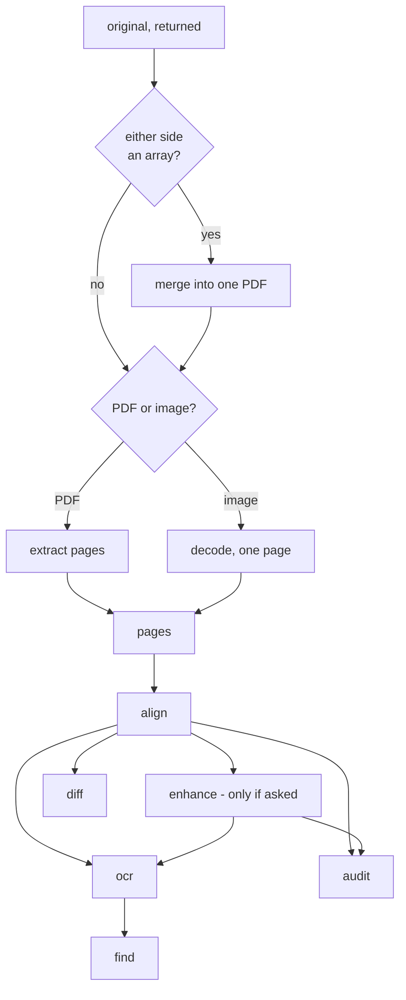

# How `@scanmate/scan` decides

This package makes no measurements of its own. Every judgement about a document
belongs to a stage, and each stage documents its own reasoning. What lives here
is the sequencing: what runs, in what order, what is remembered, what is loaded,
and when it all ends.


*One page through one session, top to bottom: the returned scan as it arrived —
crooked and offset — then put back on the original's canvas, then cleaned for
reading, then the overlay of the two, violet where the ink differs. Made from
the [IRS Form W-9](https://www.irs.gov/pub/irs-pdf/fw9.pdf) (public domain),
printed, signed by hand and scanned crooked.*

## The shape of it



Each method runs its prerequisites, so any order works. The rule is one line:
**each stage consumes the newest cached page set that satisfies its input.**

| stage | consumes | note |
|---|---|---|
| `pages` | the constructor's inputs | merges if a side is an array, extracts if it is a PDF |
| `align` | `pages` | |
| `enhance` | `align` | never run implicitly |
| `ocr` | `enhance` if it has run, else `align` | `ocrPages` reads `page.enhanced` when present |
| `diff` | `align` | it compares against the aligned raster; an enhanced page is on a finer grid |
| `find` | `ocr` | it searches a reading |
| `audit` | `enhance` if it has run, else `align` | |

**`enhance` is never implicit**, and that is a decision rather than an omission.
`auditPages` works from the raw alignment and `ocrPages` enlarges what it is
given, so enhancing behind the caller's back would move their scores away from
what the packages produce when called directly.

## What is remembered, and when it is forgotten

Two decisions carry the cache.

**Promises are cached, not values.** A second call arriving while the first is
still running joins it rather than starting a rival, so
`Promise.all([scan.ocr(), scan.diff()])` aligns the document once rather than
twice. A rejected run is evicted instead of cached, so one transient failure
does not make the session permanently broken.

**A stage that re-runs drops everything downstream.** Aligning with another
model invalidates the diff measured on the old alignment, and the audit built on
both:

```text
input → pages → align ─┬→ enhance → ocr → find
                       ├→ diff ────────────┐
                       └→ audit ←──────────┘
```

Whether a stage re-runs is decided by a **fingerprint** of its options: keys
sorted so ordering does not matter, `undefined` elided so an absent key equals
an explicit one, and anything that cannot be compared by value — an OCR engine,
a normalisation predicate, a raster — compared by identity through a `WeakMap`.
A false miss costs time; a false hit returns the wrong answer, so the comparison
leans towards missing.

`onProgress` never enters a fingerprint, and every per-call option bag is typed
`Omit<…, 'onProgress'>` so a caller cannot smuggle a second callback in and
silently trigger a re-run.

## Loading a stage only when it is used

Every `@scanmate/*` import in this package is either an `import type`, which
TypeScript erases before anything runs, or an `await import()` with a **literal**
specifier. There is not one static value import, and that is the whole feature.

The specifiers are literal because a generic loader keyed by a string would be
shorter and would defeat every static analysis that matters: Nx's project graph
reads dynamic imports to build the dependency graph, and bundlers need to see
the literal to resolve it.

Measured, not asserted. A child process runs an align-only session against the
**built** packages with a module hook logging every specifier Node resolves:

| given | what loads |
|---|---|
| two images, `align()` only | `scan`, `ink`, `align`, `sharp` — 49 specifiers in all |
| two images, `diff()` | the above plus `diff` |
| a PDF pair | plus `extract`, `pdfjs-dist`, `@napi-rs/canvas` |
| anything that reads | plus `ocr`, `tesseract.js`, a language model |
| a side given as an array | plus `merge`, `@cantoo/pdf-lib` |

**`sharp` is the floor.** Every stage depends on `@scanmate/ink`, which imports
sharp at module top level, so there is no pure-JavaScript path and no point
pretending otherwise.

The in-process `loaded` set is bookkeeping and says so: module evaluation is
process-wide and one-way, so a second session loads nothing and nothing can be
unloaded. The test that proves anything is the child process.

## One engine for the session

`ocrPages` and `auditPages` each create a tesseract engine when they are not
given one, and terminate only the one they made; an engine handed to them is
left running. That contract is what makes a shared engine possible, and using it
is not an optimisation — it is the difference between one WASM start-up and one
per call, each loading tens of megabytes of language model into a fresh heap.

The rule is ownership: **the session terminates what it created and never what
it was given.** Changing the tesseract settings between calls — another
language, another cache directory — is a different engine, so the old one is
disposed of rather than left answering with the wrong model.

A session that never reads never starts an engine, so forgetting `dispose()`
there leaks nothing.

## Not paying for the audit twice

`auditPages` runs the reading and the pixel comparison itself and keeps both on
its report, so a session that audits first has already paid for `ocr()` and
`diff()`. Those results are filed back into the cache, and the ordering is worth
knowing:

```ts
await scan.audit()   // reads and compares
await scan.ocr()     // free
await scan.diff()    // free
```

The reading is filed under the settings a bare `ocr()` would ask for, because
audit was handed exactly those. **The pixels are only filed when they cannot be
wrong**: audit runs its diff with no side-by-side and drops the masks
afterwards, so a session whose diff options ask for either must not be handed
them — it would get a `null` where it asked for a picture. That call misses the
cache and genuinely re-runs.

The reverse order still pays twice. `AuditOptions` has no way to accept a
reading it was already given, and faking it here would mean composing
`correlateFindings`, `settleDisputes`, `probeInk` and `renderEvidence` by hand —
faster, and a fork of the verdict logic that would drift from the package that
owns it. It is left as it is, and said plainly.

## Memory

Remembering every stage is the point of the class and also its largest risk. Per
page the cache can hold the original, the scan, the alignment, an enhanced copy,
the overlay and the evidence page — each four bytes a pixel. Twenty A4 pages at
300 dpi is roughly:

```text
20 pages × 6 rasters × (2480 × 3508 × 4 B) ≈ 4 GB
```

So `dispose()` clears the cache as well as the engine, and the documentation
says what the shape of the object implies: **`Scanmate` is a short-lived
per-document object, not a service singleton.** A long-lived instance in a
request handler is a leak.

**What bounds it is a session per range of pages**, selected with
`extract.pages` and disposed between batches, which holds one batch of pixels
instead of the document. Page numbers are the original's throughout, so the
batches join back up afterwards.

**There is no `keep` option, and its removal is the point.** One shipped in
0.2.0 and 0.2.1 - typed, exported, and presented right here as the answer to
this very warning - and nothing read it. A caller following the documentation to
bound their memory got `'all'` and no way to know. It went in 0.4.0.

Implementing it rather than removing it runs into this suite's own shape. Every
stage takes pages and hands pages back, which is what lets them compose without
adapters - and it means each cached report *carries* the page objects, and
through them their rasters. The reports and the pixels are not separable the way
the option implied. Freeing them means `PageImage.raster` becoming nullable in
`@scanmate/ink`, narrowed by every package and every consumer, including those
who never asked. Batching costs nobody that, so batching is what is documented.

## Constants

| option | default | |
|---|---|---|
| `expected` | none | Regions where a change is expected; the default for `diff()` and `audit()`. |
| `content` | none | Content that must be present; the default for `find()`. |
| `engine` | none | An engine to use and leave running. |
| `onProgress` | none | One callback for every stage. |
| `merge` … `audit` | each package's defaults | Passed straight through, per stage. |

## What it does not do

- **It decides nothing.** Every threshold, every verdict and every measurement
  belongs to a stage. This package sequences them and reports what they said.
- **It does not cancel.** No stage accepts an `AbortSignal`, so cancellation
  could only be honoured between stages and never between pages, which is where
  the hours go. Promising it would be a lie; it is a request on the stages.
- **It does not enhance for you**, or reorder your stages, or pick your
  thresholds.
- **It is not the only way in.** Every stage is its own package and takes plain
  arguments. Reach for this class when you want the pipeline; reach for a stage
  when you want that stage.
